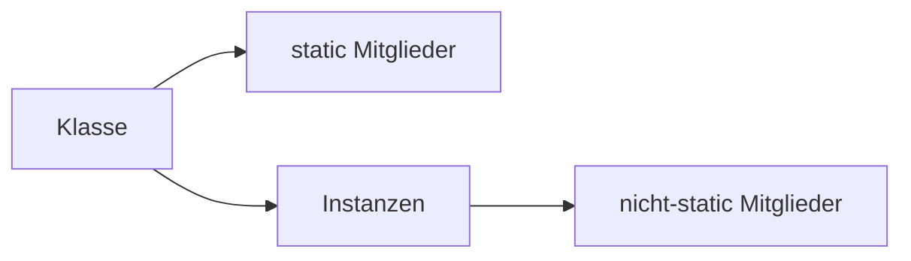

# static – Klassenmitglieder ohne Instanz

## Kurzüberblick

- `static` ist **kein Zugriffsmodifikator**, sondern ein **Schlüsselwort**
- Statische Elemente gehören zur **Klasse**, nicht zur Instanz
- Zugriff erfolgt über den **Klassennamen**
- Gilt für:
  - Attribute (Variablen)
  - Methoden
  - Initialisierungsblöcke
  - innere Klassen (nested classes)
- **Typische Nutzung**:
  - Konstanten (`static final`)
  - Utility-Methoden
- **Risiko**: Gemeinsamer Zustand → schwer nachvollziehbare Fehler

---

## Core-Erklärung

### Grundprinzip: Klassenkontext vs. Instanzkontext



- **static**:
  - existiert **einmal pro Klasse**
  - wird **geteilt** von allen Objekten

- **nicht-static**:
  - existiert **pro Objekt (Instanz)**

👉 Wichtig:
> `static` = gehört zur Klasse  
> nicht-static = gehört zum Objekt

---

### 1. Statische Attribute

```java
public class Counter {
    public static int count = 0;
}
```

- Nur **eine Variable** für alle Objekte
- Gemeinsamer Zustand

```java
Counter.count++;
```

⚠️ Achtung:
- Änderungen wirken sich auf **alle Instanzen** aus

---

### 2. Statische Methoden

```java
public static int add(int a, int b) {
    return a + b;
}
```

Aufruf:

```java
Calculator.add(3, 5);
```

#### Eigenschaften:

- Kein Zugriff auf:
  - Instanzvariablen
  - Instanzmethoden
- Kein `this`

👉 Grund:
Es existiert **keine Instanz**

---

### Beispiel: Zugriffsbeschränkung

```java
public class Example {
    int x = 10;

    public static void test() {
        // System.out.println(x); ❌ Fehler
    }
}
```

✔ Lösung:
- Entweder `x` auch static machen
- Oder Objekt erzeugen

---

### 3. Statische Initialisierungsblöcke

```java
static {
    System.out.println("Klasse wird geladen");
}
```

- Wird **einmal beim Laden der Klasse** ausgeführt
- Typischer Einsatz:
  - Initialisierung komplexer statischer Daten

---

### 4. Statische innere Klassen

```java
class Outer {
    static class Inner {
    }
}
```

- Benötigen **keine Instanz der äußeren Klasse**
- Zugriff nur auf **statische Mitglieder der Outer-Klasse**

---

### Wichtiger Unterschied: Methodenbindung

- **Instanzmethoden** → dynamisch (Polymorphie möglich)
- **statische Methoden** → **früh gebunden (compile-time)**

👉 Konsequenz:
- Statische Methoden werden **nicht überschrieben**, sondern nur **verdeckt (method hiding)**

---

## Praktisches Beispiel

### Zähler für alle Objekte

```java
public class User {
    public static int userCount = 0;

    public User() {
        userCount++;
    }
}
```

```java
User u1 = new User();
User u2 = new User();

System.out.println(User.userCount); // 2
```

---

### Utility-Klasse

```java
public class MathHelper {
    public static int square(int x) {
        return x * x;
    }
}
```

👉 Kein Objekt notwendig → sinnvoll für reine Funktionen

---

## Exam-Relevanz

Typische Prüfungsfragen:

- Unterschied zwischen `static` und nicht-static
- Warum kann eine statische Methode nicht auf Instanzvariablen zugreifen?
- Wann verwendet man `static` sinnvoll?
- Was passiert mit statischen Variablen bei mehreren Objekten?

 Merksatz:
> `static` bedeutet: Es gibt **genau eine gemeinsame Version für alle Objekte**

---

## Häufige Fehler & Klarstellungen

### 1. „Static ist wie global“
⚠️ Teilweise richtig, aber gefährlich

- Zugriff ist global möglich
- Aber:
  - nur innerhalb der Klasse definiert
  - kann zu stark gekoppeltem Code führen

---

### 2. Zugriff auf Instanzdaten

❌ Fehler:

```java
public static void test() {
    System.out.println(this.x); // nicht erlaubt
}
```

👉 Kein `this` vorhanden

---

### 3. Zu viel static

❌ Problem:
- schwer testbarer Code
- kein objektorientiertes Design

👉 Symptome:
- „Alles static“ → prozedural statt OOP

---

### 4. Static + Veränderliche Daten

⚠️ Risiko:
- Race Conditions (bei Multithreading)
- schwer nachvollziehbare Bugs

---

## Fazit

- `static` trennt klar zwischen:
  - **Klassenebene**
  - **Objektebene**
- Sinnvoll für:
  - Konstanten
  - Utility-Funktionen
  - gemeinsam genutzte Daten
- Kritisch bei:
  - veränderlichem globalen Zustand

👉 Gute Praxis:
- `static` bewusst und sparsam einsetzen
- Kapselung und OOP-Prinzipien nicht verletzen