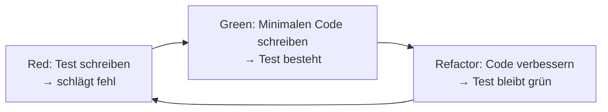

# Testing in der Softwareentwicklung

## Kurzüberblick / Definition

Testing bezeichnet den systematischen Prozess zur **Überprüfung von Software**, um Fehler zu finden und sicherzustellen, dass sie den Anforderungen entspricht.

Ziele:

- Fehler frühzeitig erkennen
- Qualität sicherstellen
- Stabilität und Zuverlässigkeit erhöhen
- Wartbarkeit verbessern

Testing ist **kein einmaliger Schritt**, sondern ein **kontinuierlicher Bestandteil des gesamten Softwareentwicklungsprozesses**.

---

## Kernerklärung

### 1. Grundprinzipien des Testings (ISTQB)

Die klassischen Testprinzipien bilden die Grundlage für professionelles Testing:

| Prinzip | Erklärung |
|--------|----------|
| **1. Testing zeigt die Anwesenheit von Fehlern** | Tests können Fehler finden, aber nie beweisen, dass keine existieren |
| **2. Vollständiges Testen ist unmöglich** | Alle möglichen Eingaben und Zustände zu testen ist nicht praktikabel |
| **3. Frühes Testen** | Fehler sollten so früh wie möglich entdeckt werden |
| **4. Fehlerhäufung** | Viele Fehler treten oft in wenigen Modulen auf |
| **5. Pestizid-Paradoxon** | Immer gleiche Tests finden irgendwann keine neuen Fehler mehr |
| **6. Testen ist kontextabhängig** | Teststrategie hängt vom System ab |
| **7. Trugschluss der Fehlerfreiheit** | Fehlerfreie Software ist nutzlos, wenn sie falsche Anforderungen erfüllt |

---

### 2. FIRST-Prinzip (für gute Unit-Tests)

Dieses Prinzip beschreibt die **Qualitätskriterien für gute automatisierte Tests**:

| Buchstabe | Bedeutung | Erklärung |
|----------|----------|----------|
| **F – Fast** | Schnell | Tests müssen schnell ausführbar sein |
| **I – Independent** | Unabhängig | Tests beeinflussen sich nicht gegenseitig |
| **R – Repeatable** | Wiederholbar | Gleiche Ergebnisse bei jeder Ausführung |
| **S – Self-validating** | Selbstprüfend | Automatische Auswertung, kein manuelles Prüfen |
| **T – Timely** | Rechtzeitig | Tests werden früh geschrieben, zum Beispiel bei TDD |

**Einordnung:**

- Ergänzt die ISTQB-Prinzipien
- Fokus auf **Entwicklerperspektive**
- Besonders wichtig für **Unit-Tests und TDD**

---

### 3. Funktionale und nicht-funktionale Anforderungen im Testing

Softwaretests prüfen, ob eine Software ihre Anforderungen erfüllt. Dabei ist für die IHK-Prüfung besonders wichtig, zwischen **funktionalen Anforderungen** und **nicht-funktionalen Anforderungen** zu unterscheiden.

| Art | Leitfrage | Bedeutung | Beispiel |
|---|---|---|---|
| **Funktionale Anforderungen** | Was soll das System tun? | Beschreiben konkrete Funktionen oder Verhalten des Systems | Ein Benutzer kann sich einloggen |
| **Nicht-funktionale Anforderungen** | Wie gut oder unter welchen Bedingungen soll das System funktionieren? | Beschreiben Qualitätsmerkmale des Systems | Der Login muss innerhalb von 2 Sekunden erfolgen |

#### Funktionale Anforderungen

Funktionale Anforderungen beschreiben die **Funktionen**, die ein System bereitstellen muss.

Beispiele:

- Benutzer können sich registrieren
- Benutzer können sich einloggen
- Eine Rechnung kann erstellt werden
- Produkte können gesucht werden
- Ein Passwort kann zurückgesetzt werden

Passende Tests:

- Unit-Tests
- Integrationstests
- Systemtests
- Akzeptanztests
- Black-Box-Tests

#### Nicht-funktionale Anforderungen

Nicht-funktionale Anforderungen beschreiben **Qualitätsmerkmale** eines Systems. Sie legen fest, wie gut eine Funktion funktionieren soll oder unter welchen Bedingungen das System arbeiten muss.

Beispiele:

- Die Anwendung soll schnell reagieren
- Das System soll auch bei vielen Benutzern stabil bleiben
- Daten sollen sicher gespeichert und übertragen werden
- Die Oberfläche soll benutzerfreundlich sein
- Das System soll gut wartbar sein
- Die Anwendung soll eine hohe Verfügbarkeit haben

Passende Tests:

- Lasttests
- Performancetests
- Sicherheitstests
- Usability-Tests
- Stresstests
- Wartbarkeitstests

#### Zusammenhang mit Testarten

| Testart | Prüft hauptsächlich | Beispiel |
|---|---|---|
| **Unit-Test** | Funktionale Anforderungen | Eine Methode berechnet den richtigen Wert |
| **Integrationstest** | Funktionale Anforderungen | Zwei Module arbeiten korrekt zusammen |
| **Systemtest** | Funktionale und nicht-funktionale Anforderungen | Das gesamte System erfüllt die Anforderungen |
| **Akzeptanztest** | Funktionale und nicht-funktionale Anforderungen | Kunde prüft, ob das System fachlich passt |
| **Lasttest** | Nicht-funktionale Anforderungen | System bleibt bei 500 gleichzeitigen Benutzern stabil |
| **Sicherheitstest** | Nicht-funktionale Anforderungen | Passwörter sind geschützt |
| **Usability-Test** | Nicht-funktionale Anforderungen | Benutzer können die Anwendung intuitiv bedienen |

**Merksatz:**

- Funktional → **Was macht das System?**
- Nicht-funktional → **Wie gut macht das System das?**

Beispiel:

| Anforderung | Art |
|---|---|
| „Der Benutzer kann sich einloggen.“ | Funktional |
| „Der Login darf maximal 2 Sekunden dauern.“ | Nicht-funktional |
| „Das System erstellt automatisch eine Rechnung.“ | Funktional |
| „Das System muss 99,5 % der Zeit verfügbar sein.“ | Nicht-funktional |

Für die Prüfung ist wichtig:  
Testing prüft nicht nur, ob eine Funktion vorhanden ist, sondern auch, ob sie zuverlässig, sicher, schnell und benutzerfreundlich funktioniert.

---

### 4. Testarten nach Testebene

| Testart | Beschreibung |
|---|---|
| **Unit-Test** | Testet einzelne Funktionen oder Methoden isoliert |
| **Integrationstest** | Testet Zusammenspiel mehrerer Komponenten |
| **Systemtest** | Testet das gesamte System als Einheit |
| **Abnahmetest** | Prüft, ob Anforderungen des Kunden erfüllt sind |

---

### 5. Testarten nach Ziel

| Testart | Ziel |
|---|---|
| **Regressionstest** | Sicherstellen, dass Änderungen nichts kaputt machen |
| **Lasttest** | Verhalten unter hoher Belastung |
| **Sicherheitstest** | Aufdecken von Schwachstellen |
| **Usability-Test** | Benutzerfreundlichkeit prüfen |

**Einordnung nach Anforderungen:**

| Testart | Bezug zu Anforderungen |
|---|---|
| **Regressionstest** | Prüft, ob bestehende funktionale Anforderungen nach Änderungen weiterhin erfüllt werden |
| **Lasttest** | Prüft nicht-funktionale Anforderungen zur Belastbarkeit und Performance |
| **Sicherheitstest** | Prüft nicht-funktionale Anforderungen zur Sicherheit |
| **Usability-Test** | Prüft nicht-funktionale Anforderungen zur Benutzerfreundlichkeit |

---

### 6. Testarten nach Durchführung

| Kategorie | Beschreibung |
|---|---|
| **Statische Tests** | Ohne Programmausführung, zum Beispiel Codeanalyse oder Reviews |
| **Dynamische Tests** | Mit Programmausführung |
| **Manuelle Tests** | Durch Menschen durchgeführt |
| **Automatisierte Tests** | Durch Tools ausgeführt |

#### Dynamische Tests: White-Box vs. Black-Box

| Ansatz | Beschreibung | Beispiel |
|---|---|---|
| **White-Box-Test** | Kennt den internen Code, also Struktur, Logik und Pfade | Unit-Tests mit Fokus auf Codeabdeckung |
| **Black-Box-Test** | Kennt nur Ein- und Ausgaben, nicht den Code | Systemtests, UI-Tests |

**Merksatz:**

- White-Box → *Wie funktioniert der Code intern?*
- Black-Box → *Was macht das System von außen?*

---

### 7. Testabdeckung (Coverage)

- Gibt an, wie viel Prozent des Codes durch Tests geprüft werden
- Hohe Coverage ≠ fehlerfreie Software
- Ziel: **kritische Bereiche zuverlässig absichern**

Wichtig:  
Testabdeckung sagt nur aus, **wie viel Code ausgeführt wurde**, aber nicht automatisch, ob die Tests fachlich sinnvoll sind oder ob alle Anforderungen korrekt geprüft wurden.

Beispiel:

- Eine Methode wird durch einen Test ausgeführt
- Der Test prüft aber nicht den richtigen Erwartungswert
- Dann steigt zwar die Coverage, aber die Testqualität bleibt schlecht

---

## Test-Driven Development (TDD)

### Konzept

Tests werden **vor dem eigentlichen Code geschrieben**.

TDD hilft dabei, Anforderungen genauer zu verstehen, weil zuerst überlegt werden muss:

- Was soll die Funktion tun?
- Welche Eingaben gibt es?
- Welches Ergebnis wird erwartet?
- Welche Sonderfälle müssen berücksichtigt werden?

### Ablauf (Red-Green-Refactor-Zyklus)



### Vorteile

- Klare Anforderungen
- Hohe Testabdeckung
- Bessere Codequalität
- Fördert sauberes Design

### Verbindung zu FIRST

- **Fast** → Tests laufen häufig und schnell
- **Independent** → Tests sind voneinander unabhängig
- **Repeatable** → stabile Ergebnisse
- **Self-validating** → automatische Verifikation
- **Timely** → Tests entstehen früh

---

## Praktisches Beispiel

### Ohne Test

```java
int add(int a, int b) {
    return a + b;
}
```

### Mit TDD

**1. Test schreiben (Red)**

```java
@Test
void testAdd() {
    assertEquals(5, add(2, 3));
}
```

**2. Implementierung (Green)**

```java
int add(int a, int b) {
    return a + b;
}
```

**3. Refactoring**

- Code optimieren, falls nötig
- Test bleibt erfolgreich

---

## Beispiel: Funktionale und nicht-funktionale Anforderungen

### Ausgangssituation

Ein Kunde möchte eine Login-Funktion für eine Webanwendung.

| Anforderung | Art der Anforderung | Möglicher Test |
|---|---|---|
| Benutzer können sich mit E-Mail und Passwort anmelden | Funktional | Unit-Test, Integrationstest, Systemtest |
| Bei falschem Passwort erscheint eine Fehlermeldung | Funktional | Black-Box-Test, Systemtest |
| Der Login darf maximal 2 Sekunden dauern | Nicht-funktional | Performancetest |
| Das System muss 500 gleichzeitige Logins verarbeiten können | Nicht-funktional | Lasttest |
| Passwörter dürfen nicht im Klartext gespeichert werden | Nicht-funktional | Sicherheitstest |
| Die Login-Seite muss einfach bedienbar sein | Nicht-funktional | Usability-Test |

### Erklärung

Die funktionalen Anforderungen beschreiben, **welche Funktionen vorhanden sein müssen**.  
Die nicht-funktionalen Anforderungen beschreiben, **welche Qualitätsmerkmale diese Funktionen erfüllen müssen**.

Eine Login-Funktion kann also fachlich korrekt sein, aber trotzdem mangelhaft, wenn sie:

- zu langsam ist
- unsicher ist
- bei vielen Benutzern abstürzt
- schwer bedienbar ist

Deshalb reicht es nicht aus, nur funktionale Tests durchzuführen.

---

## Warum ist Testing wichtig?

### 1. Fehlererkennung

- Früh erkannte Fehler sind **günstiger zu beheben**

### 2. Qualitätssicherung

- Software funktioniert wie erwartet

### 3. Wartbarkeit

- Änderungen verursachen weniger unerwartete Fehler

### 4. Erweiterbarkeit

- Neue Features können sicher integriert werden

### 5. Benutzerzufriedenheit

- Stabilere und zuverlässigere Software

### 6. Effizienz & Kosten

- Automatisierte Tests sparen Zeit
- Frühe Fehler = geringere Kosten

### 7. Gemeinsame Verantwortung

- Testing ist nicht nur Aufgabe von Testern
- Entwickler müssen aktiv Tests schreiben, zum Beispiel Unit-Tests

### 8. Prüfung von funktionalen und nicht-funktionalen Anforderungen

- Funktionale Tests prüfen, ob die geforderten Funktionen korrekt umgesetzt wurden
- Nicht-funktionale Tests prüfen Qualitätsmerkmale wie Performance, Sicherheit, Benutzbarkeit und Stabilität

---

## Exam Relevance (IHK)

Wichtige Prüfungsaspekte:

- Die **7 ISTQB-Testprinzipien**
- Das **FIRST-Prinzip** für gute Unit-Tests
- Unterschiede zwischen **Unit-, Integrations-, System- und Akzeptanztests**
- Verständnis von **statischen vs. dynamischen Tests**
- Unterschied **White-Box vs. Black-Box**
- Bedeutung von **Testabdeckung**
- Ablauf und Vorteile von **TDD**
- Unterschied zwischen **funktionalen und nicht-funktionalen Anforderungen**
- Zuordnung passender Testarten zu funktionalen und nicht-funktionalen Anforderungen
- Wirtschaftliche Bedeutung von Testing

Typische Fragen:

- „Warum können Tests keine Fehlerfreiheit beweisen?“
- „Was zeichnet gute Unit-Tests aus?“
- „Erklären Sie FIRST.“
- „Was ist der Unterschied zwischen White- und Black-Box?“
- „Was ist der Unterschied zwischen funktionalen und nicht-funktionalen Anforderungen?“
- „Nennen Sie Beispiele für nicht-funktionale Anforderungen.“
- „Welche Testarten eignen sich zur Prüfung nicht-funktionaler Anforderungen?“
- „Warum ist Testing wirtschaftlich sinnvoll?“

### Prüfungsnahe Merksätze

| Thema | Merksatz |
|---|---|
| Testing allgemein | Tests zeigen Fehler, beweisen aber keine Fehlerfreiheit |
| Funktionale Anforderungen | Beschreiben, was das System tun soll |
| Nicht-funktionale Anforderungen | Beschreiben, wie gut das System funktionieren soll |
| Coverage | Hohe Testabdeckung bedeutet nicht automatisch hohe Qualität |
| TDD | Erst Test schreiben, dann Code implementieren |
| FIRST | Gute Unit-Tests sind schnell, unabhängig, wiederholbar, selbstprüfend und rechtzeitig erstellt |

---

## Häufige Fehler & Missverständnisse

| Missverständnis | Richtigstellung |
|---|---|
| „Tests beweisen, dass Software fehlerfrei ist.“ | Tests können nur Fehler aufzeigen, nicht Fehlerfreiheit beweisen |
| „Hohe Testabdeckung = fehlerfreie Software.“ | Coverage misst Quantität, nicht Qualität |
| „Testing ist nur Aufgabe von Testern.“ | Entwickler sind mitverantwortlich, insbesondere für Unit-Tests |
| „Tests dürfen langsam sein.“ | Widerspricht FIRST: Fast |
| „Tests hängen voneinander ab.“ | Widerspricht FIRST: Independent |
| „Testing kommt am Ende.“ | Testing ist ein kontinuierlicher Prozess |
| „Funktionale Anforderungen und nicht-funktionale Anforderungen sind dasselbe.“ | Funktionale Anforderungen beschreiben Funktionen, nicht-funktionale Anforderungen beschreiben Qualitätsmerkmale |
| „Lasttests prüfen normale Funktionen.“ | Lasttests prüfen vor allem nicht-funktionale Anforderungen wie Belastbarkeit und Performance |
| „Usability ist nicht prüfbar.“ | Usability kann durch Usability-Tests geprüft werden |
| „Sicherheit ist nur ein technisches Detail.“ | Sicherheit ist eine wichtige nicht-funktionale Anforderung |

---

## Fazit

Testing kombiniert:

- **Theorie (ISTQB-Prinzipien)** → Verständnis von Testing allgemein
- **Praxis (FIRST-Prinzip)** → Qualität von Unit-Tests
- **Anforderungsprüfung** → funktionale und nicht-funktionale Anforderungen werden überprüft

Nur zusammen ergibt sich **professionelles Testing**.

Wichtigste Kernaussagen:

- Tests zeigen Fehler, aber beweisen nie Fehlerfreiheit
- Gute Tests sind **schnell, unabhängig, stabil, automatisch und frühzeitig**
- Funktionale Anforderungen beschreiben, **was** ein System tun soll
- Nicht-funktionale Anforderungen beschreiben, **wie gut** ein System funktionieren soll
- Testing verbessert Qualität, senkt Kosten und erhöht Wartbarkeit
