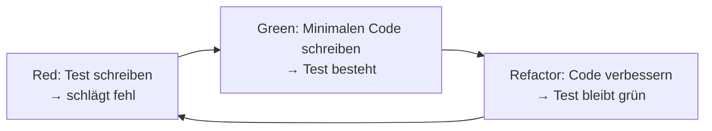

# Testing in der Softwareentwicklung

## Kurzüberblick / Definition
Testing bezeichnet den systematischen Prozess zur **Überprüfung von Software**, um Fehler zu finden und sicherzustellen, dass sie den Anforderungen entspricht.

Ziele:
- Fehler frühzeitig erkennen
- Qualität sicherstellen
- Stabilität und Zuverlässigkeit erhöhen
- Wartbarkeit verbessern

Testing ist **kein einmaliger Schritt**, sondern ein **kontinuierlicher Bestandteil des gesamten Softwareentwicklungsprozesses**.

---

## Kernerklärung

### 1. Grundprinzipien des Testings (ISTQB)

Die klassischen Testprinzipien bilden die Grundlage für professionelles Testing:

| Prinzip | Erklärung |
|--------|----------|
| **1. Testing zeigt die Anwesenheit von Fehlern** | Tests können Fehler finden, aber nie beweisen, dass keine existieren |
| **2. Vollständiges Testen ist unmöglich** | Alle möglichen Eingaben und Zustände zu testen ist nicht praktikabel |
| **3. Frühes Testen** | Fehler sollten so früh wie möglich entdeckt werden |
| **4. Fehlerhäufung** | Viele Fehler treten oft in wenigen Modulen auf |
| **5. Pestizid-Paradoxon** | Immer gleiche Tests finden irgendwann keine neuen Fehler mehr |
| **6. Testen ist kontextabhängig** | Teststrategie hängt vom System ab |
| **7. Trugschluss der Fehlerfreiheit** | Fehlerfreie Software ist nutzlos, wenn sie falsche Anforderungen erfüllt |

---

### 2. FIRST-Prinzip (für gute Unit-Tests)

Dieses Prinzip beschreibt die **Qualitätskriterien für gute automatisierte Tests**:

| Buchstabe | Bedeutung | Erklärung |
|----------|----------|----------|
| **F – Fast** | Schnell | Tests müssen schnell ausführbar sein |
| **I – Independent** | Unabhängig | Tests beeinflussen sich nicht gegenseitig |
| **R – Repeatable** | Wiederholbar | Gleiche Ergebnisse bei jeder Ausführung |
| **S – Self-validating** | Selbstprüfend | Automatische Auswertung (kein manuelles Prüfen) |
| **T – Timely** | Rechtzeitig | Tests werden früh geschrieben (z. B. TDD) |

**Einordnung:**
- Ergänzt die ISTQB-Prinzipien
- Fokus auf **Entwicklerperspektive**
- Besonders wichtig für **Unit-Tests und TDD**

---

### 3. Testarten nach Testebene

| Testart            | Beschreibung |
|--------------------|-------------|
| **Unit-Test**      | Testet einzelne Funktionen oder Methoden isoliert |
| **Integrationstest** | Testet Zusammenspiel mehrerer Komponenten |
| **Systemtest**     | Testet das gesamte System als Einheit |
| **Akzeptanztest**  | Prüft, ob Anforderungen des Kunden erfüllt sind |

---

### 4. Testarten nach Ziel

| Testart             | Ziel |
|---------------------|------|
| **Regressionstest** | Sicherstellen, dass Änderungen nichts kaputt machen |
| **Lasttest**        | Verhalten unter hoher Belastung |
| **Sicherheitstest** | Aufdecken von Schwachstellen |
| **Usability-Test**  | Benutzerfreundlichkeit prüfen |

---

### 5. Testarten nach Durchführung

| Kategorie            | Beschreibung |
|----------------------|-------------|
| **Statische Tests**  | Ohne Programmausführung (z. B. Codeanalyse, Reviews) |
| **Dynamische Tests** | Mit Programmausführung |
| **Manuelle Tests**   | Durch Menschen durchgeführt |
| **Automatisierte Tests** | Durch Tools ausgeführt |

#### Dynamische Tests: White-Box vs. Black-Box

| Ansatz            | Beschreibung | Beispiel |
|-------------------|-------------|----------|
| **White-Box-Test** | Kennt den internen Code (Struktur, Logik, Pfade) | Unit-Tests mit Fokus auf Codeabdeckung |
| **Black-Box-Test** | Kennt nur Ein- und Ausgaben, nicht den Code | Systemtests, UI-Tests |

**Merksatz:**
- White-Box → *Wie funktioniert der Code intern?*  
- Black-Box → *Was macht das System von außen?*

---

### 6. Testabdeckung (Coverage)
- Gibt an, wie viel Prozent des Codes durch Tests geprüft werden
- Hohe Coverage ≠ fehlerfreie Software
- Ziel: **kritische Bereiche zuverlässig absichern**

---

## Test-Driven Development (TDD)

### Konzept
Tests werden **vor dem eigentlichen Code geschrieben**.

### Ablauf (Red-Green-Refactor-Zyklus)



### Vorteile
- Klare Anforderungen
- Hohe Testabdeckung
- Bessere Codequalität
- Fördert sauberes Design

### Verbindung zu FIRST:
- **Fast** → Tests laufen häufig und schnell
- **Independent** → Tests sind voneinander unabhängig
- **Repeatable** → stabile Ergebnisse
- **Self-validating** → automatische Verifikation
- **Timely** → Tests entstehen früh

---

## Praktisches Beispiel

### Ohne Test
```java
int add(int a, int b) {
    return a + b;
}
```

### Mit TDD

**1. Test schreiben (Red)**
```java
@Test
void testAdd() {
    assertEquals(5, add(2, 3));
}
```

**2. Implementierung (Green)**
```java
int add(int a, int b) {
    return a + b;
}
```

**3. Refactoring**
- Code optimieren (falls nötig)
- Test bleibt erfolgreich

---

## Warum ist Testing wichtig?

### 1. Fehlererkennung
- Früh erkannte Fehler sind **günstiger zu beheben**

### 2. Qualitätssicherung
- Software funktioniert wie erwartet

### 3. Wartbarkeit
- Änderungen verursachen weniger unerwartete Fehler

### 4. Erweiterbarkeit
- Neue Features können sicher integriert werden

### 5. Benutzerzufriedenheit
- Stabilere und zuverlässigere Software

### 6. Effizienz & Kosten
- Automatisierte Tests sparen Zeit
- Frühe Fehler = geringere Kosten

### 7. Gemeinsame Verantwortung
- Testing ist nicht nur Aufgabe von Testern
- Entwickler müssen aktiv Tests schreiben (z. B. Unit-Tests)

---

## Exam Relevance (IHK)

Wichtige Prüfungsaspekte:
- Die **7 ISTQB Testprinzipien**
- Das **FIRST-Prinzip (gute Unit-Tests)**
- Unterschiede zwischen **Unit-, Integrations- und Systemtests**
- Verständnis von **statischen vs. dynamischen Tests**
- Unterschied **White-Box vs. Black-Box**
- Bedeutung von **Testabdeckung**
- Ablauf und Vorteile von **TDD**
- Wirtschaftliche Bedeutung von Testing

Typische Fragen:
- „Warum können Tests keine Fehlerfreiheit beweisen?“  
- „Was zeichnet gute Unit-Tests aus?“  
- „Erklären Sie FIRST“  
- „Was ist der Unterschied zwischen White- und Black-Box?“  
- „Warum ist Testing wirtschaftlich sinnvoll?“  

---

## Häufige Fehler & Missverständnisse

| Missverständnis | Richtigstellung |
|---|---|
| „Tests beweisen, dass Software fehlerfrei ist" | Tests können nur Fehler aufzeigen, nicht Fehlerfreiheit beweisen (ISTQB Prinzip 1) |
| „Hohe Testabdeckung = fehlerfreie Software" | Coverage misst Quantität, nicht Qualität |
| „Testing ist nur Aufgabe von Testern" | Entwickler sind mitverantwortlich, insbesondere für Unit-Tests |
| „Tests dürfen langsam sein" | Widerspricht FIRST (Fast) |
| „Tests hängen voneinander ab" | Widerspricht FIRST (Independent) |
| „Testing kommt am Ende" | Testing ist ein kontinuierlicher Prozess |

---

## Fazit

Testing kombiniert:
- **Theorie (ISTQB Prinzipien)** → Verständnis von Testing allgemein  
- **Praxis (FIRST Prinzip)** → Qualität von Unit-Tests  

→ Nur zusammen ergibt sich **professionelles Testing**

Wichtigste Kernaussagen:
- Tests zeigen Fehler, aber beweisen nie Fehlerfreiheit  
- Gute Tests sind: **schnell, unabhängig, stabil, automatisch und frühzeitig**
- Testing verbessert Qualität, senkt Kosten und erhöht Wartbarkeit

