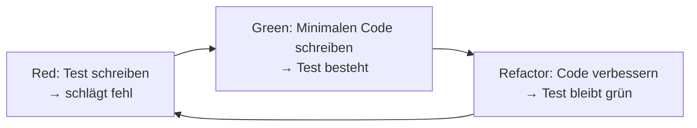

# Testing in der Softwareentwicklung

## Kurzüberblick / Definition
Testing bezeichnet den systematischen Prozess zur **Überprüfung von Software**, um Fehler zu finden und sicherzustellen, dass sie den Anforderungen entspricht.

Ziele:
- Fehler frühzeitig erkennen
- Qualität sicherstellen
- Stabilität und Zuverlässigkeit erhöhen
- Wartbarkeit verbessern

Testing ist **kein einmaliger Schritt**, sondern ein **kontinuierlicher Bestandteil des gesamten Softwareentwicklungsprozesses**.

---

## Kernerklärung

### 1. Grundprinzipien des Testings
- Tests überprüfen **Soll vs. Ist-Verhalten**
- Fehler können in jeder Phase entstehen → daher kontinuierliches Testen
- Vollständige Fehlerfreiheit ist praktisch unmöglich → Ziel ist **Risikominimierung**

---

### 2. Testarten nach Testebene

| Testart            | Beschreibung |
|--------------------|-------------|
| **Unit-Test**      | Testet einzelne Funktionen oder Methoden isoliert |
| **Integrationstest** | Testet Zusammenspiel mehrerer Komponenten |
| **Systemtest**     | Testet das gesamte System als Einheit |
| **Akzeptanztest**  | Prüft, ob Anforderungen des Kunden erfüllt sind |

---

### 3. Testarten nach Ziel

| Testart             | Ziel |
|---------------------|------|
| **Regressionstest** | Sicherstellen, dass Änderungen nichts kaputt machen |
| **Lasttest**        | Verhalten unter hoher Belastung |
| **Sicherheitstest** | Aufdecken von Schwachstellen |
| **Usability-Test**  | Benutzerfreundlichkeit prüfen |

---

### 4. Testarten nach Durchführung

| Kategorie            | Beschreibung |
|----------------------|-------------|
| **Statische Tests**  | Ohne Programmausführung (z. B. Codeanalyse, Reviews) |
| **Dynamische Tests** | Mit Programmausführung |
| **Manuelle Tests**   | Durch Menschen durchgeführt |
| **Automatisierte Tests** | Durch Tools ausgeführt |

#### Dynamische Tests: White-Box vs. Black-Box

| Ansatz            | Beschreibung | Beispiel |
|-------------------|-------------|----------|
| **White-Box-Test** | Kennt den internen Code (Struktur, Logik, Pfade) | Unit-Tests mit Fokus auf Codeabdeckung |
| **Black-Box-Test** | Kennt nur Ein- und Ausgaben, nicht den Code | Systemtests, UI-Tests |

**Merksatz:**
- White-Box → *Wie funktioniert der Code intern?*  
- Black-Box → *Was macht das System von außen?*

---

### 5. Testabdeckung (Coverage)
- Gibt an, wie viel Prozent des Codes durch Tests geprüft werden
- Hohe Coverage ≠ fehlerfreie Software
- Ziel: **kritische Bereiche zuverlässig absichern**

---

## Test-Driven Development (TDD)

### Konzept
Tests werden **vor dem eigentlichen Code geschrieben**.

### Ablauf (Red-Green-Refactor-Zyklus)



### Vorteile
- Klare Anforderungen
- Hohe Testabdeckung
- Bessere Codequalität
- Fördert sauberes Design

---

## Praktisches Beispiel

### Ohne Test
```java
int add(int a, int b) {
    return a + b;
}
```

### Mit TDD

**1. Test schreiben (Red)**
```java
@Test
void testAdd() {
    assertEquals(5, add(2, 3));
}
```

**2. Implementierung (Green)**
```java
int add(int a, int b) {
    return a + b;
}
```

**3. Refactoring**
- Code optimieren (falls nötig)
- Test bleibt erfolgreich

---

## Warum ist Testing wichtig?

### 1. Fehlererkennung
- Früh erkannte Fehler sind **günstiger zu beheben**

### 2. Qualitätssicherung
- Software funktioniert wie erwartet

### 3. Wartbarkeit
- Änderungen verursachen weniger unerwartete Fehler

### 4. Erweiterbarkeit
- Neue Features können sicher integriert werden

### 5. Benutzerzufriedenheit
- Stabilere und zuverlässigere Software

### 6. Effizienz & Kosten
- Automatisierte Tests sparen Zeit
- Frühe Fehler = geringere Kosten

---

## Exam Relevance (IHK)

Wichtige Prüfungsaspekte:
- Unterschiede zwischen **Unit-, Integrations- und Systemtests**
- Verständnis von **statischen vs. dynamischen Tests**
- Unterschied **White-Box vs. Black-Box**
- Bedeutung von **Testabdeckung**
- Ablauf und Vorteile von **TDD**
- Warum Testing wirtschaftlich sinnvoll ist

Typische Fragen:
- „Welche Testart wird wann eingesetzt?“  
- „Erklären Sie den TDD-Zyklus“  
- „Was ist der Unterschied zwischen White- und Black-Box-Tests?“  
- „Warum sind Regressionstests wichtig?“  

---

## Häufige Fehler & Missverständnisse

❌ „Hohe Testabdeckung = fehlerfreie Software“  
→ Coverage misst nur, **was getestet wird**, nicht **wie gut**

❌ „Testing ist nur Aufgabe von Testern“  
→ Entwickler sind **mitverantwortlich (z. B. Unit-Tests)**

❌ „Testing kommt am Ende“  
→ Richtig: **Testing begleitet den gesamten Entwicklungsprozess**

❌ „Manuelles Testen reicht aus“  
→ Automatisierung ist entscheidend für Skalierbarkeit

---

## Fazit

Testing ist ein zentraler Bestandteil der Softwareentwicklung und entscheidend für:
- Qualität
- Stabilität
- Wartbarkeit
- Kundenzufriedenheit

Ein strukturierter Testansatz kombiniert:
- verschiedene Testarten
- Automatisierung
- kontinuierliche Integration
- ggf. TDD

→ Ziel ist nicht perfekte Software, sondern **zuverlässige, kontrollierte und wartbare Systeme**.

---

## Bewertung der Vollständigkeit (Lernperspektive)

Die enthaltenen Informationen sind:
✔ **Ausreichend für Prüfungsvorbereitung (IHK-Grundlagen)**  
✔ **Strukturiert und logisch aufgebaut**  
✔ **Gut geeignet zum Wiederholen und Verstehen**

Was noch ergänzt werden könnte (für tieferes Verständnis):
- Testpyramide (Unit vs. Integration vs. UI)
- Mocking / Test-Doubles
- Continuous Integration (CI) im Kontext von Tests
- Beispiel für Black-Box vs. White-Box konkret

