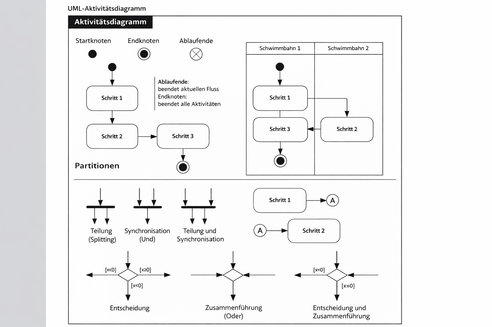
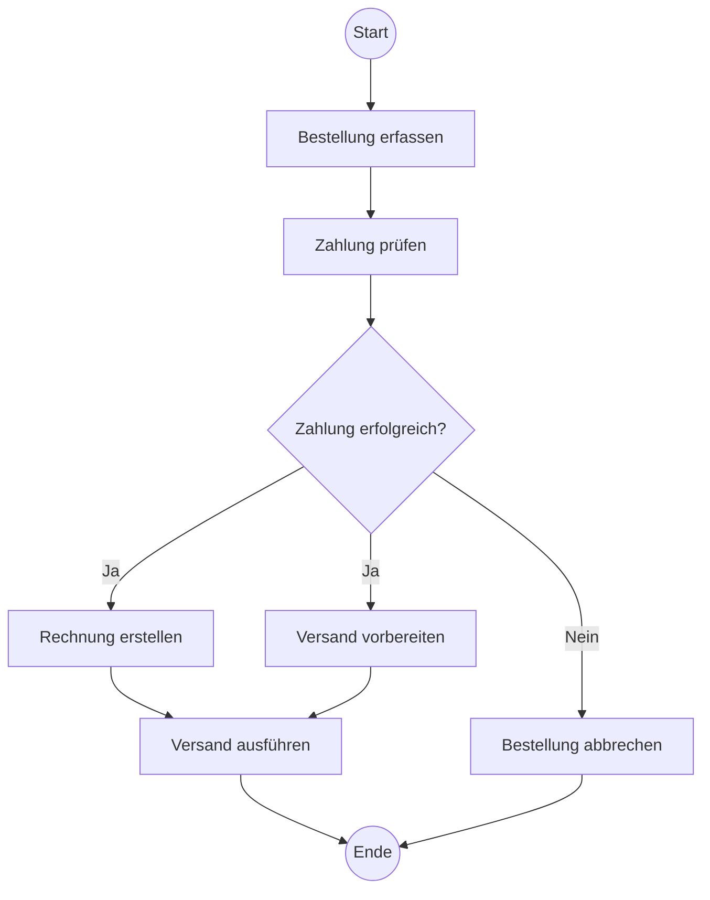
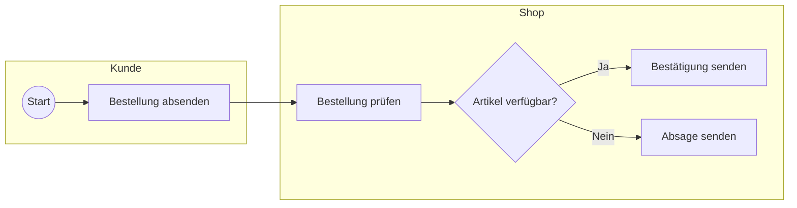

# Aktivitätsdiagramm

## Überblick

Ein **Aktivitätsdiagramm** ist ein UML-Verhaltensdiagramm zur Darstellung von **Abläufen, Prozessen und Kontrollflüssen**. Es zeigt, **welche Aktivitäten in welcher Reihenfolge ausgeführt werden**, an welchen Stellen **Entscheidungen** getroffen werden und wo **parallele Abläufe** möglich sind.

Aktivitätsdiagramme werden vor allem genutzt, um:

- Geschäftsprozesse zu beschreiben
- fachliche oder technische Abläufe zu analysieren
- Programmlogik verständlich zu visualisieren
- Verantwortlichkeiten zwischen Rollen oder Systemteilen zu trennen

Damit sind sie besonders nützlich, wenn nicht nur *was* ein System tut, sondern vor allem *wie ein Ablauf entsteht* dargestellt werden soll.

---

## Kerngedanke

Der Fokus eines Aktivitätsdiagramms liegt auf dem **Ablauf von Aktionen**.  
Im Zentrum stehen daher folgende Fragen:

- Wo beginnt ein Prozess?
- Welche Aktivität folgt auf welche?
- Unter welchen Bedingungen verzweigt der Ablauf?
- Welche Schritte laufen parallel?
- Wann endet der Prozess?

Im Unterschied zu anderen UML-Diagrammen beschreibt ein Aktivitätsdiagramm also primär den **Prozessfluss**.

---

## Wichtige Elemente eines Aktivitätsdiagramms

| Element | Bedeutung | Typische Darstellung |
|---|---|---|
| **Startknoten** | Beginn des Ablaufs | gefüllter schwarzer Kreis |
| **Aktivität / Aktion** | Auszuführender Schritt im Prozess | abgerundetes Rechteck |
| **Kontrollfluss** | Reihenfolge der Ausführung | gerichteter Pfeil |
| **Entscheidungsknoten** | Verzweigung anhand einer Bedingung | Raute |
| **Merge-Knoten** | Zusammenführung alternativer Pfade | Raute |
| **Fork-Knoten** | Aufteilung in parallele Abläufe | dicker Balken |
| **Join-Knoten** | Synchronisation paralleler Abläufe | dicker Balken |
| **Endknoten** | Ende des gesamten Ablaufs | Kreis mit Umrandung |
| **Objektknoten** | Daten / Objekte im Ablauf | Rechteck |
| **Objektfluss** | Übergabe von Daten zwischen Aktionen | Pfeil mit Objektbezug |
| **Partition / Swimlane** | Gruppierung nach Verantwortlichkeit | horizontale oder vertikale Bereiche |

---

## Zentrale Modellierungskonzepte

### 1. Start- und Endknoten

Ein Aktivitätsdiagramm beginnt üblicherweise mit einem **Startknoten**.  
Von dort aus wird der Ablauf durch Kontrollflüsse zu weiteren Aktivitäten geführt.

Ein **Endknoten** markiert das Ende des Prozesses. Dabei ist wichtig:

- Der **Aktivitätsendknoten** beendet die gesamte Aktivität.
- Ein **Flussendknoten** beendet nur einen einzelnen Pfad.

Für einfache Einführungen reicht meist der allgemeine Endknoten.

---

### 2. Aktivitäten

Eine **Aktivität** beschreibt einen Arbeitsschritt innerhalb des Prozesses, zum Beispiel:

- „Bestellung prüfen“
- „Kundendaten erfassen“
- „Rechnung erzeugen“

Aktivitäten werden sinnvollerweise mit einem **Verb** oder einer **Verbgruppe** benannt, da sie eine Handlung ausdrücken.

**Gut:**

- Zahlung prüfen
- Bestellung versenden

**Weniger gut:**

- Zahlung
- Versand

---
### 3. Kontrollfluss

Der **Kontrollfluss** verbindet die Elemente des Diagramms und zeigt, **welcher Schritt nach welchem ausgeführt wird**.

Er beschreibt also keinen Dateninhalt, sondern die **Ablauflogik**.

---

### 4. Entscheidungen und Zusammenführungen

Ein **Entscheidungsknoten** modelliert eine Verzweigung.  
Von ihm gehen mehrere alternative Pfade aus, die jeweils durch **Bedingungen** beschrieben werden, zum Beispiel:

- `[Zahlung erfolgreich]`
- `[Zahlung fehlgeschlagen]`

Ein **Merge-Knoten** führt solche alternativen Pfade später wieder zusammen.

Wichtig ist der Unterschied:

- **Entscheidung** = ein Pfad wird ausgewählt
- **Merge** = alternative Pfade werden wieder vereinigt

Beide verwenden dieselbe Grundform (Raute), erfüllen aber unterschiedliche Aufgaben.

---

### 5. Parallele Abläufe: Fork und Join

Ein großer Vorteil von Aktivitätsdiagrammen ist die Darstellung von **Nebenläufigkeit**.

#### Fork-Knoten
Ein **Fork** teilt einen Ablauf in mehrere **gleichzeitig ausführbare** Pfade auf.

#### Join-Knoten
Ein **Join** synchronisiert diese Pfade wieder. Erst wenn die benötigten parallelen Aktivitäten abgeschlossen sind, geht der Ablauf weiter.

Beispiel:

- Rechnung erstellen
- Versand vorbereiten

Diese beiden Schritte können unter Umständen parallel stattfinden und später wieder zusammengeführt werden.

---

### 6. Schleifen und Wiederholungen

Schleifen werden in Aktivitätsdiagrammen **nicht durch ein eigenes Symbol**, sondern durch entsprechende Kontrollflüsse und Bedingungen modelliert.

Beispiel:

- Eingabe prüfen
- `[ungültig]` zurück zur Eingabe
- `[gültig]` weiter zum nächsten Schritt

Damit lassen sich Wiederholungen sauber als Prozesslogik darstellen.

---

### 7. Objektflüsse und Objektknoten

Neben dem reinen Kontrollfluss kann auch sichtbar gemacht werden, **welche Daten oder Objekte zwischen Aktivitäten weitergegeben werden**.

Beispiele:

- Antrag
- Rechnung
- Kundendaten
- Bestellformular

Das ist hilfreich, wenn nicht nur der Ablauf selbst, sondern auch die **Informationsverarbeitung** verständlich sein soll.

---

### 8. Partitionen / Swimlanes

**Swimlanes** und **Partitionen** meinen im Wesentlichen dasselbe:  
Das Diagramm wird in Bereiche aufgeteilt, die einzelnen **Rollen, Abteilungen oder Systemen** zugeordnet sind.

Beispiele:

- Kunde
- Sachbearbeitung
- Warenlager
- Bezahlsystem

Dadurch wird sichtbar, **wer für welchen Schritt verantwortlich ist**.

---

## Was nicht verwechselt werden sollte

Einige in Rohnotizen genannte Begriffe sind in der UML-Einführung entweder **nicht zentral**, **zu speziell** oder in dieser Form **missverständlich**. Für die Prüfungsvorbereitung sollte man vor allem die Standardelemente sicher beherrschen.

### Besonders wichtig
- Startknoten
- Endknoten
- Aktivität
- Kontrollfluss
- Entscheidung
- Merge
- Fork
- Join
- Swimlanes / Partitionen
- Objektknoten / Objektfluss

### Mit Vorsicht zu betrachten
Begriffe wie **„Signalfluss“**, **„Zeitfluss“**, **„Interruptfluss“** oder **„spezielle Notation mit Farben“** gehören nicht zur typischen Basiseinführung eines Aktivitätsdiagramms in dieser vereinfachten Form. Für Grundlagen und Prüfungen ist es sinnvoller, zunächst die **Kernelemente und deren Bedeutung** sicher zu beherrschen.

---

## Typischer Aufbau eines Aktivitätsdiagramms

Ein einfacher Ablauf sieht oft so aus:

1. Start
2. Aktivität
3. Entscheidung
4. je nach Bedingung alternativer Pfad
5. eventuell Zusammenführung
6. Ende

Mit Parallelität erweitert sich das Schema um Fork- und Join-Knoten.

Beispiel (Morgenroutine und Arbeitstag):

---

## Praktisches Beispiel: Online-Bestellung

### Beschreibung

Ein Kunde gibt eine Bestellung auf. Danach wird die Zahlung geprüft.  
Falls die Zahlung erfolgreich ist, werden Rechnung und Versandvorbereitung parallel durchgeführt. Anschließend wird die Ware versendet. Andernfalls wird die Bestellung abgebrochen.

### Fachliche Aussage des Beispiels

Dieses Diagramm zeigt:

- einen klaren **Start- und Endpunkt**
- eine **Entscheidung** mit zwei Alternativen
- zwei logisch zusammenhängende Schritte
- einen realitätsnahen Geschäftsprozess

Für eine strengere UML-Darstellung würde man parallele Abläufe mit **Fork-/Join-Balken** statt nur mit aufgeteilten Pfeilen modellieren. Für das Grundverständnis bleibt das Beispiel dennoch hilfreich.

---

## Beispiel mit Swimlanes

### Nutzen von Swimlanes

Hier wird sofort sichtbar:

- **Kunde** löst den Prozess aus
- **Shop** verarbeitet die Bestellung
- Verantwortlichkeiten sind klar voneinander getrennt

---

## Einsatzgebiete

Aktivitätsdiagramme werden unter anderem verwendet für:

- **Geschäftsprozessmodellierung**
- **Beschreibung von Benutzerabläufen**
- **Dokumentation von Programmlogik**
- **Analyse von Soll- und Ist-Prozessen**
- **Darstellung von Verantwortlichkeiten**
- **Schulung und technische Dokumentation**

In der Anwendungsentwicklung sind sie besonders nützlich, wenn Abläufe früh verständlich gemacht werden sollen, bevor Code geschrieben wird.

---

## Abgrenzung zu anderen UML-Diagrammen

| Diagrammtyp | Fokus |
|---|---|
| **Aktivitätsdiagramm** | Ablauf, Entscheidungen, Parallelität, Prozesslogik |
| **Use-Case-Diagramm** | fachliche Anforderungen und Akteure |
| **Sequenzdiagramm** | zeitliche Kommunikation zwischen Objekten |
| **Klassendiagramm** | statische Struktur von Klassen und Beziehungen |
| **Zustandsdiagramm** | Zustände eines Objekts und Zustandswechsel |

Merksatz:  
**Das Aktivitätsdiagramm zeigt, wie ein Prozess abläuft.**

---

## Prüfungsrelevanz

Für Prüfungen sollte man insbesondere Folgendes sicher beherrschen:

### Begriffe erkennen und erklären
- Startknoten
- Endknoten
- Aktivität
- Kontrollfluss
- Entscheidung
- Merge
- Fork
- Join
- Swimlane

### Diagramme lesen können
- Reihenfolge der Aktivitäten erkennen
- Bedingungen korrekt interpretieren
- parallele Abläufe von alternativen Abläufen unterscheiden
- Verantwortlichkeiten über Swimlanes zuordnen

### Diagramme selbst erstellen können
- Aktivitäten sinnvoll benennen
- Bedingungen in eckigen Klammern formulieren
- Entscheidungen und Zusammenführungen korrekt einsetzen
- Parallelität sauber modellieren
- Ablauf logisch und widerspruchsfrei darstellen

---

## Häufige Fehler und Klarstellungen

### Entscheidung und Merge verwechseln
Beide werden als Raute gezeichnet, haben aber unterschiedliche Aufgaben:

- **Entscheidung:** ein Pfad wird ausgewählt
- **Merge:** alternative Pfade werden wieder zusammengeführt

### Parallelität und Alternative vermischen
- **Alternative:** genau ein Pfad wird gewählt
- **Parallelität:** mehrere Pfade laufen gleichzeitig

Das ist einer der häufigsten Fehler.

### Aktivitäten falsch benennen
Aktivitäten sollten **Tätigkeiten** ausdrücken und daher meist mit einem Verb beginnen.

### Zu viele Details in ein Diagramm packen
Ein Aktivitätsdiagramm soll Abläufe verständlich machen.  
Zu viele Sonderfälle oder technische Details machen es schnell unübersichtlich.

### UML und freie Flussdiagramme vermischen
Nicht jedes Flussdiagramm ist automatisch ein UML-Aktivitätsdiagramm.  
Für UML sollte man sich an die typischen Symbole und ihre Bedeutung halten.

---

## Zusammenfassung

Das Aktivitätsdiagramm ist ein wichtiges UML-Diagramm zur Darstellung von **Prozessen, Abläufen und Logik**. Es eignet sich besonders gut, um:

- Reihenfolgen von Aktivitäten darzustellen
- Entscheidungen sichtbar zu machen
- parallele Abläufe zu modellieren
- Verantwortlichkeiten über Swimlanes zu trennen

Für die Praxis und die Prüfung ist entscheidend, die **Grundelemente sicher zu kennen** und den Unterschied zwischen **Alternative**, **Wiederholung** und **Parallelität** sauber zu verstehen.