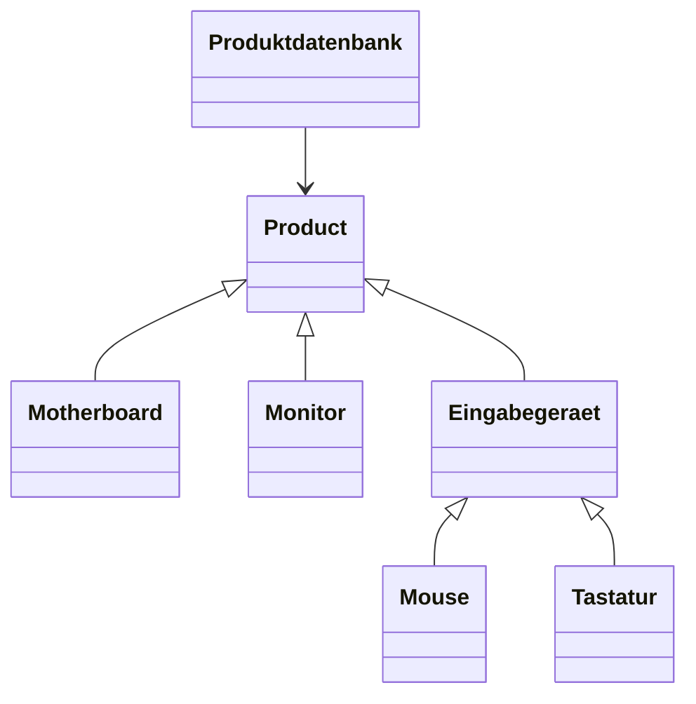
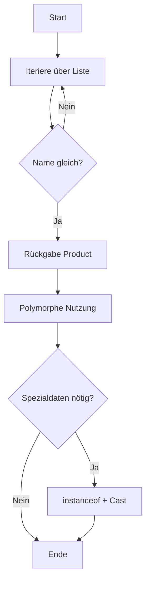

# Suche in einer ArrayList<Product> mit Vererbung, Polymorphie und Casting

## Kurzüberblick

Dieses Thema zeigt ein zentrales OOP-Muster:

> **Unterschiedliche Objekte werden über eine gemeinsame Oberklasse einheitlich verwaltet und verarbeitet.**

Kernidee:
- Speicherung verschiedener Unterklassen in `ArrayList<Product>`
- Suche über gemeinsame Attribute (`name`)
- Nutzung von **Polymorphie** für Verhalten
- Einsatz von **Casting** nur bei Bedarf

---

## Core-Erklärung

### 1. Grundprinzip: Polymorphe Sammlung

```java
ArrayList<Product> produkte = new ArrayList<>();
```

Warum funktioniert das?

- Jede Unterklasse ist **implizit auch ein `Product`**
- -> **Substitutionsprinzip (Liskov)**

```java
produkte.add(new Motherboard(...));
produkte.add(new Monitor(...));
produkte.add(new Mouse(...));
```

-> Die Liste speichert **Referenzen vom Typ `Product`**, aber die **Objekte bleiben ihre echten Typen**.

---

### 2. Polymorphie zur Laufzeit (Dynamic Binding)

```java
Product p = new Mouse(...);
System.out.println(p.getDetails());
```

➡️ Aufruf erfolgt **nicht** anhand des Referenztyps (`Product`),  
sondern anhand des **tatsächlichen Objekttyps (`Mouse`)**.

-> **Dynamic Dispatch**

---

### 3. Suchalgorithmus (lineare Suche)

```java
public Product sucheNachName(String name) {
    for (Product produkt : produkte) {
        if (produkt.getName().equalsIgnoreCase(name)) {
            return produkt;
        }
    }
    return null;
}
```

Eigenschaften:

| Eigenschaft | Bedeutung |
|------------|----------|
| Laufzeit | O(n) |
| Vergleich | case-insensitive |
| Rückgabe | polymorph (`Product`) |

---

### 4. Warum Rückgabe als `Product` korrekt ist

Die Methode ist **generisch für alle Produkttypen**.

-> Vorteil:
- Keine Kopplung an konkrete Klassen
- Erweiterbar (Open/Closed Principle)

---

## Klassenstruktur



---

## Praktisches Beispiel

### Polymorphe Nutzung

```java
Product gefunden = datenbank.sucheNachName("MX Master 3");

if (gefunden != null) {
    System.out.println(gefunden.getDetails());
}
```

-> Kein Wissen über konkrete Klasse notwendig.

---

### Casting bei Spezialverhalten

```java
if (gefunden instanceof Mouse) {
    Mouse mouse = (Mouse) gefunden;
    System.out.println(mouse.getDpi());
}
```

---

## Casting – Fachlich korrekt verstanden

### Arten von Casting

| Typ | Beschreibung |
|-----|-------------|
| Upcasting | automatisch (Unterklasse → Oberklasse) |
| Downcasting | explizit + gefährlich |

### Downcasting-Regel

```text
Downcasting ist nur sicher,
wenn das Objekt wirklich vom Zieltyp ist.
```

---

### Fehlerbeispiel

```java
Product p = new Monitor(...);
Mouse m = (Mouse) p; // ClassCastException
```

---

## Ablauf der Suche



---

## Designbewertung (WICHTIG für Prüfung)

### Vorteile

| Vorteil | Erklärung |
|--------|----------|
| Lose Kopplung | keine Abhängigkeit von Unterklassen |
| Erweiterbarkeit | neue Produkttypen ohne Änderung der Suche |
| Wiederverwendbarkeit | Datenbank bleibt generisch |
| Wartbarkeit | Logik klar getrennt |

---

### Verantwortlichkeiten (Single Responsibility)

| Klasse | Aufgabe |
|--------|--------|
| `Product` | gemeinsame Basis |
| Unterklassen | Spezialisierung |
| `Produktdatenbank` | Datenhaltung + Suche |
| `App` | Nutzung / Test |

---

## Best Practice: Polymorphie > Casting

### Schlechter Ansatz

```java
if (produkt instanceof Mouse) { ... }
else if (produkt instanceof Tastatur) { ... }
```

### Besserer Ansatz

```java
System.out.println(produkt.getDetails());
```

-> Verhalten gehört in die Klassen selbst.

---

## Prüfungsrelevanz

### Typische Fragen

**1. Warum funktioniert `ArrayList<Product>` mit Unterklassen?**

> Wegen Vererbung: Jede Unterklasse ist ein `Product`.

---

**2. Warum funktioniert `getDetails()` korrekt?**

> Wegen dynamischer Bindung (Polymorphie).

---

**3. Wann ist Casting notwendig?**

> Nur bei Zugriff auf **unterklassenspezifische Methoden**.

---

**4. Warum vorher `instanceof` prüfen?**

> Verhindert `ClassCastException`.

---

## Häufige Fehler

### ❌ Zu frühes Casting

```java
Mouse m = (Mouse) gefunden; // ohne Prüfung
```

---

### ❌ Polymorphie nicht nutzen

```java
if (produkt instanceof ...)
```

---

### ❌ Falsches Verständnis der Rückgabe

- `Product` ≠ Einschränkung
- -> bewusst **Abstraktionsebene**

---

## Merksätze

- Unterklassen sind **immer auch Instanzen der Oberklasse**
- `ArrayList<Product>` = **polymorphe Sammlung**
- Methoden werden **zur Laufzeit gebunden**
- Casting ist **Ausnahme**, nicht Standard
- `instanceof` schützt vor Laufzeitfehlern
- Gute OOP vermeidet unnötige Typprüfungen

---

## Zusammenfassung

Dieses Szenario demonstriert ein klassisches OOP-Pattern:

- **Daten werden über eine gemeinsame Abstraktion verwaltet**
- **Verhalten wird polymorph delegiert**
- **Casting wird nur bei Spezialfällen eingesetzt**

-> Entscheidend ist das Zusammenspiel von:
- Vererbung (Struktur)
- Polymorphie (Verhalten)
- Collections (Speicherung)
- Casting (gezielte Typverfeinerung)

Dieses Muster ist **extrem prüfungsrelevant** und bildet die Grundlage für viele reale Softwarearchitekturen.