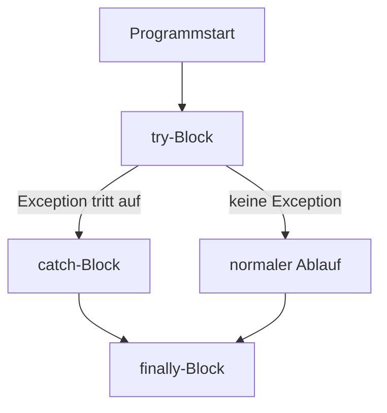
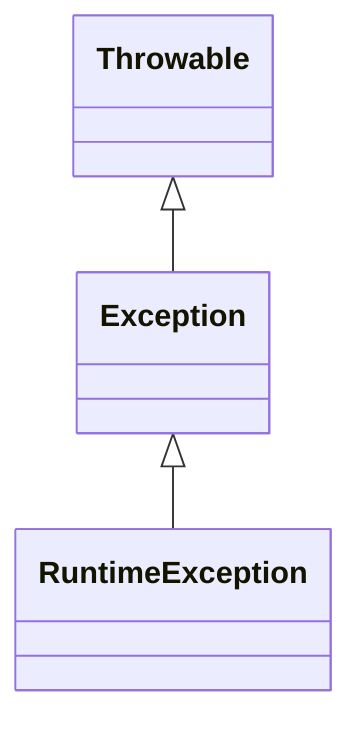

# Exception Handling – Fehlerbehandlung in Java

## Kurzüberblick

- **Exceptions** sind Fehler, die **zur Laufzeit (Runtime)** auftreten
- Trennung in:
  - **Checked Exceptions** → müssen behandelt oder deklariert werden
  - **Unchecked Exceptions (RuntimeExceptions)** → optional zu behandeln
- Behandlung über:
  - `try-catch`
  - `finally`
  - `throws` (Weitergabe)

---

## Core-Erklärung

### Grundprinzip

```java
try {
    // Code, der eine Exception auslösen kann
} catch (ExceptionType e) {
    // Behandlung der Exception
} finally {
    // wird immer ausgeführt (optional)
}
```

---

### Ablauf von Exception Handling



👉 Wichtig:
- `finally` wird **immer ausgeführt** (auch bei Fehlern)

---

### Beispiel

```java
public class Example {
    public static void main(String[] args) {
        try {
            int result = 10 / 0;
        } catch (ArithmeticException e) {
            System.out.println("Division durch 0 nicht erlaubt");
        } finally {
            System.out.println("Programm beendet");
        }
    }
}
```

---

## Arten von Exceptions

### 1. Checked Exceptions

- Müssen **behandelt oder deklariert** werden
- Werden vom Compiler überprüft

Beispiele:
- `IOException`
- `SQLException`

```java
public void readFile() throws IOException {
    // ...
}
```

---

### 2. Unchecked Exceptions (Runtime)

- Müssen **nicht behandelt werden**
- Treten durch Programmierfehler auf

Beispiele:
- `NullPointerException`
- `ArithmeticException`
- `ArrayIndexOutOfBoundsException`

---

### Hierarchie der Exceptions



👉 Alles erbt von `Throwable`

---

## Weitergabe von Exceptions (`throws`)

```java
public void method() throws IOException {
    throw new IOException("Fehler beim Lesen");
}
```

👉 Bedeutung:
- Methode behandelt Fehler **nicht selbst**
- Gibt ihn an den Aufrufer weiter

---

## Eigene Exceptions erstellen

```java
public class MyException extends Exception {
    public MyException(String message) {
        super(message);
    }
}
```

---

## Praktisches Beispiel

```java
public int divide(int a, int b) {
    if (b == 0) {
        throw new IllegalArgumentException("b darf nicht 0 sein");
    }
    return a / b;
}
```

👉 Vorteil:
- Fehler wird **gezielt kontrolliert ausgelöst**

---

## Exam-Relevanz

Typische Prüfungsfragen:

- Unterschied Checked vs. Unchecked
- Wann braucht man `throws`?
- Ablauf von `try-catch-finally`
- Was passiert ohne Exception Handling?

 Merksatz:
> Exceptions trennen **Fehlerlogik von Programmlogik**

---

## Häufige Fehler & Klarstellungen

### 1. Catch-all verwenden

```java
catch (Exception e)
```

⚠️ Problem:
- Zu allgemein → schwer debugbar

👉 Besser:
- Spezifische Exceptions fangen

---

### 2. Exception schlucken

```java
catch (Exception e) {
}
```

❌ Sehr schlecht:
- Fehler wird ignoriert

---

### 3. finally missverstehen

❌ Falsch:
- „Wird nur bei Fehler ausgeführt“

✔ Richtig:
- Wird **immer ausgeführt**

---

### 4. Checked Exceptions ignorieren

❌ Compilerfehler

👉 Lösung:
- `try-catch` oder `throws`

---

## Fazit

- Exception Handling sorgt für:
  - **robuste Programme**
  - **kontrollierte Fehlerbehandlung**
- Wichtige Konzepte:
  - `try-catch-finally`
  - Checked vs. Unchecked
  - `throw` vs. `throws`

👉 Gute Praxis:
- Fehler gezielt behandeln
- spezifische Exceptions verwenden
- keine Exceptions ignorieren