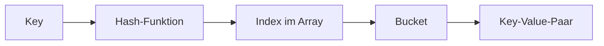
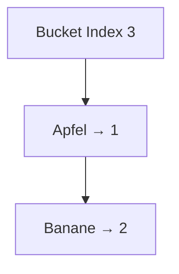

# HashMap – Schlüssel-Wert-Zugriff verstehen (hybrid: Struktur + Tiefe)

## Kurzüberblick

- `HashMap` ist eine **Datenstruktur für Schlüssel-Wert-Paare**
- Implementiert das **`Map`-Interface**
- **Schneller Zugriff** über Schlüssel (Ø **O(1)**)
- **Schlüssel eindeutig**, Werte dürfen doppelt sein
- Reihenfolge der Elemente ist **nicht garantiert**
- Nicht **thread-sicher**

👉 Kerngedanke:
> Zugriff erfolgt **nicht über Position (Array / List)**, sondern über eine **berechnete Adresse (Hashing)**

---

## Core-Erklärung

### Grundprinzip

```java
HashMap<String, Integer> map = new HashMap<>();

map.put("Apfel", 1);
map.put("Banane", 2);
```

- **Key (Schlüssel)**: eindeutig (`"Apfel"`)
- **Value (Wert)**: beliebig (`1`)

Zugriff:

```java
map.get("Apfel"); // → 1
```

👉 **Warum ist das schnell?**  
Weil nicht gesucht wird — der Speicherort wird **direkt berechnet**.

---

### Verhalten bei gleichen Schlüsseln

```java
map.put("Apfel", 3);
```

👉 Ergebnis:
- Alter Wert wird **überschrieben**

👉 **Warum?**  
Weil gleiche Schlüssel:
- gleichen `hashCode()` haben
- laut `equals()` identisch sind

➡️ Für die HashMap ist das **derselbe Eintrag**

---

### Interne Funktionsweise (vereinfacht)



1. Schlüssel wird durch **Hash-Funktion** verarbeitet  
2. Ergebnis bestimmt den **Index im internen Array**  
3. Dort wird der Wert gespeichert  

👉 **Wichtig (tieferes Verständnis):**
- HashMap = **Array + Hashfunktion + Kollisionsstrategie**
- Es ist **kein lineares Durchlaufen nötig**

---

### Warum ist Zugriff O(1)?

👉 Weil:

- der Index **direkt berechnet wird**
- kein Durchlaufen wie bei Array/List nötig ist

| Struktur       | Zugriff |
|----------------|--------|
| Array          | O(1) (Index bekannt) |
| ArrayList      | O(1) |
| LinkedList     | O(n) |
| HashMap        | O(1) (durch Hashing) |

⚠️ **Aber nur im Durchschnitt!**

---

### Kollisionen

👉 Problem:
Zwei Schlüssel → gleicher Index

👉 **Warum passiert das?**  
Weil viele mögliche Schlüssel auf wenige Array-Indizes abgebildet werden.

Lösung in Java:

- Speicherung im gleichen Bucket:
  - **Liste** (Linked List)
  - ab Java 8: ggf. **Baumstruktur (Red-Black Tree)**



👉 **Wichtige Konsequenz:**
- Mehr Kollisionen → mehr Vergleiche → langsamer Zugriff  
➡️ Worst Case: **O(n)**

---

### Wichtige Methoden

| Methode                  | Beschreibung                     |
|--------------------------|---------------------------------|
| `put(k, v)`              | Element hinzufügen/ersetzen     |
| `get(k)`                 | Wert abrufen                    |
| `remove(k)`              | Element löschen                 |
| `containsKey(k)`         | Schlüssel vorhanden?            |
| `containsValue(v)`       | Wert vorhanden?                 |
| `size()`                 | Anzahl der Einträge             |
| `isEmpty()`              | Map leer?                       |

---

### equals() und hashCode() (kritisch!)

👉 Regel:

```java
a.equals(b) == true
→ a.hashCode() == b.hashCode()
```

👉 **Warum wichtig?**

- HashMap nutzt `hashCode()` → um Bucket zu finden  
- nutzt `equals()` → um Eintrag im Bucket zu vergleichen  

❌ Fehler:
- falsche Implementierung → Elemente werden nicht gefunden

---

### Wichtige Eigenschaften

#### 1. Keine Reihenfolge

```java
for (String key : map.keySet()) {
    System.out.println(key);
}
```

👉 Reihenfolge ist **nicht definiert**

---

#### 2. null-Werte

- **1x null als Schlüssel erlaubt**
- Beliebig viele `null`-Werte erlaubt

---

#### 3. Performance

| Operation   | Durchschnitt | Erklärung |
|------------|-------------|----------|
| Zugriff     | O(1)        | direkter Indexzugriff |
| Einfügen    | O(1)        | kein Suchen nötig |
| Löschen     | O(1)        | Zugriff über Key |

⚠️ Worst Case: O(n) → bei vielen Kollisionen

---

### Thread-Sicherheit

- `HashMap` ist **nicht synchronisiert**

👉 Alternative:

```java
ConcurrentHashMap<String, Integer> map = new ConcurrentHashMap<>();
```

---

## Praktisches Beispiel

### Zählen von Wörtern

```java
HashMap<String, Integer> counter = new HashMap<>();

String word = "Apfel";

counter.put(word, counter.getOrDefault(word, 0) + 1);
```

👉 **Warum HashMap hier ideal ist:**

- direkter Zugriff auf Wort
- kein Durchlaufen wie bei List nötig
- sehr effizient bei großen Datenmengen

---

## Konkrete Anwendungsfälle (wann HashMap sinnvoller ist)

### 1. Benutzer anhand einer ID finden

```java
HashMap<Integer, User> usersById = new HashMap<>();

usersById.put(1001, user);

User user = usersById.get(1001);
```

👉 Vorteil:
- direkter Zugriff über ID  
- keine lineare Suche wie bei List

---

### 2. Wörter zählen (Frequenzanalyse)

```java
HashMap<String, Integer> wordCount = new HashMap<>();

wordCount.put(word, wordCount.getOrDefault(word, 0) + 1);
```

👉 Typisch für:
- Textanalyse
- Logs
- Statistiken

---

### 3. Produktpreis über Artikelnummer finden

```java
HashMap<String, Double> prices = new HashMap<>();

prices.put("A-123", 19.99);

double price = prices.get("A-123");
```

👉 Vorteil:
- Artikelnummer = perfekter Schlüssel

---

### 4. Login-Daten verwalten

```java
HashMap<String, String> passwordsByUsername = new HashMap<>();

passwordsByUsername.put("sean", "hashedPassword");
```

👉 Vorteil:
- schneller Zugriff über Username

---

### 5. Caching (Zwischenspeichern)

```java
HashMap<String, Result> cache = new HashMap<>();

cache.put("customer:42", result);
```

👉 Vorteil:
- teure Berechnungen vermeiden
- Wiederverwendung von Ergebnissen

---

### 6. Konfiguration / Einstellungen

```java
HashMap<String, String> config = new HashMap<>();

config.put("theme", "dark");
config.put("language", "de");
```

👉 Vorteil:
- flexible Key-Value-Struktur

---

👉 **Gemeinsames Muster:**
> Immer wenn du sagst:  
> „Ich will **X über einen eindeutigen Schlüssel schnell finden**“ → HashMap

---

## Denkmuster (entscheidend für Verständnis)

### Wann nutze ich Array / List vs HashMap?

| Situation                          | Struktur |
|----------------------------------|----------|
| Reihenfolge wichtig               | Array / List |
| Zugriff über Position             | Array / List |
| Suche nach bestimmtem Wert        | HashMap |
| Schlüssel-basierter Zugriff       | HashMap |
| Zählen / Mapping / Lookup         | HashMap |

👉 **Merksatz:**
- Array / List → *„Wo ist das Element?“*  
- HashMap → *„Welcher Wert gehört zu diesem Schlüssel?“*

---

## Exam-Relevanz (typische Fragen + direkte Antworten)

### 1. Unterschied Array / List vs HashMap

👉 Antwort:
- Array / List → Zugriff über Index (Position)
- HashMap → Zugriff über Schlüssel (Hashing)
- HashMap schneller bei Suche nach Schlüssel

---

### 2. Warum ist HashMap schnell?

👉 Antwort:
- Hashfunktion berechnet direkt den Index
- kein lineares Durchlaufen nötig

---

### 3. Was passiert bei Kollisionen?

👉 Antwort:
- mehrere Elemente im gleichen Bucket
- Speicherung als Liste oder Baum
- Zugriff wird langsamer

---

### 4. Warum müssen Schlüssel eindeutig sein?

👉 Antwort:
- Schlüssel bestimmt Speicherort
- gleiche Schlüssel → gleicher Eintrag → Überschreiben

---

### 5. Warum müssen equals() und hashCode() zusammenpassen?

👉 Antwort:
- sonst falsche Bucket-Zuordnung
- Elemente können „verloren gehen“

---

### 6. Wann verwendet man HashMap?

👉 Antwort:
- Caching
- Frequenzzählung
- Lookup-Tabellen
- Zuordnungen (Key → Value)

---

## Häufige Fehler & Klarstellungen

### 1. „HashMap ist immer O(1)“

❌ Falsch  
👉 Nur im Durchschnitt

---

### 2. Reihenfolge erwarten

❌ Falsch  
👉 Keine definierte Reihenfolge

---

### 3. Eigene Objekte als Key ohne hashCode()

```java
class User {
    String name;
}
```

❌ Problem:
- basiert auf Speicheradresse

👉 Lösung:
- `equals()` + `hashCode()` implementieren

---

### 4. Multithreading ignorieren

❌ Problem:
- Race Conditions

👉 Lösung:
- `ConcurrentHashMap`

---

### 5. HashMap vs LinkedHashMap vs TreeMap

| Struktur        | Besonderheit |
|----------------|-------------|
| HashMap        | schnell, keine Ordnung |
| LinkedHashMap  | Einfügereihenfolge |
| TreeMap        | sortiert (log n) |

---

## Fazit

- `HashMap` ist eine der **wichtigsten Datenstrukturen in Java**
- Sie ist **keine Erweiterung von Array/List**, sondern ein anderes Konzept
- Basis ist:
  - Hashfunktion
  - Array
  - Kollisionsbehandlung

👉 Zentrale Idee für Prüfung:
> **HashMap = schneller Zugriff über Schlüssel durch berechneten Index**---
title: 'HashMap (Java)'
date: 2026-04-22
weekday: 'Mittwoch'
subject: 'Programmiertechnik'
instructor: 'SELBSTSTUDIUM'
program: 'FIAE Umschulung 2025-2027'
module: 'Datenstrukturen'
topic: 'Map-Implementierungen'
level: 'Grundlagen'
tags:
  - java
  - datenstrukturen
  - hashmap
  - collections
author: 'Sean Matthew Conroy'
license: 'CC BY-NC-SA 4.0'
---

# HashMap – Schlüssel-Wert-Zugriff verstehen (hybrid: Struktur + Tiefe)

## Kurzüberblick

- `HashMap` ist eine **Datenstruktur für Schlüssel-Wert-Paare**
- Implementiert das **`Map`-Interface**
- **Schneller Zugriff** über Schlüssel (Ø **O(1)**)
- **Schlüssel eindeutig**, Werte dürfen doppelt sein
- Reihenfolge der Elemente ist **nicht garantiert**
- Nicht **thread-sicher**

👉 Kerngedanke:
> Zugriff erfolgt **nicht über Position (Array / List)**, sondern über eine **berechnete Adresse (Hashing)**

---

## Core-Erklärung

### Grundprinzip

```java
HashMap<String, Integer> map = new HashMap<>();

map.put("Apfel", 1);
map.put("Banane", 2);
```

- **Key (Schlüssel)**: eindeutig (`"Apfel"`)
- **Value (Wert)**: beliebig (`1`)

Zugriff:

```java
map.get("Apfel"); // → 1
```

👉 **Warum ist das schnell?**  
Weil nicht gesucht wird — der Speicherort wird **direkt berechnet**.

---

### Verhalten bei gleichen Schlüsseln

```java
map.put("Apfel", 3);
```

👉 Ergebnis:
- Alter Wert wird **überschrieben**

👉 **Warum?**  
Weil gleiche Schlüssel:
- gleichen `hashCode()` haben
- laut `equals()` identisch sind

➡️ Für die HashMap ist das **derselbe Eintrag**

---

### Interne Funktionsweise (vereinfacht)


1. Schlüssel wird durch **Hash-Funktion** verarbeitet  
2. Ergebnis bestimmt den **Index im internen Array**  
3. Dort wird der Wert gespeichert  

👉 **Wichtig (tieferes Verständnis):**
- HashMap = **Array + Hashfunktion + Kollisionsstrategie**
- Es ist **kein lineares Durchlaufen nötig**

---

### Warum ist Zugriff O(1)?

👉 Weil:

- der Index **direkt berechnet wird**
- kein Durchlaufen wie bei Array/List nötig ist

| Struktur       | Zugriff |
|----------------|--------|
| Array          | O(1) (Index bekannt) |
| ArrayList      | O(1) |
| LinkedList     | O(n) |
| HashMap        | O(1) (durch Hashing) |

⚠️ **Aber nur im Durchschnitt!**

---

### Kollisionen

👉 Problem:
Zwei Schlüssel → gleicher Index

👉 **Warum passiert das?**  
Weil viele mögliche Schlüssel auf wenige Array-Indizes abgebildet werden.

Lösung in Java:

- Speicherung im gleichen Bucket:
  - **Liste** (Linked List)
  - ab Java 8: ggf. **Baumstruktur (Red-Black Tree)**


👉 **Wichtige Konsequenz:**
- Mehr Kollisionen → mehr Vergleiche → langsamer Zugriff  
➡️ Worst Case: **O(n)**

---

### Wichtige Methoden

| Methode                  | Beschreibung                     |
|--------------------------|---------------------------------|
| `put(k, v)`              | Element hinzufügen/ersetzen     |
| `get(k)`                 | Wert abrufen                    |
| `remove(k)`              | Element löschen                 |
| `containsKey(k)`         | Schlüssel vorhanden?            |
| `containsValue(v)`       | Wert vorhanden?                 |
| `size()`                 | Anzahl der Einträge             |
| `isEmpty()`              | Map leer?                       |

---

### equals() und hashCode() (kritisch!)

👉 Regel:

```java
a.equals(b) == true
→ a.hashCode() == b.hashCode()
```

👉 **Warum wichtig?**

- HashMap nutzt `hashCode()` → um Bucket zu finden  
- nutzt `equals()` → um Eintrag im Bucket zu vergleichen  

❌ Fehler:
- falsche Implementierung → Elemente werden nicht gefunden

---

### Wichtige Eigenschaften

#### 1. Keine Reihenfolge

```java
for (String key : map.keySet()) {
    System.out.println(key);
}
```

👉 Reihenfolge ist **nicht definiert**

---

#### 2. null-Werte

- **1x null als Schlüssel erlaubt**
- Beliebig viele `null`-Werte erlaubt

---

#### 3. Performance

| Operation   | Durchschnitt | Erklärung |
|------------|-------------|----------|
| Zugriff     | O(1)        | direkter Indexzugriff |
| Einfügen    | O(1)        | kein Suchen nötig |
| Löschen     | O(1)        | Zugriff über Key |

⚠️ Worst Case: O(n) → bei vielen Kollisionen

---

### Thread-Sicherheit

- `HashMap` ist **nicht synchronisiert**

👉 Alternative:

```java
ConcurrentHashMap<String, Integer> map = new ConcurrentHashMap<>();
```

---

## Praktisches Beispiel

### Zählen von Wörtern

```java
HashMap<String, Integer> counter = new HashMap<>();

String word = "Apfel";

counter.put(word, counter.getOrDefault(word, 0) + 1);
```

👉 **Warum HashMap hier ideal ist:**

- direkter Zugriff auf Wort
- kein Durchlaufen wie bei List nötig
- sehr effizient bei großen Datenmengen

---

## Denkmuster (entscheidend für Verständnis)

### Wann nutze ich Array / List vs HashMap?

| Situation                          | Struktur |
|----------------------------------|----------|
| Reihenfolge wichtig               | Array / List |
| Zugriff über Position             | Array / List |
| Suche nach bestimmtem Wert        | HashMap |
| Schlüssel-basierter Zugriff       | HashMap |
| Zählen / Mapping / Lookup         | HashMap |

👉 **Merksatz:**
- Array / List → *„Wo ist das Element?“*  
- HashMap → *„Welcher Wert gehört zu diesem Schlüssel?“*

---

## Exam-Relevanz (typische Fragen + direkte Antworten)

### 1. Unterschied Array / List vs HashMap

👉 Antwort:
- Array / List → Zugriff über Index (Position)
- HashMap → Zugriff über Schlüssel (Hashing)
- HashMap schneller bei Suche nach Schlüssel

---

### 2. Warum ist HashMap schnell?

👉 Antwort:
- Hashfunktion berechnet direkt den Index
- kein lineares Durchlaufen nötig

---

### 3. Was passiert bei Kollisionen?

👉 Antwort:
- mehrere Elemente im gleichen Bucket
- Speicherung als Liste oder Baum
- Zugriff wird langsamer

---

### 4. Warum müssen Schlüssel eindeutig sein?

👉 Antwort:
- Schlüssel bestimmt Speicherort
- gleiche Schlüssel → gleicher Eintrag → Überschreiben

---

### 5. Warum müssen equals() und hashCode() zusammenpassen?

👉 Antwort:
- sonst falsche Bucket-Zuordnung
- Elemente können „verloren gehen“

---

### 6. Wann verwendet man HashMap?

👉 Antwort:
- Caching
- Frequenzzählung
- Lookup-Tabellen
- Zuordnungen (Key → Value)

---

## Häufige Fehler & Klarstellungen

### 1. „HashMap ist immer O(1)“

❌ Falsch  
👉 Nur im Durchschnitt

---

### 2. Reihenfolge erwarten

❌ Falsch  
👉 Keine definierte Reihenfolge

---

### 3. Eigene Objekte als Key ohne hashCode()

```java
class User {
    String name;
}
```

❌ Problem:
- basiert auf Speicheradresse

👉 Lösung:
- `equals()` + `hashCode()` implementieren

---

### 4. Multithreading ignorieren

❌ Problem:
- Race Conditions

👉 Lösung:
- `ConcurrentHashMap`

---

### 5. HashMap vs LinkedHashMap vs TreeMap

| Struktur        | Besonderheit |
|----------------|-------------|
| HashMap        | schnell, keine Ordnung |
| LinkedHashMap  | Einfügereihenfolge |
| TreeMap        | sortiert (log n) |

---

## Fazit

- `HashMap` ist eine der **wichtigsten Datenstrukturen in Java**
- Sie ist **keine Erweiterung von Array/List**, sondern ein anderes Konzept
- Basis ist:
  - Hashfunktion
  - Array
  - Kollisionsbehandlung

👉 Zentrale Idee für Prüfung:
> **HashMap = schneller Zugriff über Schlüssel durch berechneten Index**

---
