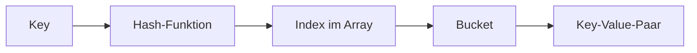

# HashMap – Schlüssel-Wert-Paare in Java

## Kurzüberblick

- `HashMap` ist eine **Datenstruktur für Schlüssel-Wert-Paare**
- Implementiert das **`Map`-Interface**
- **Schneller Zugriff** über Schlüssel (Ø **O(1)**)
- **Schlüssel eindeutig**, Werte dürfen doppelt sein
- Reihenfolge der Elemente ist **nicht garantiert**
- Nicht **thread-sicher**

---

## Core-Erklärung

### Grundprinzip

Eine `HashMap` speichert Daten als Paare:

```java
HashMap<String, Integer> map = new HashMap<>();

map.put("Apfel", 1);
map.put("Banane", 2);
```

- **Key (Schlüssel)**: eindeutig (`"Apfel"`)
- **Value (Wert)**: beliebig (`1`)

Zugriff:

```java
map.get("Apfel"); // → 1
```

---

### Verhalten bei gleichen Schlüsseln

```java
map.put("Apfel", 3);
```

👉 Ergebnis:
- Alter Wert wird **überschrieben**
- Kein doppelter Schlüssel möglich

---

### Interne Funktionsweise (vereinfacht)



1. Schlüssel wird durch **Hash-Funktion** verarbeitet
2. Ergebnis bestimmt den **Index im Array**
3. Dort wird der Wert gespeichert

---

### Kollisionen

👉 Problem:
Zwei Schlüssel → gleicher Index

Lösung in Java:

- Speicherung im gleichen Bucket:
  - **Liste** (Linked List)
  - ab Java 8: ggf. **Baumstruktur (Tree)**

---

### Wichtige Methoden

| Methode                  | Beschreibung                     |
|--------------------------|---------------------------------|
| `put(k, v)`              | Element hinzufügen/ersetzen     |
| `get(k)`                 | Wert abrufen                    |
| `remove(k)`              | Element löschen                 |
| `containsKey(k)`         | Schlüssel vorhanden?            |
| `containsValue(v)`       | Wert vorhanden?                 |
| `size()`                 | Anzahl der Einträge             |
| `isEmpty()`              | Map leer?                       |

---

### Beispiel

```java
HashMap<String, Integer> stock = new HashMap<>();

stock.put("Apfel", 10);
stock.put("Banane", 5);

if (stock.containsKey("Apfel")) {
    System.out.println(stock.get("Apfel"));
}
```

---

### Wichtige Eigenschaften

#### 1. Keine Reihenfolge

```java
for (String key : map.keySet()) {
    System.out.println(key);
}
```

👉 Reihenfolge ist **nicht vorhersehbar**

---

#### 2. null-Werte

- **1x null als Schlüssel erlaubt**
- Beliebig viele `null`-Werte erlaubt

---

#### 3. Performance

| Operation   | Durchschnitt |
|------------|-------------|
| Zugriff     | O(1)        |
| Einfügen    | O(1)        |
| Löschen     | O(1)        |

⚠️ Im Worst Case: O(n)

---

### Thread-Sicherheit

- `HashMap` ist **nicht synchronisiert**

👉 Alternative:

```java
ConcurrentHashMap<String, Integer> map = new ConcurrentHashMap<>();
```

---

## Praktisches Beispiel

### Zählen von Wörtern

```java
HashMap<String, Integer> counter = new HashMap<>();

String word = "Apfel";

counter.put(word, counter.getOrDefault(word, 0) + 1);
```

👉 Typischer Einsatz:
- Statistik
- Frequenzzählung
- Caching

---

## Exam-Relevanz

Typische Prüfungsfragen:

- Unterschied `HashMap` vs. `ArrayList`
- Warum sind Schlüssel eindeutig?
- Wie funktioniert Hashing?
- Was passiert bei Kollisionen?
- Ist `HashMap` thread-sicher?

 Merksatz:
> `HashMap` = schneller Zugriff über Schlüssel dank Hashing

---

## Häufige Fehler & Klarstellungen

### 1. Reihenfolge erwarten

❌ Falsch  
→ Keine garantierte Reihenfolge

👉 Alternative:
- `LinkedHashMap` (Einfügereihenfolge)
- `TreeMap` (sortiert)

---

### 2. Gleichheit von Schlüsseln

👉 Wichtig:
- basiert auf `equals()` und `hashCode()`

❌ Fehler:
- eigene Objekte ohne korrekte Implementierung

---

### 3. Null-Verhalten missverstehen

✔ erlaubt:
- 1x `null` Key
- mehrere `null` Values

---

### 4. Multithreading ignorieren

❌ Problem:
- Race Conditions

👉 Lösung:
- `ConcurrentHashMap`

---

## Fazit

- `HashMap` ist eine der **wichtigsten Datenstrukturen in Java**
- Optimal für:
  - schnelle Suchen
  - Schlüssel-basierte Daten
- Voraussetzung für korrektes Verhalten:
  - sauber implementierte `hashCode()` und `equals()`

👉 Gute Praxis:
- bewusst wählen zwischen:
  - `HashMap`
  - `LinkedHashMap`
  - `TreeMap`