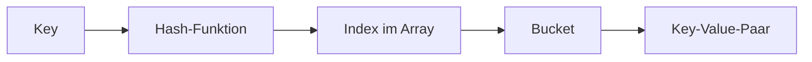

# HashMap - Schluessel-Wert-Paare in Java

## Kurzueberblick

- `HashMap` ist eine Datenstruktur fuer Schluessel-Wert-Paare
- Sie implementiert das `Map`-Interface
- Zugriff ueber Schluessel ist im Durchschnitt `O(1)`
- Schluessel sind eindeutig, Werte duerfen mehrfach vorkommen
- Die Reihenfolge der Eintraege ist nicht garantiert
- `HashMap` ist nicht thread-sicher

---

## Core-Erklaerung

### Grundprinzip

```java
HashMap<String, Integer> map = new HashMap<>();

map.put("Apfel", 1);
map.put("Banane", 2);
```

- Key (Schluessel): eindeutig, z. B. `"Apfel"`
- Value (Wert): beliebig, z. B. `1`

Zugriff:

```java
map.get("Apfel"); // 1
```

### Verhalten bei gleichen Schluesseln

```java
map.put("Apfel", 3);
```

Ergebnis:
- Der vorhandene Wert wird ueberschrieben
- Es entsteht kein zweiter Eintrag mit demselben Schluessel

### Interne Funktionsweise (vereinfacht)



1. Der Schluessel wird durch die Hash-Funktion verarbeitet
2. Daraus entsteht ein Index im internen Array
3. Im passenden Bucket wird der Eintrag gespeichert

### Kollisionen

Eine Kollision tritt auf, wenn zwei unterschiedliche Schluessel auf denselben Index abgebildet werden.

Loesung in Java:
- Speicherung im gleichen Bucket als Liste
- Ab Java 8 bei groesseren Buckets ggf. Baumstruktur

Folge:
- Durchschnittlich bleibt der Zugriff schnell
- Im unguenstigen Fall kann die Laufzeit auf `O(n)` ansteigen

### Wichtige Methoden

| Methode | Beschreibung |
|---|---|
| `put(k, v)` | Hinzufuegen oder Ersetzen |
| `get(k)` | Wert lesen |
| `remove(k)` | Eintrag loeschen |
| `containsKey(k)` | Schluessel vorhanden? |
| `containsValue(v)` | Wert vorhanden? |
| `size()` | Anzahl der Eintraege |
| `isEmpty()` | Map leer? |

### equals() und hashCode()

Fuer eigene Objekttypen als Schluessel gilt:

```java
a.equals(b) == true
-> a.hashCode() == b.hashCode()
```

HashMap nutzt `hashCode()` fuer die Bucket-Auswahl und `equals()` fuer den finalen Vergleich.

### Wichtige Eigenschaften

#### 1. Keine Reihenfolge

```java
for (String key : map.keySet()) {
    System.out.println(key);
}
```

Die Ausgabereihenfolge ist nicht vorhersehbar.

#### 2. Null-Werte

- Ein `null`-Schluessel ist erlaubt
- Mehrere `null`-Werte sind erlaubt

#### 3. Performance

| Operation | Durchschnitt |
|---|---|
| Zugriff | O(1) |
| Einfuegen | O(1) |
| Loeschen | O(1) |

Im Worst Case: `O(n)`

### Thread-Sicherheit

`HashMap` ist nicht synchronisiert.

Alternative fuer parallelen Zugriff:

```java
ConcurrentHashMap<String, Integer> map = new ConcurrentHashMap<>();
```

---

## Praktisches Beispiel

### Woerter zaehlen

```java
HashMap<String, Integer> counter = new HashMap<>();

String word = "Apfel";
counter.put(word, counter.getOrDefault(word, 0) + 1);
```

Typische Einsaetze:
- Statistik
- Frequenzzaehlung
- Caching

---

## Anleitung: Erste Schritte mit HashMap

### Schritt 1: Erstellen und fuellen

```java
HashMap<String, String> telefonbuch = new HashMap<>();

telefonbuch.put("Alice", "0123-456789");
telefonbuch.put("Bob", "0987-654321");
telefonbuch.put("Charlie", "0555-111222");

System.out.println("Eintraege: " + telefonbuch.size());
```

### Schritt 2: Werte abrufen

```java
String nummer = telefonbuch.get("Alice");
System.out.println("Alice: " + nummer);

if (telefonbuch.containsKey("Diana")) {
    System.out.println(telefonbuch.get("Diana"));
} else {
    System.out.println("Diana nicht im Telefonbuch");
}

String nummer2 = telefonbuch.getOrDefault("Eve", "Nicht vorhanden");
System.out.println(nummer2);
```

### Schritt 3: Iteration

Nur Schluessel:

```java
for (String name : telefonbuch.keySet()) {
    System.out.println(name);
}
```

Nur Werte:

```java
for (String n : telefonbuch.values()) {
    System.out.println(n);
}
```

Schluessel und Wert:

```java
for (Map.Entry<String, String> entry : telefonbuch.entrySet()) {
    System.out.println(entry.getKey() + ": " + entry.getValue());
}
```

### Schritt 4: Aendern und loeschen

```java
telefonbuch.put("Alice", "0111-999888");
telefonbuch.remove("Bob");
telefonbuch.clear();
```

---

## Anwendungsbeispiele

### Telefonbuch

```java
HashMap<String, String> kontakte = new HashMap<>();
kontakte.put("Mutter", "+49-123-456");
kontakte.put("Freund", "+49-987-654");

System.out.println(kontakte.get("Mutter"));
```

### Benotung (Name -> Note)

```java
HashMap<String, Integer> noten = new HashMap<>();
noten.put("Alice", 1);
noten.put("Bob", 2);
noten.put("Charlie", 1);

int beste = Collections.min(noten.values());
System.out.println("Beste Note: " + beste);
```

### Warenkorb (Artikel -> Menge)

```java
HashMap<String, Integer> warenkorb = new HashMap<>();
warenkorb.put("Apfel", 3);
warenkorb.put("Banane", 5);

warenkorb.put("Apfel", warenkorb.get("Apfel") + 1);
warenkorb.put("Orange", warenkorb.getOrDefault("Orange", 0) + 2);
```

### Haeufigkeitszaehler (Wort -> Anzahl)

```java
HashMap<String, Integer> wortCounter = new HashMap<>();
String[] worte = {"Hallo", "Welt", "Hallo", "Java"};

for (String wort : worte) {
    wortCounter.put(wort, wortCounter.getOrDefault(wort, 0) + 1);
}
```

---

## Haeufige Anfaengerfehler

| Fehler | Problem | Loesung |
|---|---|---|
| `map.get("key")` ohne Null-Handling | Rueckgabe kann `null` sein | `getOrDefault()` nutzen |
| Eigene Key-Klasse ohne `hashCode()`/`equals()` | Eintraege werden nicht korrekt gefunden | Beide Methoden sauber ueberschreiben |
| Reihenfolge erwarten | HashMap garantiert keine Sortierung | Bei Bedarf `LinkedHashMap` oder `TreeMap` |
| Gleichzeitiger Zugriff aus mehreren Threads | Race Conditions | `ConcurrentHashMap` verwenden |

---

## Praktische Uebung: Schueler-Klassen-Verwaltung

```java
public static void main(String[] args) {
    HashMap<String, String> schueler = new HashMap<>();
    schueler.put("Alice", "10a");
    schueler.put("Bob", "10b");
    schueler.put("Charlie", "10a");

    System.out.println("Schueler in Klasse 10a:");
    for (Map.Entry<String, String> entry : schueler.entrySet()) {
        if (entry.getValue().equals("10a")) {
            System.out.println(entry.getKey());
        }
    }

    schueler.put("Bob", "10a");

    System.out.println("\nAlle Schueler:");
    for (Map.Entry<String, String> entry : schueler.entrySet()) {
        System.out.println(entry.getKey() + " -> " + entry.getValue());
    }
}
```

---

## Exam-Relevanz

Typische Pruefungsfragen:

- Unterschied `HashMap` vs. `ArrayList`
- Warum sind Schluessel eindeutig?
- Wie funktioniert Hashing?
- Was passiert bei Kollisionen?
- Ist `HashMap` thread-sicher?

---

## Fazit

`HashMap` ist eine zentrale Datenstruktur fuer schnelle, schluesselbasierte Zugriffe.
Sie ist besonders geeignet fuer Lookup-Tabellen, Zuordnungen und Frequenzzaehlungen.
Fuer robuste Nutzung mit eigenen Key-Typen muessen `equals()` und `hashCode()` konsistent implementiert sein.
