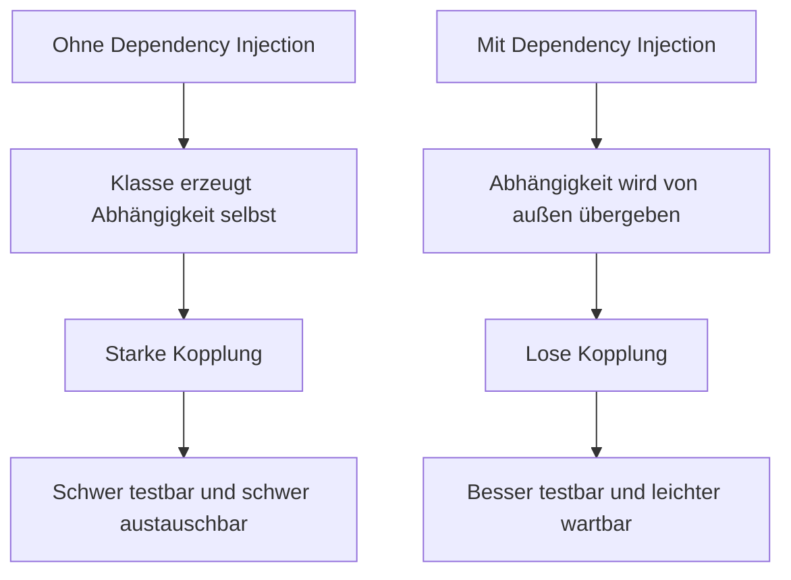
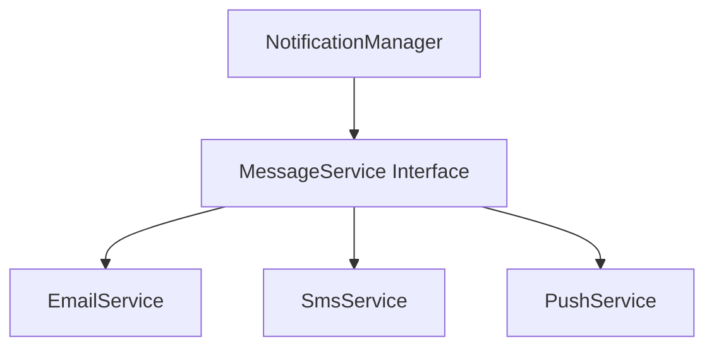
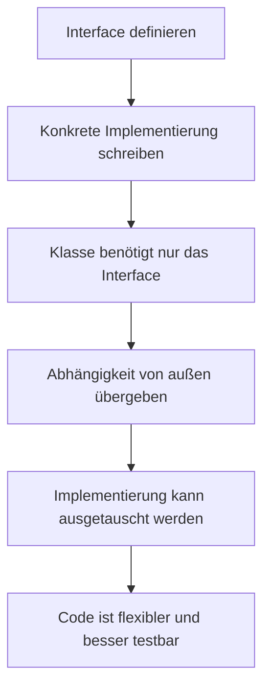

# Dependency Injection in Java

## Kurzüberblick / Definition

**Dependency Injection** bedeutet auf Deutsch **Abhängigkeitsinjektion**. Es handelt sich um ein Entwurfsprinzip beziehungsweise Design Pattern, bei dem ein Objekt seine benötigten Abhängigkeiten nicht selbst erzeugt, sondern von außen bereitgestellt bekommt.

Eine **Abhängigkeit** ist dabei ein anderes Objekt oder eine Komponente, die eine Klasse benötigt, um ihre Aufgabe zu erfüllen.

Beispiel:

Eine Klasse `OrderService` benötigt möglicherweise ein Objekt `PaymentService`, um Zahlungen auszuführen. Dann ist `PaymentService` eine Abhängigkeit von `OrderService`.

Ohne Dependency Injection erstellt `OrderService` seine Abhängigkeit selbst:

```java
public class OrderService {
    private PaymentService paymentService = new PaymentService();
}
```

Mit Dependency Injection wird die Abhängigkeit von außen übergeben:

```java
public class OrderService {
    private final PaymentService paymentService;

    public OrderService(PaymentService paymentService) {
        this.paymentService = paymentService;
    }
}
```

Das Ziel von Dependency Injection ist es, Klassen voneinander zu entkoppeln. Dadurch wird der Code flexibler, leichter testbar und besser wartbar.

---

## Kernerklärung

### Grundproblem: Feste Kopplung zwischen Klassen

In objektorientierten Programmen arbeiten Klassen häufig mit anderen Klassen zusammen.

Beispiel:

```java
public class ReportService {
    private PdfGenerator pdfGenerator = new PdfGenerator();

    public void createReport() {
        pdfGenerator.generate();
    }
}
```

Hier erzeugt `ReportService` selbst ein Objekt der Klasse `PdfGenerator`.

Das wirkt zunächst einfach, führt aber zu Problemen:

| Problem | Erklärung |
|---|---|
| Starke Kopplung | `ReportService` ist fest an `PdfGenerator` gebunden |
| Schlechte Austauschbarkeit | Ein anderer Generator, zum Beispiel `HtmlGenerator`, kann nur schwer verwendet werden |
| Schwierige Tests | Im Test kann kein einfaches Testobjekt eingesetzt werden |
| Weniger Flexibilität | Änderungen an Abhängigkeiten betreffen direkt die Klasse |

Die Klasse entscheidet also selbst, **welche konkrete Implementierung** sie verwendet. Dadurch entsteht eine enge Verbindung zwischen den Klassen.

---

## Grundidee von Dependency Injection

Bei Dependency Injection erstellt eine Klasse ihre Abhängigkeiten nicht selbst. Stattdessen bekommt sie diese von außen übergeben.

Die Klasse sagt nur:

> Ich brauche eine bestimmte Fähigkeit.

Sie entscheidet aber nicht selbst:

> Ich erzeuge mir genau diese konkrete Klasse.

Dadurch wird der Code flexibler.

Beispiel mit Interface:

```java
public interface ReportGenerator {
    void generate();
}
```

Konkrete Implementierung:

```java
public class PdfGenerator implements ReportGenerator {
    @Override
    public void generate() {
        System.out.println("PDF-Bericht wird erzeugt.");
    }
}
```

Verwendende Klasse:

```java
public class ReportService {
    private final ReportGenerator reportGenerator;

    public ReportService(ReportGenerator reportGenerator) {
        this.reportGenerator = reportGenerator;
    }

    public void createReport() {
        reportGenerator.generate();
    }
}
```

Die Klasse `ReportService` kennt nur das Interface `ReportGenerator`, aber nicht zwingend die konkrete Klasse `PdfGenerator`.

---

## Abhängigkeit ohne und mit Dependency Injection



---

## Arten der Dependency Injection

In Java gibt es mehrere typische Formen von Dependency Injection.

### 1. Konstruktorinjektion

Bei der **Konstruktorinjektion** werden Abhängigkeiten über den Konstruktor übergeben.

```java
public class UserService {
    private final UserRepository userRepository;

    public UserService(UserRepository userRepository) {
        this.userRepository = userRepository;
    }
}
```

Vorteile:

- Abhängigkeiten sind beim Erzeugen des Objekts sofort vorhanden.
- Pflichtabhängigkeiten sind klar sichtbar.
- Felder können `final` sein.
- Die Klasse kann nicht versehentlich ohne notwendige Abhängigkeiten verwendet werden.
- Sehr gut für Tests geeignet.

Konstruktorinjektion ist in vielen Fällen die bevorzugte Variante.

---

### 2. Setter-Injektion

Bei der **Setter-Injektion** werden Abhängigkeiten über Setter-Methoden gesetzt.

```java
public class UserService {
    private UserRepository userRepository;

    public void setUserRepository(UserRepository userRepository) {
        this.userRepository = userRepository;
    }
}
```

Vorteile:

- Abhängigkeiten können nachträglich gesetzt oder geändert werden.
- Geeignet für optionale Abhängigkeiten.
- Flexible Konfiguration möglich.

Nachteile:

- Das Objekt kann zeitweise unvollständig sein.
- Wenn der Setter nicht aufgerufen wird, kann es zu Fehlern kommen.
- Pflichtabhängigkeiten sind weniger klar erkennbar.

Setter-Injektion eignet sich eher für optionale oder austauschbare Abhängigkeiten.

---

### 3. Interface-Injektion

Bei der **Interface-Injektion** definiert ein Interface eine Methode, über die eine Abhängigkeit gesetzt wird.

```java
public interface UserRepositoryAware {
    void setUserRepository(UserRepository userRepository);
}
```

Eine Klasse implementiert dieses Interface:

```java
public class UserService implements UserRepositoryAware {
    private UserRepository userRepository;

    @Override
    public void setUserRepository(UserRepository userRepository) {
        this.userRepository = userRepository;
    }
}
```

Diese Variante ist in modernen Java-Anwendungen seltener als Konstruktor- oder Setter-Injektion.

---

## Vergleich der Injektionsarten

| Art | Übergabe über | Typischer Einsatz | Bewertung |
|---|---|---|---|
| Konstruktorinjektion | Konstruktor | Pflichtabhängigkeiten | Meist bevorzugt |
| Setter-Injektion | Setter-Methode | Optionale Abhängigkeiten | Flexibel, aber fehleranfälliger |
| Interface-Injektion | Methode aus Interface | Spezielle Framework- oder Architekturvorgaben | Seltener verwendet |

---

## Praktisches Beispiel ohne Dependency Injection

Angenommen, eine Anwendung soll Benachrichtigungen versenden.

```java
public class EmailService {
    public void sendMessage(String message) {
        System.out.println("E-Mail gesendet: " + message);
    }
}
```

Eine Klasse `NotificationManager` verwendet diesen Dienst:

```java
public class NotificationManager {
    private EmailService emailService = new EmailService();

    public void notifyUser(String message) {
        emailService.sendMessage(message);
    }
}
```

Problem:

`NotificationManager` ist fest an `EmailService` gebunden. Wenn später statt einer E-Mail eine SMS oder Push-Nachricht versendet werden soll, muss die Klasse geändert werden.

---

## Praktisches Beispiel mit Dependency Injection

Zuerst wird ein Interface definiert:

```java
public interface MessageService {
    void sendMessage(String message);
}
```

Dann wird eine konkrete Implementierung erstellt:

```java
public class EmailService implements MessageService {
    @Override
    public void sendMessage(String message) {
        System.out.println("E-Mail gesendet: " + message);
    }
}
```

Eine weitere Implementierung wäre ebenfalls möglich:

```java
public class SmsService implements MessageService {
    @Override
    public void sendMessage(String message) {
        System.out.println("SMS gesendet: " + message);
    }
}
```

Der `NotificationManager` hängt nun nur noch vom Interface ab:

```java
public class NotificationManager {
    private final MessageService messageService;

    public NotificationManager(MessageService messageService) {
        this.messageService = messageService;
    }

    public void notifyUser(String message) {
        messageService.sendMessage(message);
    }
}
```

Verwendung:

```java
public class Main {
    public static void main(String[] args) {
        MessageService emailService = new EmailService();
        NotificationManager manager = new NotificationManager(emailService);

        manager.notifyUser("Willkommen!");
    }
}
```

Jetzt kann die Implementierung leicht ausgetauscht werden:

```java
MessageService smsService = new SmsService();
NotificationManager manager = new NotificationManager(smsService);

manager.notifyUser("Ihr Code lautet 123456.");
```

Der `NotificationManager` musste dafür nicht verändert werden.

---

## Zusammenhang mit Interfaces

Dependency Injection wird häufig zusammen mit Interfaces verwendet.

Das Interface beschreibt, **was** eine Komponente können muss. Die konkrete Klasse beschreibt, **wie** sie es tut.



Vorteil:

Die verwendende Klasse hängt nicht mehr von einer konkreten Implementierung ab, sondern nur von einer abstrakten Schnittstelle.

Das entspricht dem Prinzip:

> Programmiere gegen Abstraktionen, nicht gegen konkrete Implementierungen.

---

## Vorteile von Dependency Injection

### Geringere Kopplung

Klassen sind weniger stark voneinander abhängig.

Ohne Dependency Injection:

```java
private EmailService emailService = new EmailService();
```

Mit Dependency Injection:

```java
private final MessageService messageService;
```

Die zweite Variante ist flexibler, weil die Klasse nicht mehr wissen muss, welche konkrete Implementierung verwendet wird.

---

### Bessere Testbarkeit

Dependency Injection erleichtert Unit Tests, weil echte Abhängigkeiten durch Testobjekte ersetzt werden können.

Beispiel:

```java
public class FakeMessageService implements MessageService {
    @Override
    public void sendMessage(String message) {
        System.out.println("Testnachricht: " + message);
    }
}
```

Testverwendung:

```java
MessageService fakeService = new FakeMessageService();
NotificationManager manager = new NotificationManager(fakeService);

manager.notifyUser("Test");
```

Dadurch muss im Test keine echte E-Mail versendet werden.

---

### Bessere Wartbarkeit

Wenn sich eine konkrete Implementierung ändert, muss nicht unbedingt die verwendende Klasse angepasst werden.

Beispiel:

- Heute: `EmailService`
- Später: `SmsService`
- Noch später: `PushNotificationService`

Solange alle Klassen dasselbe Interface implementieren, bleibt der aufrufende Code stabil.

---

### Bessere Erweiterbarkeit

Neue Implementierungen können ergänzt werden, ohne bestehende Klassen stark zu verändern.

Beispiel:

```java
public class PushService implements MessageService {
    @Override
    public void sendMessage(String message) {
        System.out.println("Push-Nachricht gesendet: " + message);
    }
}
```

Der `NotificationManager` muss nicht angepasst werden, solange er weiterhin mit `MessageService` arbeitet.

---

## Dependency Injection und das Single Responsibility Principle

Dependency Injection unterstützt das **Single Responsibility Principle**.

Eine Klasse sollte sich auf ihre fachliche Aufgabe konzentrieren und nicht zusätzlich dafür verantwortlich sein, ihre Abhängigkeiten selbst zu erzeugen.

Beispiel:

| Klasse | Verantwortlichkeit |
|---|---|
| `NotificationManager` | Benachrichtigung auslösen |
| `EmailService` | E-Mail senden |
| `SmsService` | SMS senden |
| Konfigurationscode | Passende Implementierung zusammenbauen |

Ohne Dependency Injection übernimmt eine Klasse oft zu viele Aufgaben:

1. Fachlogik ausführen.
2. Abhängigkeiten auswählen.
3. Abhängigkeiten erzeugen.
4. Abhängigkeiten verwalten.

Mit Dependency Injection werden diese Verantwortlichkeiten klarer getrennt.

---

## Dependency Injection und Inversion of Control

Dependency Injection ist eine konkrete Form von **Inversion of Control**.

**Inversion of Control** bedeutet, dass nicht mehr die Klasse selbst den Ablauf oder die Erstellung ihrer Abhängigkeiten vollständig kontrolliert. Stattdessen wird ein Teil dieser Kontrolle nach außen verlagert.

Ohne Dependency Injection:

```java
public class Service {
    private Repository repository = new Repository();
}
```

Die Klasse kontrolliert selbst, welche Abhängigkeit erzeugt wird.

Mit Dependency Injection:

```java
public class Service {
    private final Repository repository;

    public Service(Repository repository) {
        this.repository = repository;
    }
}
```

Die Abhängigkeit wird von außen geliefert. Die Kontrolle über die konkrete Implementierung liegt also außerhalb der Klasse.

---

## Dependency Injection mit Frameworks

In größeren Java-Anwendungen wird Dependency Injection häufig durch Frameworks unterstützt, zum Beispiel durch Spring.

Beispiel mit Spring-Annotationen:

```java
@Service
public class UserService {
    private final UserRepository userRepository;

    public UserService(UserRepository userRepository) {
        this.userRepository = userRepository;
    }
}
```

Spring erkennt die benötigte Abhängigkeit und stellt automatisch eine passende Instanz bereit.

Beispiel für ein Repository:

```java
@Repository
public class UserRepository {
    public User findById(long id) {
        return new User(id, "Max");
    }
}
```

Wichtig:

Dependency Injection ist kein ausschließliches Spring-Konzept. Das Prinzip kann auch ohne Framework manuell umgesetzt werden.

---

## Manuelle Dependency Injection

Dependency Injection kann vollständig ohne Framework umgesetzt werden.

```java
public class Main {
    public static void main(String[] args) {
        UserRepository repository = new UserRepository();
        UserService service = new UserService(repository);

        service.printUser(1);
    }
}
```

Dabei übernimmt die `Main`-Methode oder eine separate Konfigurationsklasse die Aufgabe, die Objekte zusammenzubauen.

Vorteil:

- Keine zusätzliche Framework-Abhängigkeit.
- Prinzip ist leicht nachvollziehbar.
- Gut für kleine Programme und Lernzwecke.

Nachteil:

- Bei großen Anwendungen kann die manuelle Verdrahtung vieler Objekte unübersichtlich werden.

---

## Dependency Injection Container

Ein **Dependency Injection Container** ist eine Komponente, die Objekte erzeugt, verwaltet und miteinander verbindet.

In Spring wird dieser Container oft als **Application Context** bezeichnet.

Aufgaben eines DI-Containers:

| Aufgabe | Erklärung |
|---|---|
| Objekte erzeugen | Der Container erstellt benötigte Instanzen |
| Abhängigkeiten auflösen | Der Container erkennt, welches Objekt benötigt wird |
| Objekte verbinden | Der Container übergibt Abhängigkeiten automatisch |
| Lebenszyklus verwalten | Der Container verwaltet Erzeugung und Zerstörung von Objekten |
| Konfiguration zentralisieren | Abhängigkeiten werden nicht überall im Code verteilt erstellt |

Dadurch muss der Anwendungscode viele Objekte nicht selbst erzeugen.

---

## Typische Begriffe

| Begriff | Bedeutung |
|---|---|
| Dependency | Eine Abhängigkeit, die eine Klasse benötigt |
| Injection | Das Bereitstellen dieser Abhängigkeit von außen |
| Service | Klasse mit fachlicher Logik |
| Repository | Klasse für Datenzugriff |
| Interface | Abstrakte Beschreibung einer Fähigkeit |
| Implementation | Konkrete Umsetzung eines Interfaces |
| DI Container | Komponente, die Abhängigkeiten automatisch verwaltet |
| Inversion of Control | Umkehrung der Kontrolle über Erzeugung und Verwaltung |

---

## Häufiger Ablauf mit Dependency Injection



---

## Examensrelevanz

Dependency Injection ist für die FIAE-Prüfung relevant, weil es zentrale Themen der objektorientierten Programmierung und Softwarequalität verbindet.

Wichtige Prüfungsaspekte:

| Thema | Prüfungsrelevante Aussage |
|---|---|
| Kopplung | DI reduziert direkte Abhängigkeiten zwischen Klassen |
| Testbarkeit | Abhängigkeiten können durch Testobjekte ersetzt werden |
| Wartbarkeit | Änderungen an Implementierungen wirken sich weniger stark aus |
| Interfaces | DI wird häufig mit Schnittstellen kombiniert |
| Konstruktorinjektion | Geeignet für Pflichtabhängigkeiten |
| Setter-Injektion | Geeignet für optionale Abhängigkeiten |
| Inversion of Control | DI ist eine Form davon |
| Frameworks | Spring kann DI automatisieren, DI funktioniert aber auch manuell |

Typische Prüfungsfragen könnten sein:

| Frage | Erwartete Kernaussage |
|---|---|
| Was ist Dependency Injection? | Abhängigkeiten werden von außen bereitgestellt |
| Warum verwendet man DI? | Zur Entkopplung, besseren Testbarkeit und Wartbarkeit |
| Welche Arten gibt es? | Konstruktor-, Setter- und Interface-Injektion |
| Welche Variante ist oft bevorzugt? | Konstruktorinjektion für Pflichtabhängigkeiten |
| Muss man Spring verwenden? | Nein, DI ist ein Prinzip und kann manuell umgesetzt werden |
| Was ist der Vorteil von Interfaces bei DI? | Austauschbarkeit konkreter Implementierungen |

---

## Häufige Fehler und Klarstellungen

### Fehler 1: „Dependency Injection bedeutet automatisch Spring“

Falsch. Spring unterstützt Dependency Injection, aber DI ist ein allgemeines Entwurfsprinzip.

Man kann Dependency Injection auch vollständig ohne Framework verwenden.

---

### Fehler 2: „Eine Klasse darf nie selbst Objekte erzeugen“

Nicht ganz richtig. Eine Klasse sollte vor allem ihre fachlich relevanten Abhängigkeiten nicht unnötig selbst erzeugen.

Einfache Wertobjekte oder lokale Hilfsobjekte können weiterhin direkt erstellt werden.

Problematisch sind vor allem fest eingebaute Abhängigkeiten auf austauschbare Dienste, Datenzugriffsklassen oder externe Systeme.

---

### Fehler 3: „Setter-Injektion ist immer besser, weil sie flexibler ist“

Falsch. Setter-Injektion ist zwar flexibel, kann aber zu unvollständig initialisierten Objekten führen.

Für notwendige Abhängigkeiten ist Konstruktorinjektion meist klarer und sicherer.

---

### Fehler 4: „Dependency Injection macht Code automatisch gut“

Falsch. DI verbessert Struktur und Testbarkeit, ersetzt aber kein gutes Klassendesign.

Zu viele Abhängigkeiten in einer Klasse können ein Hinweis darauf sein, dass die Klasse zu viele Verantwortlichkeiten hat.

---

### Fehler 5: „Interfaces sind immer Pflicht“

Nicht immer. Interfaces sind besonders nützlich, wenn mehrere Implementierungen möglich sind oder Tests erleichtert werden sollen.

Bei sehr einfachen Klassen ohne Austauschbedarf kann eine direkte Klasse ausreichen. Trotzdem ist die Trennung über Interfaces in vielen größeren Anwendungen sinnvoll.

---

## Merksätze

- Dependency Injection bedeutet: Abhängigkeiten werden von außen übergeben.
- Eine Klasse sollte ihre wichtigen Abhängigkeiten nicht unnötig selbst erzeugen.
- DI reduziert Kopplung und verbessert Testbarkeit.
- Konstruktorinjektion eignet sich besonders für Pflichtabhängigkeiten.
- Setter-Injektion eignet sich eher für optionale Abhängigkeiten.
- Interfaces erhöhen die Austauschbarkeit von Implementierungen.
- Dependency Injection ist eine Form von Inversion of Control.
- Spring kann DI automatisieren, aber DI funktioniert auch ohne Framework.