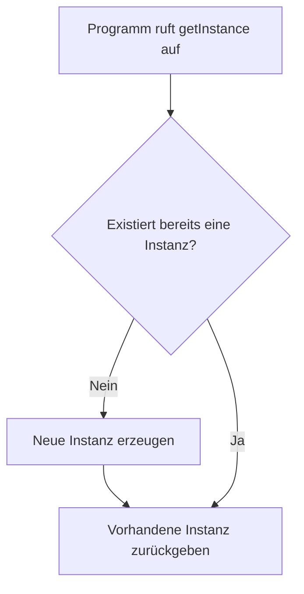

# Singletons in Java

## Kurzüberblick / Definition

Ein **Singleton** ist ein Entwurfsmuster, das sicherstellt, dass von einer Klasse **genau eine Instanz** existiert und diese Instanz über einen **zentralen Zugriffspunkt** erreichbar ist.

In Java wird ein Singleton typischerweise durch folgende Bestandteile umgesetzt:

1. einen **privaten Konstruktor**, damit von außen keine Objekte erzeugt werden können,
2. ein **statisches Attribut**, das die einzige Instanz speichert,
3. eine **statische Zugriffsmethode**, zum Beispiel `getInstance()`, über die die Instanz abgerufen wird.

Das Singleton-Muster wird verwendet, wenn ein Objekt zentral verwaltet werden soll, zum Beispiel bei:

- Konfigurationsverwaltung
- Loggern
- zentraler Datenhaltung in kleinen Programmen
- gemeinsam genutzten Ressourcen

Wichtig ist: Ein Singleton ist kein Ersatz für gutes objektorientiertes Design. Es sollte nur verwendet werden, wenn wirklich genau eine Instanz sinnvoll und notwendig ist.

---

## Einordnung des Schwierigkeitsgrads

Dieses Thema ist als **fortgeschritten** einzuordnen, weil es über die reine Java-Grundsyntax hinausgeht.

Für das Verständnis eines Singletons braucht man bereits Kenntnisse über:

- Klassen und Objekte
- Konstruktoren
- Sichtbarkeiten wie `private` und `public`
- statische Attribute und Methoden
- Referenzvergleich mit `==`
- Grundideen objektorientierter Architektur

Zusätzlich berührt das Singleton-Muster Themen wie globale Zustände, Testbarkeit, Kopplung und Thread-Sicherheit. Diese Aspekte gehören nicht mehr zu den absoluten Java-Grundlagen, sondern eher zu Entwurfsmustern und Softwarearchitektur.

---

## Kernerklärung

## 1. Ziel eines Singletons

Das Ziel eines Singletons besteht darin, die Objekterzeugung einer Klasse zu kontrollieren.

Normalerweise kann eine Klasse beliebig oft instanziiert werden:

```java
ProduktDatenBank db1 = new ProduktDatenBank();
ProduktDatenBank db2 = new ProduktDatenBank();
```

In diesem Fall entstehen zwei verschiedene Objekte mit zwei verschiedenen Produktlisten. Änderungen an `db1` haben keine Auswirkungen auf `db2`.

Bei einer zentralen Produktdatenbank innerhalb eines einfachen PC-Shop-Programms kann das problematisch sein:

```java
db1.addProdukt(produkt);
db2.searchProdukt("Lenovo", "ThinkPad");
```

Wenn `produkt` nur in `db1` gespeichert wurde, kann `db2` es nicht finden, weil `db1` und `db2` unterschiedliche Objekte sind.

Ein Singleton verhindert genau dieses Problem, indem es sicherstellt:

- Es gibt nur eine Produktdatenbank-Instanz.
- Alle Programmteile greifen auf dieselbe Produktliste zu.
- Der Zustand bleibt zentral und konsistent.

---

## 2. Grundprinzip des Singleton-Musters

Das Singleton-Muster folgt einem klaren Aufbau.

| Bestandteil | Bedeutung |
|---|---|
| `private` Konstruktor | Verhindert Objekterzeugung von außen |
| `private static` Instanzvariable | Speichert die einzige Instanz der Klasse |
| `public static getInstance()` | Gibt die einzige Instanz zurück |
| Lazy Initialization | Instanz wird erst erzeugt, wenn sie gebraucht wird |

Der zentrale Gedanke ist:

```java
ProduktDatenBank db = ProduktDatenBank.getInstance();
```

Statt `new ProduktDatenBank()` zu verwenden, fragt man die Klasse selbst nach ihrer einzigen Instanz.

---

## 3. Ablauf bei Lazy Initialization

Bei der sogenannten **Lazy Initialization** wird das Singleton-Objekt nicht direkt beim Programmstart erzeugt, sondern erst dann, wenn es zum ersten Mal benötigt wird.



Das bedeutet:

1. Beim ersten Aufruf von `getInstance()` ist die Instanz noch `null`.
2. Die Klasse erzeugt intern genau ein Objekt.
3. Dieses Objekt wird gespeichert.
4. Bei allen späteren Aufrufen wird dasselbe Objekt zurückgegeben.

---

## Praktisches Beispiel: `ProduktDatenBank` als Singleton

Ausgangslage ist eine Klasse `ProduktDatenBank`, die alle Produkte eines PC-Shops in einer Liste speichert.

Die ursprüngliche Version erlaubt beliebig viele Instanzen:

```java
public ProduktDatenBank() {
    this.produkte = new ArrayList<Produkt>();
}
```

Dadurch könnte versehentlich mehr als eine Produktdatenbank entstehen. Für ein kleines Programm, in dem alle Produkte zentral verwaltet werden sollen, kann die Klasse als Singleton umgesetzt werden.

---

## 4. Singleton-Version der Klasse `ProduktDatenBank`

```java
import java.util.ArrayList;
import java.util.List;

/**
 * Diese Klasse verwaltet alle Produkte des PC-Shops in einer zentralen Liste.
 * Durch das Singleton-Muster kann nur eine Instanz dieser Klasse existieren.
 */
public class ProduktDatenBank {

    /**
     * Einzige Instanz der ProduktDatenBank.
     * Sie wird erst erzeugt, wenn getInstance() zum ersten Mal aufgerufen wird.
     */
    private static ProduktDatenBank instance;

    /**
     * Liste mit allen gespeicherten Produkten.
     */
    private ArrayList<Produkt> produkte;

    /**
     * Privater Konstruktor verhindert die Instanziierung von außen.
     */
    private ProduktDatenBank() {
        this.produkte = new ArrayList<Produkt>();
    }

    /**
     * Gibt die einzige Instanz der ProduktDatenBank zurück.
     *
     * @return Die zentrale ProduktDatenBank-Instanz.
     */
    public static ProduktDatenBank getInstance() {
        if (instance == null) {
            instance = new ProduktDatenBank();
        }
        return instance;
    }

    /**
     * Fügt ein Produkt zur Datenbank hinzu.
     *
     * @param produkt Das Produkt, das gespeichert werden soll.
     */
    public void addProdukt(Produkt produkt) {
        if (produkt != null) {
            produkte.add(produkt);
        }
    }

    /**
     * Entfernt ein Produkt aus der Datenbank.
     *
     * @param produkt Das Produkt, das entfernt werden soll.
     */
    public void removeProdukt(Produkt produkt) {
        produkte.remove(produkt);
    }

    /**
     * Sucht ein Produkt anhand von Marke und Modell.
     *
     * @param marke Marke des gesuchten Produkts.
     * @param modell Modell des gesuchten Produkts.
     * @return Das gefundene Produkt oder null, wenn kein Treffer vorhanden ist.
     */
    public Produkt searchProdukt(String marke, String modell) {
        for (Produkt produkt : produkte) {
            if (produkt.getMarke().equalsIgnoreCase(marke)
                    && produkt.getModell().equalsIgnoreCase(modell)) {
                return produkt;
            }
        }
        return null;
    }

    /**
     * Gibt alle Produkte der Datenbank als Kopie zurück.
     * Dadurch kann die interne Liste nicht direkt von außen verändert werden.
     *
     * @return Kopie der Liste mit allen Produkten.
     */
    public List<Produkt> getAlleProdukte() {
        return new ArrayList<Produkt>(produkte);
    }
}
```

---

## 5. Verwendung der Singleton-Datenbank

Da der Konstruktor jetzt `private` ist, ist folgende Objekterzeugung nicht mehr erlaubt:

```java
ProduktDatenBank datenbank = new ProduktDatenBank(); // Fehler
```

Stattdessen muss die Instanz über `getInstance()` geholt werden:

```java
ProduktDatenBank datenbank = ProduktDatenBank.getInstance();
```

Beispiel:

```java
ProduktDatenBank datenbank = ProduktDatenBank.getInstance();

Produkt produkt = new Produkt("Lenovo", "ThinkPad T480");
datenbank.addProdukt(produkt);

Produkt gefunden = datenbank.searchProdukt("Lenovo", "ThinkPad T480");

if (gefunden != null) {
    System.out.println("Produkt gefunden.");
} else {
    System.out.println("Produkt nicht gefunden.");
}
```

Wird an einer anderen Stelle im Programm erneut `getInstance()` aufgerufen, erhält man dieselbe Datenbank:

```java
ProduktDatenBank db1 = ProduktDatenBank.getInstance();
ProduktDatenBank db2 = ProduktDatenBank.getInstance();

System.out.println(db1 == db2); // true
```

Der Operator `==` prüft bei Objekten, ob beide Variablen auf dasselbe Objekt im Speicher zeigen. Das Ergebnis `true` zeigt, dass `db1` und `db2` dieselbe Singleton-Instanz verwenden.

---

## 6. Warum der Konstruktor privat sein muss

Der Konstruktor ist bei einem Singleton der wichtigste Schutzmechanismus.

```java
private ProduktDatenBank() {
    this.produkte = new ArrayList<Produkt>();
}
```

Durch `private` kann der Konstruktor nur innerhalb der Klasse `ProduktDatenBank` selbst aufgerufen werden.

Das bedeutet:

```java
new ProduktDatenBank();
```

ist außerhalb der Klasse nicht erlaubt.

Nur die Klasse selbst darf entscheiden, wann ihre einzige Instanz erzeugt wird:

```java
instance = new ProduktDatenBank();
```

Dadurch bleibt die Kontrolle über die Objekterzeugung vollständig innerhalb der Klasse.

---

## 7. Unterschied zwischen normaler Klasse und Singleton

| Normale Klasse | Singleton |
|---|---|
| Konstruktor ist meist `public` | Konstruktor ist `private` |
| Mehrere Objekte können erzeugt werden | Nur eine Instanz ist vorgesehen |
| Zustand kann pro Objekt unterschiedlich sein | Zustand ist zentral |
| Zugriff über `new` | Zugriff über `getInstance()` |
| Besser für unabhängige Objekte | Geeignet für zentrale Ressourcen |

Beispiel für eine normale Klasse:

```java
Produkt p1 = new Produkt("Dell", "XPS 13");
Produkt p2 = new Produkt("HP", "EliteBook");
```

Hier ist es sinnvoll, mehrere Produktobjekte zu haben, weil jedes Produkt andere Daten besitzt.

Beispiel für ein Singleton:

```java
ProduktDatenBank datenbank = ProduktDatenBank.getInstance();
```

Hier kann eine einzige zentrale Datenbank sinnvoll sein, weil alle Produkte an einer gemeinsamen Stelle verwaltet werden sollen.

---

## 8. Vorteile von Singletons

Singletons können in bestimmten Situationen nützlich sein.

| Vorteil | Erklärung |
|---|---|
| Nur eine Instanz | Verhindert versehentliche Mehrfacherzeugung |
| Zentraler Zugriffspunkt | Andere Klassen können dieselbe Instanz verwenden |
| Gemeinsamer Zustand | Daten bleiben an einer zentralen Stelle |
| Kontrollierte Erzeugung | Die Klasse verwaltet ihre eigene Instanz |
| Einfache Nutzung | Zugriff erfolgt über eine statische Methode |

Im Beispiel der `ProduktDatenBank` bedeutet das:

- Es gibt nur eine Produktliste.
- Alle Programmteile greifen auf dieselben Produkte zu.
- Hinzugefügte Produkte sind überall sichtbar, wo dieselbe Instanz verwendet wird.

---

## 9. Nachteile und Risiken von Singletons

Singletons haben auch wichtige Nachteile.

| Nachteil | Erklärung |
|---|---|
| Globaler Zustand | Daten können von vielen Stellen verändert werden |
| Enge Kopplung | Klassen hängen direkt vom Singleton ab |
| Schwerer testbar | Tests können sich gegenseitig beeinflussen |
| Versteckte Abhängigkeiten | Man sieht nicht immer sofort, welche Klasse das Singleton verwendet |
| Thread-Probleme | In parallelen Programmen kann eine einfache Implementierung unsicher sein |

Besonders kritisch ist der globale Zustand.

Wenn viele Klassen direkt auf `ProduktDatenBank.getInstance()` zugreifen, kann es schwer nachvollziehbar werden, welche Klasse wann Produkte hinzufügt, entfernt oder verändert.

Das kann die Wartbarkeit verschlechtern.

---

## 10. Thread-Sicherheit

Die einfache Singleton-Implementierung mit Lazy Initialization ist in Programmen mit mehreren Threads nicht sicher.

Problematischer Code:

```java
public static ProduktDatenBank getInstance() {
    if (instance == null) {
        instance = new ProduktDatenBank();
    }
    return instance;
}
```

Wenn zwei Threads gleichzeitig prüfen, ob `instance == null` ist, könnten theoretisch beide Threads eine neue Instanz erzeugen.

Für einfache Schul- und Konsolenprogramme ist diese Version oft ausreichend. In professionellen Anwendungen muss Thread-Sicherheit jedoch beachtet werden.

Eine einfache thread-sichere Variante verwendet `synchronized`:

```java
public static synchronized ProduktDatenBank getInstance() {
    if (instance == null) {
        instance = new ProduktDatenBank();
    }
    return instance;
}
```

Durch `synchronized` kann immer nur ein Thread gleichzeitig diese Methode ausführen.

Nachteil: Der Zugriff kann etwas langsamer sein, weil jeder Aufruf synchronisiert wird.

---

## 11. Alternative: Singleton mit `enum`

In Java gilt ein Singleton mit `enum` als robuste Variante, weil die Instanz nur einmal erzeugt wird und die Sprache selbst wichtige Schutzmechanismen übernimmt.

```java
import java.util.ArrayList;
import java.util.List;

public enum ProduktDatenBankSingleton {
    INSTANCE;

    private ArrayList<Produkt> produkte = new ArrayList<Produkt>();

    public void addProdukt(Produkt produkt) {
        if (produkt != null) {
            produkte.add(produkt);
        }
    }

    public void removeProdukt(Produkt produkt) {
        produkte.remove(produkt);
    }

    public Produkt searchProdukt(String marke, String modell) {
        for (Produkt produkt : produkte) {
            if (produkt.getMarke().equalsIgnoreCase(marke)
                    && produkt.getModell().equalsIgnoreCase(modell)) {
                return produkt;
            }
        }
        return null;
    }

    public List<Produkt> getAlleProdukte() {
        return new ArrayList<Produkt>(produkte);
    }
}
```

Verwendung:

```java
ProduktDatenBankSingleton datenbank = ProduktDatenBankSingleton.INSTANCE;
```

Diese Variante ist kompakt und automatisch thread-sicher. Für Einsteiger ist die klassische Variante mit privatem Konstruktor und `getInstance()` jedoch meist leichter zu verstehen.

---

## 12. Verbesserung: Rückgabe der Produktliste schützen

In der ursprünglichen Beispielklasse gab die Methode `getAlleProdukte()` direkt die interne Liste zurück:

```java
public ArrayList<Produkt> getAlleProdukte() {
    return produkte;
}
```

Das ist problematisch, weil andere Klassen die Liste direkt verändern können:

```java
datenbank.getAlleProdukte().clear();
```

Dadurch könnten alle Produkte gelöscht werden, ohne dass die Klasse `ProduktDatenBank` dies kontrolliert.

Eine sicherere Variante ist eine Kopie der Liste:

```java
public ArrayList<Produkt> getAlleProdukte() {
    return new ArrayList<Produkt>(produkte);
}
```

Dadurch erhält der Aufrufer eine eigene Liste. Die interne Liste der Datenbank bleibt geschützt.

Noch sauberer ist es, gegen das Interface `List` zu programmieren:

```java
import java.util.ArrayList;
import java.util.List;

public List<Produkt> getAlleProdukte() {
    return new ArrayList<Produkt>(produkte);
}
```

Das verbessert die Flexibilität, weil die Methode nicht unnötig auf `ArrayList` festgelegt ist.

---

## Examensrelevanz

Singletons sind für die FIAE-Prüfung nicht zwingend als Java-Grundsyntax zu erwarten, können aber als Beispiel für objektorientierte Entwurfsmuster und saubere Architekturüberlegungen relevant sein.

Besonders wichtig sind dabei:

- objektorientierte Programmierung
- Sichtbarkeiten wie `private`, `public` und `static`
- kontrollierte Objekterzeugung
- Unterschied zwischen Klasse, Objekt und Instanz
- globaler Zustand
- Wartbarkeit und Testbarkeit
- Entwurfsmuster als fortgeschrittenes Konzept

Typische Prüfungs- oder Verständnisfragen könnten sein:

| Frage | Erwartete Kernantwort |
|---|---|
| Was ist ein Singleton? | Eine Klasse, von der genau eine Instanz existieren soll |
| Wie verhindert man weitere Instanzen? | Durch einen privaten Konstruktor |
| Wie greift man auf die Instanz zu? | Über eine statische Methode wie `getInstance()` |
| Warum ist `static` notwendig? | Damit die Instanz ohne vorhandenes Objekt erreichbar ist |
| Was ist ein Nachteil von Singletons? | Globaler Zustand, enge Kopplung, schwierige Tests |
| Was bedeutet Lazy Initialization? | Die Instanz wird erst beim ersten Zugriff erzeugt |
| Warum kann ein Singleton in Multithreading problematisch sein? | Mehrere Threads könnten gleichzeitig eine Instanz erzeugen |

---

## Häufige Fehler und wichtige Klarstellungen

## Fehler 1: Konstruktor bleibt `public`

Falsch:

```java
public ProduktDatenBank() {
    this.produkte = new ArrayList<Produkt>();
}
```

Wenn der Konstruktor `public` bleibt, können weiterhin beliebig viele Objekte erzeugt werden. Dann ist die Klasse kein echtes Singleton.

Richtig:

```java
private ProduktDatenBank() {
    this.produkte = new ArrayList<Produkt>();
}
```

---

## Fehler 2: Zugriff weiterhin mit `new`

Falsch:

```java
ProduktDatenBank datenbank = new ProduktDatenBank();
```

Richtig:

```java
ProduktDatenBank datenbank = ProduktDatenBank.getInstance();
```

Ein Singleton wird nicht direkt mit `new` von außen erzeugt.

---

## Fehler 3: `static` nicht verstehen

Die Methode `getInstance()` ist `static`, weil sie aufgerufen werden muss, bevor ein Objekt existiert.

```java
ProduktDatenBank.getInstance();
```

Wäre `getInstance()` nicht statisch, bräuchte man bereits ein Objekt, um sie aufzurufen. Genau das soll aber verhindert werden.

---

## Fehler 4: Singleton mit guter Architektur verwechseln

Ein Singleton löst nur das Problem der einmaligen Instanzerzeugung. Es löst nicht automatisch Probleme wie:

- saubere Zuständigkeiten
- lose Kopplung
- Testbarkeit
- Datenkapselung
- Nebenwirkungsfreiheit

In größeren Anwendungen wird häufig Dependency Injection bevorzugt, weil Abhängigkeiten dadurch sichtbarer und besser testbar werden.

---

## Fehler 5: Interne Liste ungeschützt zurückgeben

Falsch oder zumindest riskant:

```java
public ArrayList<Produkt> getAlleProdukte() {
    return produkte;
}
```

Besser:

```java
public List<Produkt> getAlleProdukte() {
    return new ArrayList<Produkt>(produkte);
}
```

Dadurch kann der Aufrufer die interne Liste nicht direkt manipulieren.

---

## Zusammenfassung

Ein Singleton stellt sicher, dass von einer Klasse nur eine Instanz existiert. In Java wird dies meist durch einen privaten Konstruktor, eine statische Instanzvariable und eine statische Zugriffsmethode umgesetzt.

Für die Klasse `ProduktDatenBank` kann ein Singleton sinnvoll sein, wenn alle Programmteile dieselbe zentrale Produktliste verwenden sollen. Dadurch wird verhindert, dass mehrere voneinander unabhängige Produktdatenbanken entstehen.

Das Thema ist eher **fortgeschritten**, weil es nicht nur Java-Syntax betrifft, sondern auch objektorientiertes Design, Entwurfsmuster, globale Zustände, Testbarkeit und Architekturentscheidungen.

Trotzdem sollte das Singleton-Muster bewusst eingesetzt werden. Es kann globalen Zustand erzeugen, Tests erschweren und zu enger Kopplung führen. Für einfache Programme ist es gut geeignet, um zentrale Ressourcen zu verwalten. In größeren Anwendungen sollte sorgfältig geprüft werden, ob andere Lösungen wie Dependency Injection besser passen.