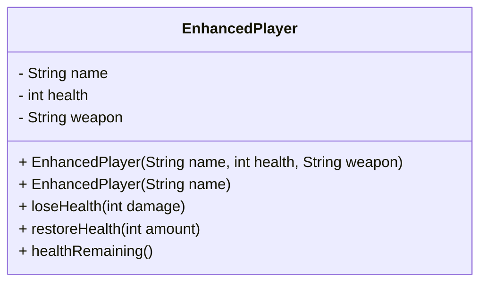

# Encapsulation in Java

## Overview

**Encapsulation** is a fundamental concept of **Object-Oriented Programming (OOP)**.  
It describes the practice of **restricting direct access to an object's internal data** and allowing interaction **only through controlled methods**.

In Java, encapsulation is mainly implemented using:

- `private` fields
- `public` methods (e.g., getters, setters, business methods)
- constructors for controlled initialization

The goal is to **protect data, simplify interfaces, and reduce coupling between classes**.

---

## Core Concept

Encapsulation separates a class into two conceptual parts:

| Part | Description |
|-----|-------------|
| **Public Interface** | Methods accessible from outside the class |
| **Internal Implementation** | Private fields and internal logic hidden from other classes |

Only the **public interface** should be visible to other classes.

```
External Code
     │
     ▼
Public Methods (Interface)
     │
     ▼
Private Data + Internal Logic
```

This turns a class into a **black box**:  
Other classes can **use it**, but they **cannot manipulate its internal state directly**.

---

## Why Encapsulation Is Important

Encapsulation solves several design problems.

### 1. Protecting Data Integrity

If fields are public, external code can change them arbitrarily.

Example problem:

```java
player.health = 200;   // invalid state
```

This bypasses the logic that should ensure:

```
health must stay between 1 and 100
```

Encapsulation ensures that **all modifications pass through controlled methods**.

---

### 2. Preventing Logic Bypass

Business rules are often implemented inside methods.

Example:

```java
restoreHealth(int amount)
```

This method may contain logic such as:

- max health = 100
- health cannot exceed limits

If fields are public, code can **skip these rules entirely**.

---

### 3. Reducing Coupling

When fields are public, external code depends on **internal implementation details**.

Example:

```java
player.name
```

If the field is renamed to:

```java
fullName
```

All calling code breaks.

Encapsulation avoids this because external code calls:

```java
player.getName();
```

Internal changes **do not affect external classes**.

---

### 4. Ensuring Valid Object Initialization

Without encapsulation, objects may be created in an **invalid state**.

Example:

```java
Player player = new Player();
```

Fields may remain uninitialized:

```
health = 0
name = null
```

Using constructors allows enforcing **valid object creation**.

---

## Example Without Encapsulation

### Class Design

Fields are public and can be modified directly.

```java
public class Player {

    public String name;
    public int health;
    public String weapon;

    public void loseHealth(int damage) {
        health = health - damage;

        if (health <= 0) {
            System.out.println("Player knocked out of the game");
        }
    }

    public int healthRemaining() {
        return health;
    }

    public void restoreHealth(int extraHealth) {
        health = health + extraHealth;

        if (health > 100) {
            System.out.println("Player restored to full health");
            health = 100;
        }
    }
}
```

### Problems

1. Fields are **directly accessible**
2. External code can **bypass validation**
3. Internal changes break external code
4. Object initialization is **not guaranteed**

Example misuse:

```java
player.health = 200;
```

---

## Encapsulated Class Design

The improved design hides internal fields.

```java
public class EnhancedPlayer {

    private String name;
    private int health;
    private String weapon;

    public EnhancedPlayer(String name, int health, String weapon) {

        this.name = name;
        this.weapon = weapon;

        if (health <= 0) {
            this.health = 1;
        } else if (health > 100) {
            this.health = 100;
        } else {
            this.health = health;
        }
    }

    public EnhancedPlayer(String name) {
        this(name, 100, "Sword");
    }

    public void loseHealth(int damage) {

        health = health - damage;

        if (health <= 0) {
            System.out.println("Player knocked out of the game");
        }
    }

    public int healthRemaining() {
        return health;
    }

    public void restoreHealth(int extraHealth) {

        health = health + extraHealth;

        if (health > 100) {
            System.out.println("Player restored to full health");
            health = 100;
        }
    }
}
```

---

## Constructor Chaining

The second constructor calls the first.

```java
public EnhancedPlayer(String name) {
    this(name, 100, "Sword");
}
```

Benefits:

- default values
- simpler object creation
- guaranteed initialization

Example usage:

```java
EnhancedPlayer player = new EnhancedPlayer("Tim");
```

Result:

```
name = "Tim"
health = 100
weapon = "Sword"
```

---

## Encapsulation Structure



Legend:

- `-` private members  
- `+` public methods

---

## Benefits of Encapsulation

| Benefit | Explanation |
|------|-------------|
| Data protection | Prevents uncontrolled modification |
| Validation | Enforces rules before changing data |
| Flexibility | Internal implementation can change |
| Reduced coupling | External classes depend only on public methods |
| Safer initialization | Constructors guarantee valid objects |

---

## Access Modifiers and Encapsulation

| Modifier | Visibility | Typical Use |
|------|------|------|
| `private` | Only inside the class | Fields, helper methods |
| `protected` | Class + subclasses | Carefully used in inheritance |
| `public` | Everywhere | Public API methods |

Best practice:

```
fields → private
methods → public only if needed
```

---

## Practical Example

Game logic:

```java
EnhancedPlayer tim = new EnhancedPlayer("Tim", 200, "Sword");
System.out.println(tim.healthRemaining());
```

Even though `200` is passed:

```
health = 100
```

because the constructor enforces the rule.

---

## Exam Relevance (FIAE)

Typical exam questions include:

- Explain **encapsulation in OOP**
- Identify problems of **public fields**
- Explain the purpose of **private fields**
- Explain how **constructors support encapsulation**
- Understand **API vs internal implementation**

Important keyword definition:

> **Encapsulation** is the bundling of data and methods in a class while restricting direct access to the internal state of the object.

---

## Common Mistakes

### 1. Making fields public

```java
public int health;
```

This breaks encapsulation.

Correct:

```java
private int health;
```

---

### 2. Adding unnecessary setters

Not every field needs a setter.

Example:

```
health should only change via game logic
```

---

### 3. Forgetting validation

Constructors and setters should enforce constraints.

Example rule:

```
health ∈ [1,100]
```

---

### 4. Confusing "interface"

Two meanings exist:

| Term | Meaning |
|-----|------|
| Java `interface` | Special Java type |
| Class interface | Public methods available to other classes |

In encapsulation, **interface means the public API of a class**.

---

## Key Takeaway

Encapsulation makes classes behave like **self-contained modules**.

Rules:

1. **Fields should usually be private**
2. **Provide controlled access via methods**
3. **Use constructors to ensure valid objects**
4. **Hide internal implementation details**

Well-encapsulated classes are **easier to maintain, safer, and more flexible to change**.