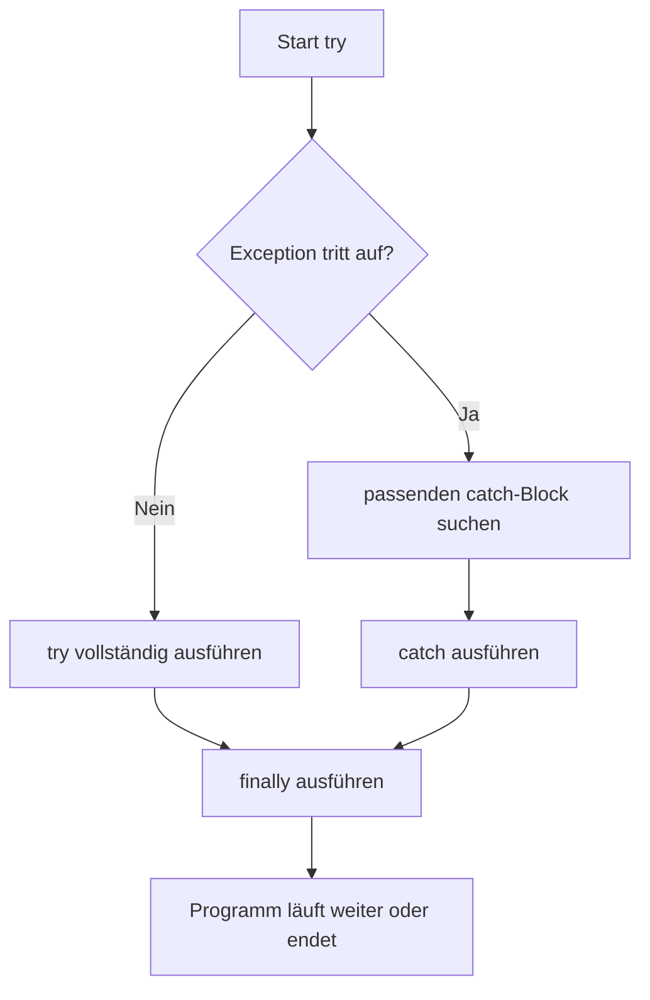

# Try-Catch-Finally

## Kurzüberblick

`try-catch-finally` ist ein Mechanismus zur **Behandlung von Ausnahmen** (*Exceptions*) in Java. Damit können Fehler kontrolliert abgefangen und Programme robuster gestaltet werden, anstatt bei Laufzeitfehlern sofort unkontrolliert abzubrechen.

Typische Einsatzfälle sind:

- Divisionen oder Berechnungen mit ungültigen Werten
- Datei- und Datenbankzugriffe
- Verarbeitung von Benutzereingaben
- Freigabe von Ressourcen nach einer Operation

## Grundprinzip

Eine Ausnahme entsteht, wenn zur Laufzeit ein Problem auftritt, das den normalen Programmablauf stört, zum Beispiel eine Division durch `0` oder der Zugriff auf eine nicht vorhandene Datei.

Der Aufbau besteht aus drei möglichen Blöcken:

### `try`

Im `try`-Block steht der Code, bei dem eine Ausnahme auftreten **kann**.

Sobald dort eine Ausnahme auftritt, wird die normale Ausführung des `try`-Blocks **sofort abgebrochen**. Das Programm springt dann in einen passenden `catch`-Block.

### `catch`

Im `catch`-Block wird die Ausnahme behandelt.

Es können mehrere `catch`-Blöcke vorhanden sein, um unterschiedliche Fehlertypen getrennt zu behandeln. Das ist sinnvoll, weil verschiedene Fehler oft unterschiedlich reagieren müssen.

Beispiel:

- `ArithmeticException` bei Division durch Null
- `NullPointerException` bei Zugriff auf `null`
- `NumberFormatException` bei ungültiger Umwandlung von Text in Zahlen

### `finally`

Der `finally`-Block wird **nach dem `try` bzw. `catch`** ausgeführt, unabhängig davon, ob ein Fehler aufgetreten ist oder nicht.

Er wird typischerweise für **Aufräumarbeiten** genutzt, zum Beispiel:

- Dateien schließen
- Datenbankverbindungen freigeben
- Streams oder Scanner schließen
- Sperren lösen

## Ablauf im Überblick



## Beispiel in Java

```java
public class TryCatchFinallyExample {
    public static void main(String[] args) {
        try {
            int result = 10 / 0;
            System.out.println("Ergebnis: " + result);
        } catch (ArithmeticException e) {
            System.out.println("Fehler: Division durch Null ist nicht erlaubt.");
        } finally {
            System.out.println("Dieser Block wird immer ausgeführt.");
        }
    }
}
```

## Erklärung des Beispiels

Im `try`-Block wird `10 / 0` berechnet. Das führt in Java zu einer `ArithmeticException`.

Der normale Ablauf ist dann:

1. Der Fehler tritt im `try`-Block auf.
2. Der restliche Code im `try`-Block wird **nicht weiter ausgeführt**.
3. Der passende `catch`-Block für `ArithmeticException` wird ausgeführt.
4. Anschließend wird der `finally`-Block ausgeführt.

### Erwartete Ausgabe

```text
Fehler: Division durch Null ist nicht erlaubt.
Dieser Block wird immer ausgeführt.
```

## Wichtige fachliche Einordnung

### Warum nicht einfach alles ohne Fehlerbehandlung schreiben?

Ohne Fehlerbehandlung kann ein Laufzeitfehler das gesamte Programm abbrechen. Mit `try-catch-finally` kann das Programm:

- verständlich auf Fehler reagieren
- kontrolliert weiterlaufen
- Ressourcen korrekt freigeben
- dem Benutzer sinnvolle Rückmeldungen geben

### Warum spezifische Exceptions besser sind

Ein häufiger Fehler ist das zu allgemeine Abfangen von Ausnahmen, zum Beispiel mit `catch (Exception e)`.

Das funktioniert zwar technisch, ist aber oft unsauber, weil dadurch:

- die eigentliche Ursache schlechter erkennbar wird
- unterschiedliche Fehler nicht gezielt behandelt werden
- Debugging schwieriger wird

Besser ist es, möglichst konkrete Fehlertypen zu behandeln.

## Beispiel mit mehreren `catch`-Blöcken

```java
public class MultipleCatchExample {
    public static void main(String[] args) {
        try {
            String text = null;
            System.out.println(text.length());
        } catch (ArithmeticException e) {
            System.out.println("Mathematischer Fehler.");
        } catch (NullPointerException e) {
            System.out.println("Fehler: Objekt ist null.");
        } finally {
            System.out.println("Aufräumarbeiten abgeschlossen.");
        }
    }
}
```

### Bedeutung

Hier zeigt sich, dass verschiedene Fehlerarten unterschiedlich behandelt werden können. Das erhöht Lesbarkeit, Wartbarkeit und fachliche Genauigkeit.

## Praktisches Beispiel aus der Anwendung

Ein typischer Anwendungsfall ist das Arbeiten mit Dateien oder anderen Ressourcen:

```java
import java.io.BufferedReader;
import java.io.FileReader;
import java.io.IOException;

public class FileExample {
    public static void main(String[] args) {
        BufferedReader reader = null;

        try {
            reader = new BufferedReader(new FileReader("daten.txt"));
            System.out.println(reader.readLine());
        } catch (IOException e) {
            System.out.println("Fehler beim Lesen der Datei.");
        } finally {
            try {
                if (reader != null) {
                    reader.close();
                }
            } catch (IOException e) {
                System.out.println("Fehler beim Schließen der Datei.");
            }
        }
    }
}
```

### Fachlicher Nutzen

Hier sorgt `finally` dafür, dass die Datei auch dann geschlossen wird, wenn beim Lesen ein Fehler auftritt. Genau dafür ist dieser Block gedacht: **Ressourcen sicher freigeben**.

## Abgrenzung: Logischer Fehler vs. Exception

Nicht jeder Fehler im Programm ist automatisch eine Exception.

| Art | Beispiel | Behandlung |
|---|---|---|
| Logischer Fehler | Falsche Formel liefert falsches Ergebnis | Durch Testen und Korrektur |
| Laufzeitfehler / Exception | Division durch 0, Datei nicht gefunden | Mit `try-catch-finally` |
| Syntaxfehler | Semikolon fehlt | Wird bereits beim Kompilieren erkannt |

## Prüfungsrelevanz

Für Prüfungen ist besonders wichtig, dass du folgende Punkte sicher erklären kannst:

- Zweck von `try`, `catch` und `finally`
- Ablauf bei einer auftretenden Exception
- Unterschied zwischen spezifischen und allgemeinen Exceptions
- Warum `finally` für Aufräumarbeiten verwendet wird
- Warum der Code im `try`-Block nach einer Exception nicht vollständig weiterläuft

Eine typische Prüfungsfrage ist zum Beispiel:

> Was passiert bei einer Ausnahme innerhalb des `try`-Blocks, und welche Aufgabe hat der `finally`-Block?

Eine gute Antwort wäre:

> Tritt im `try`-Block eine passende Ausnahme auf, wird die Ausführung dort sofort unterbrochen und der zugehörige `catch`-Block ausgeführt. Danach wird der `finally`-Block ausgeführt, unabhängig davon, ob ein Fehler aufgetreten ist oder nicht. Er dient häufig zum Freigeben von Ressourcen.

## Häufige Fehler und Missverständnisse

### `finally` bedeutet nicht „nur bei Fehler“

Das ist falsch. `finally` wird nicht nur bei einem Fehler ausgeführt, sondern grundsätzlich nach `try` bzw. `catch`.

### Nach einer Exception läuft der `try`-Block nicht normal weiter

Sobald eine Ausnahme auftritt, wird der restliche Code im `try`-Block übersprungen.

### Zu allgemeines Abfangen verschlechtert die Codequalität

`catch (Exception e)` sollte nicht reflexartig verwendet werden. Besser ist eine gezielte Behandlung konkreter Fehlertypen.

### Fehler nicht einfach „verschlucken“

Ein leerer `catch`-Block ist problematisch:

```java
catch (Exception e) {
}
```

Dadurch wird ein Fehler zwar abgefangen, aber nicht sinnvoll behandelt. Das erschwert Fehlersuche und Wartung.

## Merksätze

- `try` enthält potenziell fehleranfälligen Code.
- `catch` behandelt eine aufgetretene Ausnahme.
- `finally` wird unabhängig vom Fehlerfall ausgeführt.
- Nach einer Exception wird der restliche `try`-Block nicht weiter ausgeführt.
- Spezifische Exceptions sind besser als pauschales Abfangen.

## Zusammenfassung

`try-catch-finally` ist ein zentrales Konzept der Fehlerbehandlung in Java. Es ermöglicht, Laufzeitfehler kontrolliert zu behandeln, anstatt Programme unkontrolliert abbrechen zu lassen. Der `try`-Block enthält riskanten Code, `catch` behandelt passende Ausnahmen, und `finally` sorgt für sichere Aufräumarbeiten. Für sauberen und wartbaren Code ist es wichtig, möglichst konkrete Exceptions zu behandeln und `finally` gezielt zur Ressourcenfreigabe einzusetzen.