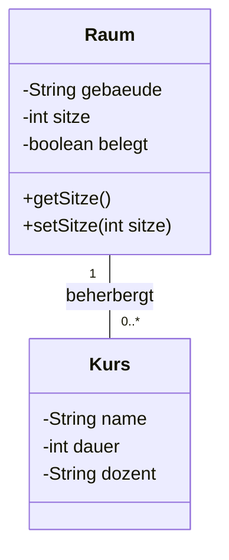
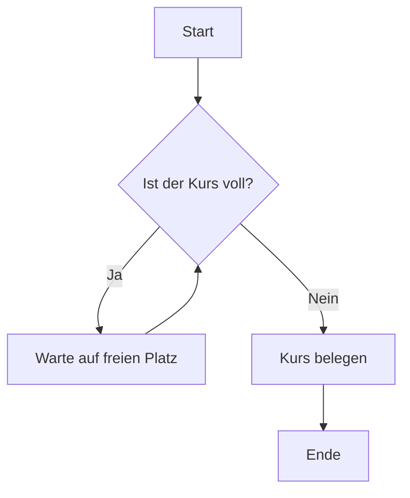
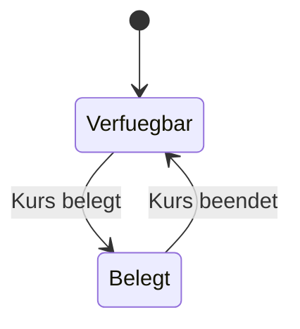
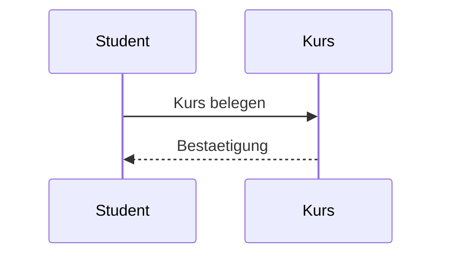

# Encapsulation & UML – 2026-02-11 (POG)

## Encapsulation (Kapselung)

**Definition:**  
Kapselung bedeutet, dass Attribute (Daten) und Methoden innerhalb einer Klasse gebündelt und vor direktem Zugriff von außen geschützt werden.  
Der Zugriff erfolgt kontrolliert über definierte Schnittstellen (z. B. Getter und Setter).

### Ziele der Kapselung
- Schutz der Datenintegrität
- Verhinderung unerlaubter Manipulation
- Trennung zwischen interner Logik und externer Nutzung
- Wartbarkeit und Erweiterbarkeit

### Technische Umsetzung in Java
- Attribute werden in der Regel `private` deklariert
- Zugriff erfolgt über `public` Methoden
- Validierungslogik wird typischerweise im Setter implementiert

Beispielhafte Logik:  
Ein Raum darf keine negative Anzahl an Sitzplätzen haben → Prüfung im Setter.

---

# Klassische Objektorientierung

## Klassen
Eine Klasse ist eine Blaupause für Objekte.  
Sie definiert:

- Attribute (Zustand)
- Methoden (Verhalten)

Beispiele:

**Raum**
- Gebäude
- Sitzanzahl
- Belegungsstatus

**Kurs**
- Name
- Dauer
- Dozent

Objekte sind konkrete Instanzen dieser Klassen.

---

# UML (Unified Modeling Language)

UML ist eine standardisierte grafische Sprache zur Modellierung von Softwaresystemen.

Sie dient dazu:
- Strukturen darzustellen
- Abläufe zu visualisieren
- Beziehungen zwischen Objekten zu zeigen
- Systeme vor der Implementierung zu planen

Prüfungsrelevant: Diagrammtypen erkennen, lesen und interpretieren.

---

# 1. Klassendiagramm

Zeigt:
- Klassen
- Attribute
- Methoden
- Beziehungen
- Multiplizitäten

### Bedeutung
- `-` = private
- `+` = public
- `"1"` zu `"0..*"` = 1:n-Beziehung  
  Ein Raum kann mehrere Kurse beherbergen.  
  Ein Kurs findet genau in einem Raum statt.

---

# 2. Aktivitätsdiagramm

Zeigt:
- Prozessabläufe
- Entscheidungen
- Schleifen

- Raute = Entscheidung
- Pfeile = Kontrollfluss
- Rücksprung = Schleife

---

# 3. Zustandsdiagramm

Zeigt:
- Zustände eines Objekts
- Übergänge
- Ereignisse

Ein Raum kann:
- verfügbar
- belegt

sein. Ereignisse lösen Zustandswechsel aus.

---

# 4. Sequenzdiagramm

Zeigt:
- Interaktionen zwischen Objekten
- Zeitliche Reihenfolge
- Nachrichtenfluss

- Objekte oben
- Zeit von oben nach unten
- Pfeile = Methodenaufrufe oder Rückgaben

---

# Prüfungszusammenfassung (AP1)

Du solltest können:

- Encapsulation korrekt erklären
- Access Modifier zuordnen (`private`, `public`)
- UML-Diagramme lesen
- Multiplizitäten verstehen (1, 0..*, 1..*)
- Strukturdiagramme von Ablaufdiagrammen unterscheiden

Merksatz:
- Klassendiagramm = Struktur  
- Aktivitätsdiagramm = Ablauf  
- Zustandsdiagramm = Lebenszyklus  
- Sequenzdiagramm = Kommunikation

