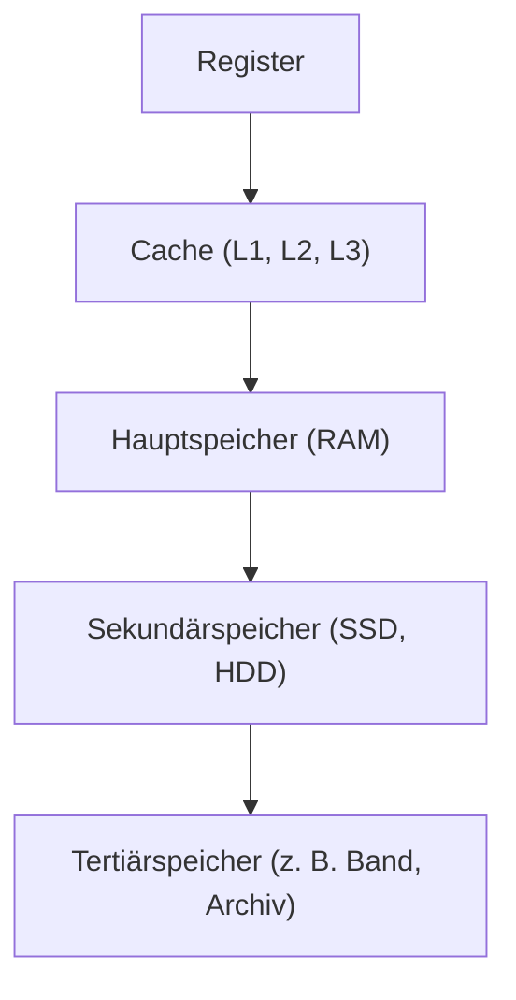
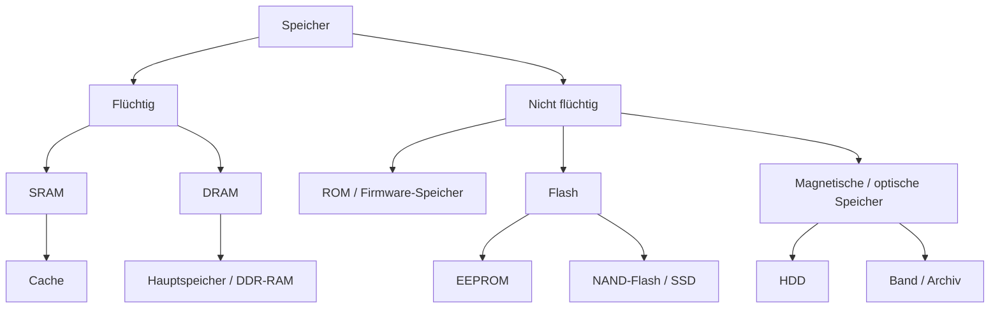

## Speicherhierarchie

Die **Speicherhierarchie** beschreibt die abgestufte Organisation verschiedener Speicherarten in einem Computersystem. Diese Abstufung folgt vor allem vier Kriterien:

- **Zugriffszeit (Latenz)**
- **Datenrate (Bandbreite)**
- **Kapazität**
- **Kosten pro Bit**

Das Ziel ist ein praktikabler Kompromiss:

- sehr schneller Speicher ist **klein und teuer**
- großer Speicher ist **langsamer, aber günstiger**

Grundregel:

> **Je näher ein Speicher an der CPU liegt, desto schneller ist er in der Regel, desto kleiner ist seine Kapazität und desto höher sind die Kosten pro Bit.**

---

## Kernkonzept: Aufbau der Speicherhierarchie

Die klassische Speicherhierarchie kann vereinfacht als Pyramide dargestellt werden:

### Typische Eigenschaften der Ebenen

| Ebene | Nähe zur CPU | Geschwindigkeit | Kapazität | Kosten pro Bit | Flüchtigkeit |
|---|---|---:|---:|---:|---|
| Register | sehr hoch | sehr hoch | sehr klein | sehr hoch | flüchtig |
| Cache | hoch | sehr hoch | klein | hoch | flüchtig |
| RAM | mittel | hoch | mittel bis groß | mittel | flüchtig |
| SSD/HDD | gering | deutlich niedriger | groß bis sehr groß | niedrig | nicht flüchtig |
| Band/Archiv | sehr gering | sehr niedrig | sehr groß | sehr niedrig | nicht flüchtig |

---

## Warum gibt es eine Speicherhierarchie?

Die CPU arbeitet wesentlich schneller als große Massenspeicher. Würde die CPU ständig direkt auf SSD oder HDD zugreifen müssen, entstünden massive Wartezeiten.

Die Speicherhierarchie reduziert dieses Problem:

- **Register** halten unmittelbar benötigte Werte
- **Caches** puffern häufig benötigte Daten
- **RAM** hält aktive Programme und Daten
- **Massenspeicher** speichert Daten dauerhaft

Dadurch entsteht der Eindruck eines großen und gleichzeitig schnellen Speichers, obwohl tatsächlich mehrere unterschiedlich schnelle Speicherstufen zusammenarbeiten.

---

## Die einzelnen Speicherstufen

### 1. Register

Register befinden sich direkt in der CPU. Sie speichern Operanden, Adressen, Zwischenergebnisse und Steuerinformationen.

**Merkmale:**

- kleinste Speicherkapazität
- schnellster Zugriff
- direkt für Rechenoperationen genutzt

**Beispiel:**  
Ein Additionsbefehl verarbeitet Werte typischerweise zuerst in Registern.

---

### 2. Cache (L1, L2, L3)

Der Cache ist ein sehr schneller Pufferspeicher zwischen CPU und RAM. Er speichert Daten und Befehle, die mit hoher Wahrscheinlichkeit bald erneut benötigt werden.

**Merkmale:**

- kleiner als RAM
- deutlich schneller als RAM
- meist in mehreren Ebenen organisiert:
  - **L1**: sehr klein, sehr schnell
  - **L2**: größer, etwas langsamer
  - **L3**: noch größer, meist von mehreren Kernen gemeinsam genutzt

#### Lokalitätsprinzip

Der Cache funktioniert gut, weil Programme oft ein typisches Zugriffsverhalten zeigen:

- **Zeitliche Lokalität**: kürzlich verwendete Daten werden oft bald wieder verwendet
- **Räumliche Lokalität**: Daten in benachbarten Speicherbereichen werden oft nacheinander verwendet

**Beispiel:**  
Eine Schleife greift wiederholt auf aufeinanderfolgende Array-Elemente zu. Dadurch profitiert sie stark vom Cache.

---

### 3. Hauptspeicher (RAM)

Der **Random Access Memory (RAM)** ist der Arbeitsspeicher des Systems. Dort liegen Programme und Daten, die aktuell ausgeführt oder verarbeitet werden.

**Merkmale:**

- Arbeitsbereich für Betriebssystem und Anwendungen
- größer als Cache
- langsamer als Cache, aber viel schneller als SSD/HDD
- **flüchtig**: Inhalte gehen ohne Stromversorgung verloren

Typisch ist heute **DRAM** als Hauptspeicher, z. B. DDR-RAM.

---

### 4. Sekundärspeicher

Sekundärspeicher dient der dauerhaften Speicherung von Programmen und Daten.

**Beispiele:**

- SSD
- HDD

**Merkmale:**

- **nicht flüchtig**
- große Kapazität
- deutlich höhere Zugriffszeiten als RAM
- langfristige Speicherung von Dateien, Programmen und Betriebssystem

---

### 5. Tertiärspeicher

Tertiärspeicher wird vor allem für Archivierung, Sicherung und langfristige Aufbewahrung verwendet.

**Beispiele:**

- Bandlaufwerke
- Bandbibliotheken
- Archivsysteme

**Merkmale:**

- sehr hohe Kapazität
- sehr langsamer Zugriff
- oft nicht für den direkten Alltagsbetrieb gedacht

---

## Ergänzung: Offlinespeicher und externe Speicher

**Offlinespeicher** ist keine klassische eigene Hierarchiestufe der Speicherpyramide, sondern bezeichnet Speicher, die **nicht ständig mit dem System verbunden** sind.

**Beispiele:**

- externe Festplatten
- USB-Sticks
- optische Datenträger
- ausgelagerte Backup-Medien

Wichtig: **Cloud-Speicher** ist nicht automatisch Offlinespeicher. Er ist in der Regel ein netzwerkbasierter Dienst und logisch eher eine Form externer, entfernter Speicherung als „offline“.

---

## RAM vs. ROM

RAM und ROM erfüllen unterschiedliche Aufgaben und dürfen nicht verwechselt werden.

| Eigenschaft | RAM | ROM |
|---|---|---|
| Bedeutung | Random Access Memory | Read Only Memory |
| Flüchtigkeit | flüchtig | nicht flüchtig |
| Schreibbarkeit | lesen und schreiben | traditionell nur lesbar, moderne Varianten teils beschreibbar |
| Typische Verwendung | laufende Programme und Daten | Firmware, z. B. BIOS/UEFI |
| Geschwindigkeit | hoch | meist niedriger als RAM |

### Einordnung

Der Begriff **ROM** ist historisch geprägt. Moderne Firmware liegt häufig in **Flash-Speicher**, der technisch beschreibbar ist. Deshalb ist „ROM“ heute oft eher eine funktionale Bezeichnung als eine streng technische.

---

## Volatile vs. Non-Volatile Memory

### Flüchtiger Speicher (volatile)

Flüchtiger Speicher verliert seinen Inhalt ohne Stromversorgung.

**Beispiele:**

- Register
- Cache
- RAM

### Nicht flüchtiger Speicher (non-volatile)

Nicht flüchtiger Speicher behält seinen Inhalt auch ohne Stromversorgung.

**Beispiele:**

- ROM
- Flash-Speicher
- SSD
- HDD
- Band

---

## Speichertechnologien im Überblick

| Technologie | Typische Verwendung | Flüchtig | Besonderheit |
|---|---|---|---|
| SRAM | Cache | ja | sehr schnell, teuer, geringe Dichte |
| DRAM | Hauptspeicher | ja | hohe Dichte, günstiger als SRAM |
| ROM | feste Firmware | nein | klassisch nur lesbar |
| PROM | einmal programmierbar | nein | nachträglich genau einmal beschreibbar |
| EPROM | ältere Firmwarelösungen | nein | löschbar per UV-Licht |
| EEPROM | Konfigurationsdaten, Firmware | nein | elektrisch lösch- und schreibbar |
| Flash | SSD, USB-Sticks, Firmware | nein | Sonderform von EEPROM mit hoher Speicherdichte |

### Wichtige Unterscheidung: SRAM vs. DRAM

- **SRAM** ist schneller und wird typischerweise für Cache verwendet.
- **DRAM** ist dichter und günstiger, deshalb wird es als Hauptspeicher eingesetzt.

---

## Praktisches Beispiel

Beim Start eines Programms läuft der Zugriff typischerweise so ab:

1. Das Programm liegt dauerhaft auf der **SSD**.
2. Beim Start wird es in den **RAM** geladen.
3. Häufig benötigte Befehle und Daten werden in den **Cache** übernommen.
4. Unmittelbar benötigte Werte landen in **Registern**.

Der Weg zeigt die Grundidee der Hierarchie: Je aktueller und relevanter Daten sind, desto weiter oben werden sie gehalten.

---

## Memory vs. Storage

Im Deutschen werden beide Begriffe oft unscharf mit „Speicher“ übersetzt, technisch ist die Unterscheidung aber wichtig.

### Memory

**Memory** meint meist den **Arbeitsspeicher** beziehungsweise die direkt für die Verarbeitung genutzten schnellen Speicher:

- Register
- Cache
- RAM

### Storage

**Storage** meint die **dauerhafte Datenspeicherung**:

- SSD
- HDD
- USB-Stick
- Band
- optische Datenträger

| Aspekt | Memory | Storage |
|---|---|---|
| Zweck | aktive Verarbeitung | dauerhafte Ablage |
| Beispiele | Register, Cache, RAM | SSD, HDD, Band |
| Geschwindigkeit | hoch bis sehr hoch | deutlich niedriger |
| Flüchtigkeit | oft flüchtig | meist nicht flüchtig |
| typische Nutzung | laufende Prozesse | Dateien, Programme, Archive |

### Beispiel

- Eine Textdatei liegt dauerhaft auf der **SSD** → das ist **Storage**
- Beim Öffnen wird ihr Inhalt in den **RAM** geladen → das ist **Memory**

---

## Zukunfts- und Spezialthemen

Einige Speichertechnologien werden in der Lehre gelegentlich ergänzend erwähnt, gehören aber **nicht** zur üblichen praktischen Standard-Speicherhierarchie heutiger Rechner:

- **holographischer Speicher**: theoretisch sehr hohe Datendichte
- **Quantenspeicher**: Forschungsfeld, nicht Teil klassischer Rechnerarchitektur im Alltag

Für Prüfungen im Grundlagenbereich sind diese Themen meist **nachrangig**, sofern sie nicht ausdrücklich im Unterricht behandelt wurden.

---

## Prüfungsrelevanz

Für Prüfungen sollte Folgendes sicher beherrscht werden:

### Reihenfolge der Hierarchie

**Register → Cache → RAM → SSD/HDD → Band/Archiv**

### Zentrale Zusammenhänge

- höhere Geschwindigkeit bedeutet meist:
  - geringere Kapazität
  - höhere Kosten pro Bit
- Cache überbrückt die Geschwindigkeitslücke zwischen CPU und RAM
- RAM ist flüchtig, Massenspeicher sind in der Regel nicht flüchtig
- Cache besteht typischerweise aus **SRAM**, Hauptspeicher aus **DRAM**

### Häufige Vergleichsfragen

- Cache vs. RAM
- RAM vs. ROM
- volatile vs. non-volatile
- memory vs. storage

---

## Häufige Fehler und Klarstellungen

### „RAM ist dauerhaft.“

**Falsch.**  
RAM ist **flüchtig**. Ohne Stromversorgung gehen die Inhalte verloren.

### „ROM kann nie verändert werden.“

**So pauschal falsch bzw. veraltet.**  
Klassisches ROM ist nur lesbar, aber moderne Firmware-Speicher wie **EEPROM** oder **Flash** können beschrieben werden.

### „SSD ist genauso schnell wie RAM.“

**Falsch.**  
SSD ist schnell im Vergleich zu HDD, aber RAM ist in Zugriffszeit und Datenrate weiterhin deutlich überlegen.

### „Cache ist einfach nur kleiner RAM.“

**Unpräzise.**  
Cache ist anders optimiert, meist mit **SRAM** aufgebaut und speziell dafür gedacht, die CPU mit sehr geringer Latenz zu versorgen.

### „Cloud ist eine Hierarchiestufe wie Cache oder RAM.“

**Falsch.**  
Cloud beschreibt in erster Linie ein Bereitstellungs- bzw. Speichermodell über ein Netzwerk, keine klassische lokale Speicherstufe in der Hardwarehierarchie.

---

## Zusammenfassung

Die Speicherhierarchie ist ein Grundprinzip moderner Rechnerarchitektur. Sie verbindet mehrere Speicherarten so, dass ein System gleichzeitig:

- **schnell**
- **bezahlbar**
- **kapazitätsstark**

sein kann.

Die Leitidee lautet:

> **Schnelle Speicher sind klein und teuer, große Speicher sind langsamer und günstiger.**

Erst durch das Zusammenspiel von **Registern**, **Cache**, **RAM** und **Massenspeicher** können moderne Programme effizient ausgeführt werden.