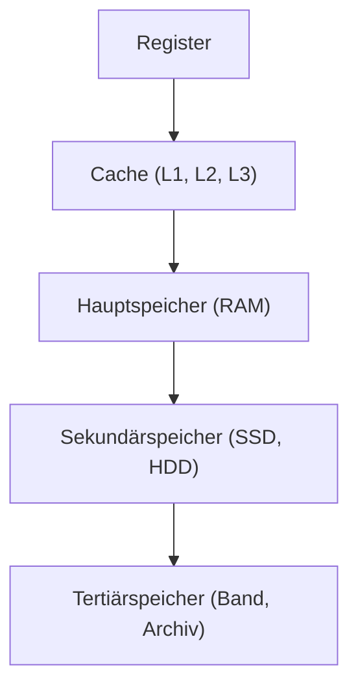
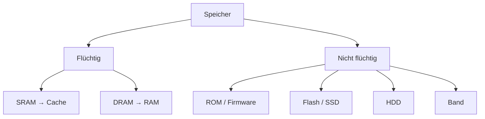
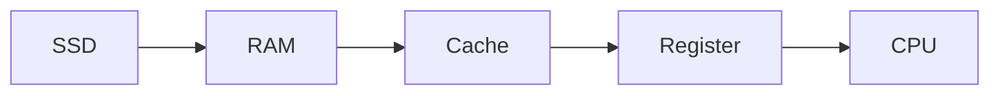

## Überblick / Definition

Die **Speicherhierarchie** beschreibt die abgestufte Organisation verschiedener Speicherarten in einem Computersystem. Diese Abstufung folgt vor allem vier Kriterien:

- **Zugriffszeit (Latenz)**
- **Datenrate (Bandbreite)**
- **Kapazität**
- **Kosten pro Bit**

Ziel ist ein effizienter Kompromiss:

- schneller Speicher → **klein & teuer**
- großer Speicher → **langsamer & günstig**

> **Je näher ein Speicher an der CPU liegt, desto schneller, kleiner und teurer ist er.**

---

## Kernkonzept: Aufbau der Speicherhierarchie



### Typische Eigenschaften

| Ebene | Geschwindigkeit | Kapazität | Kosten/Bit | Flüchtig |
|---|---:|---:|---:|---|
| Register | sehr hoch | sehr klein | sehr hoch | ja |
| Cache | sehr hoch | klein | hoch | ja |
| RAM | hoch | mittel–groß | mittel | ja |
| SSD/HDD | niedrig | groß | niedrig | nein |
| Band | sehr niedrig | sehr groß | sehr niedrig | nein |

---

## Warum gibt es eine Speicherhierarchie?

Die CPU ist um Größenordnungen schneller als Massenspeicher.

Ohne Hierarchie:
- CPU müsste ständig warten → **massiver Performanceverlust**

Mit Hierarchie:
- häufig benötigte Daten werden **nach oben “gezogen”**
- selten benötigte bleiben **unten gespeichert**

👉 Ergebnis: **hohe Performance bei vertretbaren Kosten**

---

## Speicherstufen im Detail

### 1. Register
- direkt in der CPU
- schnellster Zugriff
- minimale Kapazität
- enthalten aktuelle Operanden

---

### 2. Cache (SRAM)

- Pufferspeicher zwischen CPU und RAM
- basiert auf **SRAM**
- extrem geringe Latenz

**Lokalitätsprinzip:**

- zeitlich → kürzlich genutzt = wahrscheinlich wieder
- räumlich → benachbarte Daten werden genutzt

---

### 3. Hauptspeicher (RAM / DRAM)

- Arbeitsbereich für Programme
- basiert auf **DRAM**
- flüchtig

---

### 4. Sekundärspeicher

- dauerhafte Speicherung
- SSD (Flash) / HDD (magnetisch)
- nicht flüchtig

---

### 5. Tertiärspeicher

- Backup & Archiv
- sehr langsam, sehr groß
- z. B. Band

---

## Ergänzung: Offlinespeicher

Kein fester Bestandteil der Hierarchie, sondern Nutzungsform:

- externe Festplatten
- USB-Sticks
- Backup-Medien

---

## RAM vs. ROM

| Eigenschaft | RAM | ROM |
|---|---|---|
| Flüchtig | ja | nein |
| Schreibbar | ja | teilweise |
| Nutzung | Programme | Firmware |

👉 Moderne „ROM“-Varianten = **Flash / EEPROM**

---

## Volatile vs. Non-Volatile Memory

### Volatile (flüchtig)
- Register
- Cache (SRAM)
- RAM (DRAM)

### Non-Volatile (nicht flüchtig)
- ROM
- Flash / SSD
- HDD
- Band



---

## Speichertechnologien

| Technologie | Einsatz | Besonderheit |
|---|---|---|
| SRAM | Cache | sehr schnell, teuer |
| DRAM | RAM | günstig, hohe Dichte |
| Flash | SSD | nicht flüchtig |
| HDD | Massenspeicher | mechanisch, langsam |

---

## Praktisches Beispiel



Ablauf:
1. Programm liegt auf SSD  
2. wird in RAM geladen  
3. häufige Daten → Cache  
4. aktuelle Werte → Register  

---

## Memory vs. Storage

| Aspekt | Memory | Storage |
|---|---|---|
| Zweck | Verarbeitung | Speicherung |
| Beispiele | RAM, Cache | SSD, HDD |
| Geschwindigkeit | hoch | niedrig |
| Flüchtig | meist ja | nein |

---

## Kenngrößen (typische Größenordnungen)

| Speicherart | Zugriffszeit | Datenrate | Kapazität | Kosten/Bit |
|---|---:|---:|---:|---:|
| Register | < 1 ns | > 100 GB/s | Bytes | sehr hoch |
| L1 Cache | 1–2 ns | 50–100 GB/s | KB | hoch |
| L2 Cache | 3–10 ns | 20–50 GB/s | KB–MB | hoch |
| L3 Cache | 10–20 ns | 10–20 GB/s | MB | mittel |
| RAM | 10–100 ns | 10–25 GB/s | GB | mittel |
| SSD | 50–100 µs | bis ~3 GB/s | TB | niedrig |
| HDD | 5–10 ms | 100–200 MB/s | TB | sehr niedrig |

> Werte sind Richtwerte und variieren je nach Hardware.

---

## Adressierung

Maximal adressierbarer Speicher:

```text
2^n
```

- **n = Anzahl der Adressleitungen**
- Beispiel:
  - 32 Bit → 2³² = 4 GB

---

## Prüfungsrelevanz

Wichtig:

- Reihenfolge der Hierarchie
- Cache vs. RAM vs. SSD
- volatile vs. non-volatile
- Zusammenhang:
  - Geschwindigkeit ↑ → Kosten ↑ → Kapazität ↓

---

## Häufige Fehler

❌ RAM ist dauerhaft  
→ falsch (flüchtig)

❌ SSD ≈ RAM  
→ falsch (RAM viel schneller)

❌ Cache = kleiner RAM  
→ falsch (andere Technologie: SRAM)

---

## Zusammenfassung

Die Speicherhierarchie ermöglicht:

- hohe Geschwindigkeit
- große Speichermengen
- akzeptable Kosten

Ohne sie wären Systeme entweder:
- **zu langsam** oder
- **zu teuer**