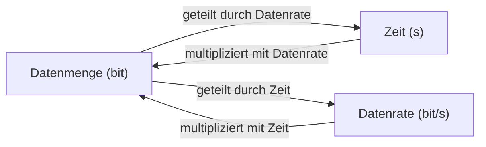

# Datenrate, Datenmenge und Übertragungsdauer berechnen: Ein umfassender Leitfaden für IHK AP1 und AP2

Dieser Leitfaden behandelt alle **typischen Umrechnungen und Berechnungen** rund um:

- Übertragungsdauer  
- Datenrate  
- Datenmenge  

wie sie in **IHK AP1 und AP2** regelmäßig geprüft werden.

---

# Überblick

Alle Aufgaben zu diesem Thema folgen **immer derselben Logik**. Der Unterschied liegt nur darin, **welche Größe gesucht ist** und **wie die Einheiten angegeben sind**.

Ziel ist es, ein **robustes, wiederholbares Lösungsschema** zu beherrschen.

---

# Grundprinzip

Die drei zentralen Größen stehen immer in direktem Zusammenhang:

| Gesucht        | Formel                                  |
|----------------|------------------------------------------|
| Zeit           | Zeit = Datenmenge / Datenrate            |
| Datenrate      | Datenrate = Datenmenge / Zeit            |
| Datenmenge     | Datenmenge = Datenrate × Zeit            |

---

# Einheiten und Umrechnungssysteme

## Speicher (binär)

| Einheit | Umrechnung              |
|--------|-------------------------|
| 1 KiB  | 1024 Byte               |
| 1 MiB  | 1024 KiB                |
| 1 GiB  | 1024 MiB                |

## Netzwerk (dezimal)

| Einheit | Umrechnung              |
|--------|-------------------------|
| 1 kbit | 1.000 bit               |
| 1 Mbit | 1.000.000 bit           |
| 1 Gbit | 1.000.000.000 bit       |

## Byte zu Bit

| Umrechnung |
|-----------|
| 1 Byte = 8 bit |

---

# Kernkonzept: Systemtrennung

- Speichergrößen werden **binär** berechnet (2er-Potenzen)
- Übertragungsraten werden **dezimal** berechnet (10er-Potenzen)

Diese Trennung ist zentral für die korrekte Lösung von IHK-Aufgaben.

---

# Entscheidungslogik (Pflicht vor jeder Rechnung)

Bevor gerechnet wird, erfolgt immer eine **strukturierte Analyse**:

```text
1. Gegeben identifizieren
2. Gesucht bestimmen
3. Einheitentyp erkennen (binär / dezimal)
4. Overhead prüfen
```

## Typische Interpretation

| Situation                         | Konsequenz                    |
|----------------------------------|-------------------------------|
| "Wie lange dauert..."            | Zeit berechnen (÷)            |
| "Welche Datenrate..."            | Datenrate berechnen (÷)       |
| "Wie viel Daten..."              | Datenmenge berechnen (×)      |

---

# Der vollständige Lösungsprozess (entscheidend für die Prüfung)

## Schritt 1: Einheiten vereinheitlichen

**Ziel:** Alle Größen kompatibel machen

| Größe        | Ziel-Einheit |
|-------------|-------------|
| Datenmenge   | bit         |
| Datenrate    | bit/s       |
| Zeit         | Sekunden    |

**Warum wichtig?**  
Formeln funktionieren nur korrekt, wenn die Einheiten zusammenpassen.

---

## Schritt 2: Datenmenge korrekt umrechnen

### Fall A: Binär (GiB, MiB)

```text
GiB → MiB → KiB → Byte → bit
```

Rechenweg:

- × 1024 pro Stufe  
- × 8 für Byte → bit  

---

### Fall B: Dezimal (MB)

```text
MB → Byte → bit
```

Rechenweg:

- × 1.000.000  
- × 8  

---

## Schritt 3: Overhead einbauen (falls vorhanden)

```text
effektive Datenmenge = Rohdaten × (1 + Overhead)
```

### Interpretation

| Angabe       | Bedeutung                |
|-------------|--------------------------|
| +10 %        | mehr Daten → × 1,10      |
| +20 %        | mehr Daten → × 1,20      |

**Wichtiges Verständnis:**  
Overhead erhöht die **zu übertragende Datenmenge**, nicht die Zeit direkt.

---

## Schritt 4: Datenrate korrekt interpretieren

Netzwerkangaben sind **immer dezimal**:

```text
250 Mbit/s = 250.000.000 bit/s
```

Fehlerquelle:  
Nicht mit 1024 multiplizieren.

---

## Schritt 5: Formel anwenden (Kernschritt)

Jetzt erst wird gerechnet:

| Gesucht     | Operation        |
|------------|------------------|
| Zeit        | teilen           |
| Datenrate   | teilen           |
| Datenmenge  | multiplizieren   |

---

## Schritt 6: Ergebnis interpretieren und umrechnen

Typische Umrechnungen:

- Sekunden → Minuten + Sekunden  
- bit → Byte → MB / GiB  

---

# Mentales Prüfungsschema

```text
1. Verstehen (Gegeben / Gesucht)
2. Umrechnen (alles in bit / bit/s / s)
3. Overhead berücksichtigen
4. Formel anwenden
5. Ergebnis umrechnen
```

---

# Beispiel Aufgabe (mit vollständigem Denkprozess)

**Gegeben:**

- 15 GiB  
- 250 Mbit/s  
- 10 % Overhead  

---

## Schritt 1: Analyse

- Gesucht: Zeit  
- Formel: Datenmenge / Datenrate  
- GiB → binär  
- Mbit/s → dezimal  
- Overhead vorhanden  

---

## Schritt 2: Datenmenge umrechnen

```text
15 × 2³⁰ Byte = 16.106.127.360 Byte
× 8 = 128.849.018.880 bit
```

---

## Schritt 3: Overhead berücksichtigen

```text
128.849.018.880 × 1,10 = 141.733.920.768 bit
```

---

## Schritt 4: Datenrate umrechnen

```text
250 Mbit/s = 250.000.000 bit/s
```

---

## Schritt 5: Zeit berechnen

```text
141.733.920.768 / 250.000.000 = 566,94 s
```

---

## Schritt 6: Ergebnis umrechnen

```text
566,94 s ≈ 9 min 27 s
```

---

## Ergebnis

**Übertragungsdauer: 9 Minuten 27 Sekunden**

---

# Weitere typische Aufgabentypen und Vorgehensweisen

## 1. Gesucht: Datenrate

### Denkprozess:

- "Wie schnell muss übertragen werden?"

### Vorgehen:

```text
Datenrate = Datenmenge / Zeit
```

---

## 2. Gesucht: Datenmenge

### Denkprozess:

- "Wie viel wurde übertragen?"

### Vorgehen:

```text
Datenmenge = Datenrate × Zeit
```

---

## 3. Aufgaben mit MB statt MiB

### Entscheidender Schritt:

- MB erkannt → dezimal rechnen

---

## 4. Aufgaben ohne Overhead

### Konsequenz:

- Schritt entfällt vollständig

---

# Typische Prüfungsfallen

- Binär und dezimal vermischt  
- Byte nicht in bit umgerechnet  
- Overhead vergessen  
- falsche Formel gewählt  
- Einheiten nicht vereinheitlicht  

---

# Vertiefung: Zusammenhang der Größen



---

# Exam Relevance

Dieses Thema ist ein **Kernbestandteil der AP1** und regelmäßig Teil der **AP2**.

Entscheidend ist nicht nur das Ergebnis, sondern:

- sauberer Rechenweg  
- korrekte Einheiten  
- klare Struktur  

---

# Häufige Missverständnisse und Klarstellungen

- MB ist nicht automatisch binär  
- Netzwerk = immer bit/s  
- Overhead wirkt auf Datenmenge  
- Reihenfolge der Schritte ist entscheidend  

---

# Merksätze

- Speicher = binär  
- Netzwerk = dezimal  
- Erst umrechnen, dann rechnen  

---

# Prüfungstipp

Unter Zeitdruck:

```text
1. Alles in bit umrechnen
2. Datenrate in bit/s bringen
3. Teilen oder multiplizieren
4. Ergebnis umrechnen
```

Dieses Schema ist **prüfungssicher** und deckt nahezu alle IHK-Aufgaben ab.