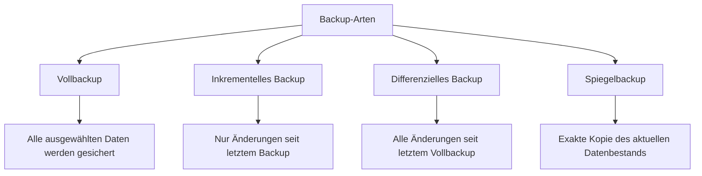
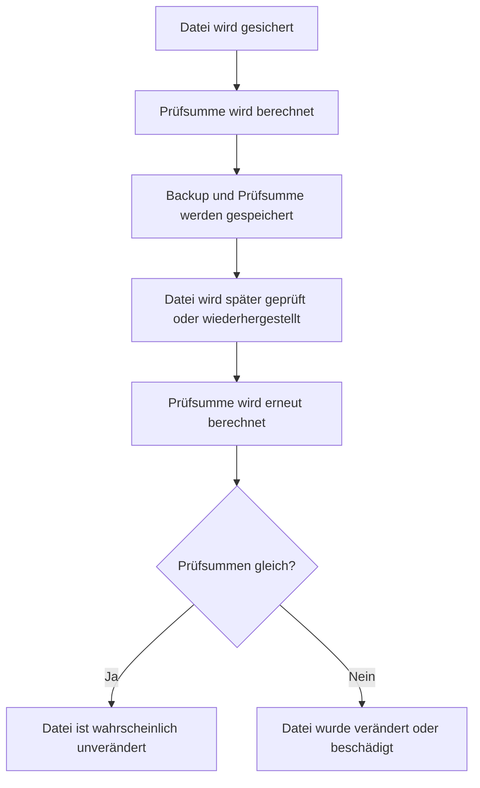
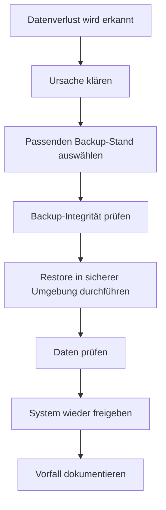

# Backups

## Kurzüberblick / Definition

Ein **Backup** ist eine Sicherungskopie von Daten, Dateien, Anwendungen oder ganzen Systemen. Es wird erstellt, damit Daten nach einem Verlust, einer Beschädigung oder einem Systemausfall wiederhergestellt werden können.

Backups schützen vor Datenverlust durch zum Beispiel:

- Hardwarefehler,
- Softwarefehler,
- versehentliches Löschen,
- fehlerhafte Updates,
- Schadsoftware,
- Ransomware,
- Diebstahl,
- Brand oder Wasserschäden,
- Bedienfehler,
- Datenkorruption.

Ein Backup ist ein zentraler Bestandteil der **Datensicherung** und unterstützt vor allem die Schutzziele **Verfügbarkeit** und **Integrität**.

Wichtig:

> Ein Backup ist nur dann wertvoll, wenn es im Ernstfall erfolgreich wiederhergestellt werden kann.

Die Wiederherstellung aus einem Backup nennt man **Restore**.

---

## Kernerklärung

## Backup, Restore und Recovery

| Begriff | Bedeutung |
|---|---|
| Backup | Sicherungskopie von Daten oder Systemen |
| Restore | Wiederherstellung von Daten aus einem Backup |
| Recovery | Wiederherstellung eines Systems oder Dienstes nach einem Ausfall |
| Backup-Strategie | Geplanter Ablauf, wann, was, wie und wohin gesichert wird |

Beispiel:

Ein Benutzer löscht versehentlich eine wichtige Projektdatei. Wenn ein aktuelles Backup vorhanden ist, kann die Datei per Restore wiederhergestellt werden.

---

## Warum Backups wichtig sind

Daten sind in Unternehmen oft geschäftskritisch.

| Datenart | Risiko bei Verlust |
|---|---|
| Kundendaten | Geschäftsprozesse und Datenschutz betroffen |
| Rechnungen | Buchhaltung und Nachweispflichten betroffen |
| Quellcode | Entwicklungsarbeit geht verloren |
| Konfigurationen | Systeme können nicht korrekt betrieben werden |
| E-Mails | Kommunikationsnachweise fehlen |
| Datenbanken | Anwendungen funktionieren nicht mehr |
| Projektdokumente | Arbeitsfortschritt geht verloren |

Ohne Backup kann ein einzelner Fehler zu dauerhaftem Datenverlust führen.

---

## Vier IHK-relevante Arten von Backups

Für die Prüfung sind besonders vier Backup-Arten wichtig:

1. **Vollbackup**
2. **Inkrementelles Backup**
3. **Differenzielles Backup**
4. **Spiegelbackup**



---

## 1. Vollbackup

Ein **Vollbackup** sichert alle ausgewählten Daten vollständig.

Beispiel:

```text
Jeden Sonntag wird der komplette Dateiserver gesichert.
```

Vorteile:

- einfache Wiederherstellung,
- alle Daten befinden sich in einer vollständigen Sicherung,
- übersichtlich,
- unabhängig von anderen Backup-Ständen.

Nachteile:

- hoher Speicherbedarf,
- längere Sicherungsdauer,
- höhere Belastung von Netzwerk und Speichersystemen.

Beispielhafter Ablauf:

| Tag | Backup-Art | Gesicherte Daten |
|---|---|---|
| Sonntag | Vollbackup | Alle Daten |
| Montag | Vollbackup | Alle Daten |
| Dienstag | Vollbackup | Alle Daten |

Vollbackups sind besonders einfach zu verstehen und wiederherzustellen, aber bei großen Datenmengen oft teuer und zeitaufwendig.

---

## 2. Inkrementelles Backup

Ein **inkrementelles Backup** sichert nur die Daten, die sich seit dem letzten Backup geändert haben.

Dabei ist es egal, ob das letzte Backup ein Vollbackup oder ein inkrementelles Backup war.

Beispiel:

| Tag | Backup-Art | Gesicherte Daten |
|---|---|---|
| Sonntag | Vollbackup | Alle Daten |
| Montag | Inkrementell | Änderungen seit Sonntag |
| Dienstag | Inkrementell | Änderungen seit Montag |
| Mittwoch | Inkrementell | Änderungen seit Dienstag |

Vorteile:

- geringer Speicherbedarf,
- schnelle Sicherung,
- geringe Systemlast,
- gut geeignet für häufige Backups.

Nachteile:

- Wiederherstellung ist aufwendiger,
- mehrere Backup-Stände werden benötigt,
- wenn ein inkrementelles Backup beschädigt ist, kann die Wiederherstellung späterer Stände problematisch sein.

Für einen Restore auf Mittwoch benötigt man:

```text
Vollbackup von Sonntag
+ inkrementelles Backup von Montag
+ inkrementelles Backup von Dienstag
+ inkrementelles Backup von Mittwoch
```

Merksatz:

> Inkrementell sichert seit dem letzten Backup.

---

## 3. Differenzielles Backup

Ein **differenzielles Backup** sichert alle Daten, die sich seit dem letzten Vollbackup geändert haben.

Beispiel:

| Tag | Backup-Art | Gesicherte Daten |
|---|---|---|
| Sonntag | Vollbackup | Alle Daten |
| Montag | Differenziell | Änderungen seit Sonntag |
| Dienstag | Differenziell | Änderungen seit Sonntag |
| Mittwoch | Differenziell | Änderungen seit Sonntag |

Vorteile:

- Wiederherstellung einfacher als beim inkrementellen Backup,
- für den Restore werden nur zwei Sicherungen benötigt,
- guter Kompromiss zwischen Vollbackup und inkrementellem Backup.

Nachteile:

- Speicherbedarf wächst mit jedem Tag seit dem letzten Vollbackup,
- Sicherungsdauer steigt bis zum nächsten Vollbackup,
- benötigt mehr Speicher als inkrementelle Backups.

Für einen Restore auf Mittwoch benötigt man:

```text
Vollbackup von Sonntag
+ differenzielles Backup von Mittwoch
```

Merksatz:

> Differenziell sichert seit dem letzten Vollbackup.

---

## 4. Spiegelbackup

Ein **Spiegelbackup** oder **Mirror Backup** erstellt eine exakte Kopie des aktuellen Datenbestands.

Wenn sich die Originaldaten ändern, wird die Spiegelkopie entsprechend angepasst.

Beispiel:

```text
Der Inhalt eines Ordners wird regelmäßig 1:1 auf ein zweites Laufwerk gespiegelt.
```

Vorteile:

- schnelle Wiederherstellung,
- einfache Struktur,
- aktuelle Kopie ist direkt verfügbar,
- gut geeignet für schnelle Verfügbarkeit.

Nachteile:

- keine oder nur eingeschränkte Versionierung,
- versehentlich gelöschte Dateien können auch im Spiegel gelöscht werden,
- beschädigte oder verschlüsselte Dateien können ebenfalls gespiegelt werden,
- schützt schlecht vor logischen Fehlern, wenn keine Historie vorhanden ist.

Wichtig:

> Ein Spiegelbackup ersetzt kein versioniertes Backup.

Wenn eine Datei durch Ransomware verschlüsselt wird und diese Änderung sofort gespiegelt wird, ist auch die Spiegelkopie betroffen.

---

## Vergleich der vier Backup-Arten

| Backup-Art | Gesichert wird | Speicherbedarf | Restore-Aufwand | Hauptvorteil | Hauptnachteil |
|---|---|---:|---:|---|---|
| Vollbackup | Alle Daten | Hoch | Niedrig | Sehr einfache Wiederherstellung | Langsam und speicherintensiv |
| Inkrementell | Änderungen seit letztem Backup | Niedrig | Hoch | Schnell und platzsparend | Viele Sicherungen für Restore nötig |
| Differenziell | Änderungen seit letztem Vollbackup | Mittel | Mittel | Restore einfacher als inkrementell | Wächst bis zum nächsten Vollbackup |
| Spiegelbackup | Aktueller Datenbestand als Kopie | Je nach Datenmenge | Niedrig | Sehr schnelle Verfügbarkeit | Keine gute Historie |

---

## Beispiel: Voll, inkrementell und differenziell im Vergleich

Angenommen, am Sonntag wird ein Vollbackup erstellt.

Danach ändern sich täglich Dateien.

| Tag | Vollbackup | Inkrementelles Backup | Differenzielles Backup |
|---|---|---|---|
| Sonntag | Alle Daten | Alle Daten als Startpunkt | Alle Daten als Startpunkt |
| Montag | Alle Daten | Änderungen von Montag | Änderungen seit Sonntag |
| Dienstag | Alle Daten | Änderungen von Dienstag | Änderungen seit Sonntag inklusive Montag und Dienstag |
| Mittwoch | Alle Daten | Änderungen von Mittwoch | Änderungen seit Sonntag inklusive Montag bis Mittwoch |

Für die Wiederherstellung auf Mittwoch:

| Verfahren | Benötigte Sicherungen |
|---|---|
| Vollbackup | Vollbackup von Mittwoch |
| Inkrementell | Vollbackup von Sonntag + alle inkrementellen Backups bis Mittwoch |
| Differenziell | Vollbackup von Sonntag + differenzielles Backup von Mittwoch |

---

## Weitere Backup-Formen und Begriffe

Neben den vier IHK-relevanten Arten gibt es weitere Begriffe, die häufig im Zusammenhang mit Backups vorkommen.

## Cloud-Backup

Ein **Cloud-Backup** speichert Sicherungen bei einem Cloud-Anbieter oder in einem externen Rechenzentrum.

Vorteile:

- externer Speicherort,
- gute Skalierbarkeit,
- Zugriff von verschiedenen Standorten,
- oft automatisierbar.

Nachteile:

- abhängig von Internetverbindung,
- abhängig vom Anbieter,
- Datenschutz und Verschlüsselung müssen beachtet werden,
- Wiederherstellung großer Datenmengen kann lange dauern.

---

## Lokales Backup

Ein **lokales Backup** wird auf einem lokalen Medium gespeichert.

Beispiele:

- externe Festplatte,
- NAS,
- Bandlaufwerk,
- lokaler Backup-Server,
- USB-Datenträger.

Vorteile:

- schnelle Sicherung,
- schnelle Wiederherstellung,
- direkte Kontrolle über das Medium.

Nachteile:

- anfällig für lokale Schäden,
- Diebstahl oder Brand können Original und Backup betreffen,
- dauerhaft verbundene Backups können durch Schadsoftware gefährdet sein.

---

## Offsite-Backup

Ein **Offsite-Backup** befindet sich an einem anderen physischen Standort.

Beispiele:

- zweites Firmengebäude,
- externes Rechenzentrum,
- Cloud-Speicher,
- sicher gelagerter Datenträger außerhalb des Hauptstandorts.

Vorteil:

Ein Offsite-Backup schützt vor lokalen Katastrophen wie Brand, Wasserschaden oder Diebstahl.

---

## Offline-Backup

Ein **Offline-Backup** ist nach der Sicherung nicht dauerhaft mit dem Produktivsystem verbunden.

Beispiele:

- getrennte externe Festplatte,
- Bandkassette im Tresor,
- nicht dauerhaft erreichbarer Backup-Speicher.

Vorteil:

Offline-Backups bieten besseren Schutz gegen Ransomware, weil Schadsoftware sie nicht ohne Weiteres erreichen kann.

---

## Automatisiertes Backup

Ein **automatisiertes Backup** wird nach einem festen Zeitplan oder durch ein Ereignis gestartet.

Beispiel:

```text
Jeden Tag um 22:00 Uhr startet automatisch ein Backup der Datenbank.
```

Vorteile:

- reduziert menschliche Fehler,
- sorgt für Regelmäßigkeit,
- kann protokolliert und überwacht werden.

---

## Manuelles Backup

Ein **manuelles Backup** wird durch einen Benutzer oder Administrator bewusst gestartet.

Vorteile:

- flexibel,
- nützlich vor besonderen Änderungen,
- gut vor Updates oder Migrationen.

Nachteile:

- fehleranfällig,
- kann vergessen werden,
- abhängig von einzelnen Personen.

---

## Versioniertes Backup

Ein **versioniertes Backup** speichert mehrere Stände von Dateien oder Daten.

Beispiel:

```text
Eine Datei kann nicht nur von heute, sondern auch von gestern oder letzter Woche wiederhergestellt werden.
```

Vorteile:

- Schutz vor versehentlichem Überschreiben,
- ältere Dateistände können wiederhergestellt werden,
- hilfreich bei Datenkorruption oder Ransomware.

---

## Snapshot-Backup

Ein **Snapshot** ist ein Abbild eines Systems, Dateisystems oder Datenbestands zu einem bestimmten Zeitpunkt.

Snapshots werden häufig verwendet bei:

- virtuellen Maschinen,
- Datenbanken,
- Storage-Systemen,
- Dateisystemen.

Vorteile:

- sehr schnell erstellt,
- schneller Rücksprung auf vorherigen Zustand,
- nützlich vor Updates oder Konfigurationsänderungen.

Aber:

> Ein Snapshot ersetzt kein vollständiges Backup.

Wenn der zugrunde liegende Speicher ausfällt, können auch Snapshots verloren gehen.

---

## Backup-Strategie

Eine Backup-Strategie legt fest, wie Backups geplant, erstellt, gespeichert, geschützt und wiederhergestellt werden.

## Großvater-Vater-Sohn-Prinzip

Das **Großvater-Vater-Sohn-Prinzip** ist eine klassische Backup-Rotation und damit für die IHK-Prüfung relevant.

Es beschreibt eine Aufbewahrungs- und Rotationsstrategie für Sicherungen:

| Ebene | Bedeutung | Typische Häufigkeit |
|---|---|---|
| Sohn | Tägliche oder sehr häufige Sicherungen | täglich |
| Vater | Wöchentliche Sicherungen | wöchentlich |
| Großvater | Monatliche oder länger aufbewahrte Sicherungen | monatlich |

Ziel:

- mehrere Wiederherstellungspunkte bereitstellen,
- ältere Stände länger aufbewahren,
- Fehler, Löschungen oder Ransomware besser abfedern,
- die Wiederherstellung je nach Bedarf vereinfachen.

Beispiel:

```text
Söhne = tägliche Backups
Väter = Wochenbackups
Großväter = Monatsbackups
```

Wichtig:

> Das GFS-Prinzip ist keine einzelne Backup-Art, sondern eine Rotations- und Aufbewahrungsstrategie.

Wichtige Fragen:

| Frage | Bedeutung |
|---|---|
| Welche Daten werden gesichert? | Auswahl der relevanten Daten |
| Wie oft wird gesichert? | Begrenzung des möglichen Datenverlusts |
| Welche Backup-Art wird verwendet? | Voll, inkrementell, differenziell oder Spiegel |
| Wo werden Backups gespeichert? | Lokal, offsite, cloud, offline |
| Wie lange werden Backups aufbewahrt? | Aufbewahrungsfrist und Versionierung |
| Wer ist verantwortlich? | Zuständigkeiten |
| Wie wird verschlüsselt? | Schutz vor unbefugtem Zugriff |
| Wie wird der Restore getestet? | Nachweis der Wiederherstellbarkeit |
| Wie werden Fehler erkannt? | Monitoring und Protokollierung |

---

## Beispiel für eine einfache Backup-Strategie

| Zeitpunkt | Maßnahme |
|---|---|
| Täglich | Inkrementelles Backup wichtiger Arbeitsdaten |
| Wöchentlich | Vollbackup aller Serverdaten |
| Monatlich | Zusätzliches Offline-Backup |
| Laufend | Backup-Logs prüfen |
| Monatlich | Restore-Test durchführen |
| Jährlich | Backup-Konzept überprüfen und anpassen |

Diese Strategie ist nur ein Beispiel. In der Praxis muss sie an Datenmenge, Risiken, Kosten und Wiederherstellungsanforderungen angepasst werden.

---

## 3-2-1-Regel

Eine bekannte Grundregel für Backups ist die **3-2-1-Regel**.

| Bestandteil | Bedeutung |
|---|---|
| 3 Kopien | Originaldaten plus mindestens zwei Sicherungskopien |
| 2 verschiedene Medien | Speicherung auf mindestens zwei unterschiedlichen Medien oder Systemen |
| 1 Kopie extern | Mindestens eine Kopie an einem anderen Standort |

Beispiel:

```text
1. Originaldaten auf dem Server
2. Backup auf lokalem NAS
3. Verschlüsseltes Offsite-Backup in einem externen Rechenzentrum
```

Die 3-2-1-Regel schützt besser vor:

- Hardwareausfall,
- Diebstahl,
- Brand,
- Wasserschaden,
- Ransomware,
- Bedienfehlern.

---

## Best Practices für Backups

## Regelmäßige Backups

Backups müssen regelmäßig erstellt werden.

Die Häufigkeit hängt davon ab, wie viel Datenverlust akzeptabel ist.

Beispiel:

| Situation | Sinnvolle Backup-Häufigkeit |
|---|---|
| Private Dokumente | täglich oder wöchentlich |
| Unternehmensdatenbank | täglich oder häufiger |
| Transaktionssystem | sehr häufig oder kontinuierlich |
| Archivdaten | seltener, da wenig Änderung |

---

## Backups sicher aufbewahren

Backups sollten vor physischen und digitalen Risiken geschützt werden.

Geeignete Maßnahmen:

- Zugriff beschränken,
- Backups verschlüsseln,
- Backup-Medien sicher lagern,
- Offsite-Kopie verwenden,
- Offline-Kopie vorhalten,
- Backup-Systeme überwachen,
- Backup-Medien vor Feuer, Wasser und Diebstahl schützen.

---

## Backups verschlüsseln

Backups enthalten oft viele sensible Informationen. Deshalb sollten sie verschlüsselt werden.

Wichtig:

- Verschlüsselung schützt vor unbefugtem Lesen.
- Der Schlüssel muss sicher verwaltet werden.
- Ohne Schlüssel ist ein verschlüsseltes Backup möglicherweise nicht wiederherstellbar.

Merksatz:

> Ein Backup ohne Zugriffsschutz kann selbst ein Sicherheitsrisiko sein.

---

## Backups regelmäßig testen

Ein Backup muss regelmäßig durch einen Restore-Test geprüft werden.

Ein Restore-Test beantwortet Fragen wie:

- Ist das Backup lesbar?
- Sind die Daten vollständig?
- Funktioniert die Wiederherstellung technisch?
- Wie lange dauert der Restore?
- Sind die Verantwortlichen mit dem Ablauf vertraut?

Wichtig:

> Nicht getestete Backups sind unsichere Backups.

---

## Backup-Logs überprüfen

Backup-Systeme erzeugen Protokolle, sogenannte Logs.

Diese sollten regelmäßig kontrolliert werden.

Zu prüfen ist:

- Wurde das Backup erfolgreich erstellt?
- Gab es Warnungen oder Fehler?
- Wurden alle vorgesehenen Daten gesichert?
- Reicht der Speicherplatz aus?
- Gab es ungewöhnliche Laufzeiten?
- Sind Sicherungen manipuliert oder unvollständig?

Fehlgeschlagene Backups dürfen nicht unbemerkt bleiben.

---

## Backup-Strategie dokumentieren

Eine Backup-Dokumentation sollte enthalten:

- welche Daten gesichert werden,
- welche Systeme betroffen sind,
- wann Backups laufen,
- wo Backups gespeichert werden,
- wie lange Backups aufbewahrt werden,
- wer verantwortlich ist,
- wie ein Restore durchgeführt wird,
- wo Schlüssel und Zugangsdaten sicher verwaltet werden,
- welche Notfallkontakte existieren.

Dokumentation ist besonders im Notfall wichtig, weil dann schnell und kontrolliert gehandelt werden muss.

---

## Automatisierung verwenden

Automatisierte Backups reduzieren das Risiko, dass Sicherungen vergessen werden.

Trotzdem gilt:

> Automatisierung ersetzt keine Kontrolle.

Automatisierte Backups müssen weiterhin überwacht und getestet werden.

---

## Prüfsumme

## Definition

Eine **Prüfsumme** ist ein berechneter Wert, der aus dem Inhalt einer Datei oder eines Datenblocks erzeugt wird. Sie dient dazu, die **Integrität** der Daten zu überprüfen.

Wenn sich der Inhalt der Datei ändert, ändert sich normalerweise auch die Prüfsumme.

Beispielhafte Prüfsummen- oder Hashverfahren:

- CRC32,
- MD5,
- SHA-256.

Für Sicherheitszwecke werden moderne kryptografische Hashfunktionen wie SHA-256 bevorzugt, da ältere Verfahren wie MD5 als kollisionsanfällig gelten.

---

## Prüfsumme bei Backups

Bei der Erstellung eines Backups kann für Dateien oder Backup-Archive eine Prüfsumme berechnet und gespeichert werden.

Bei einer späteren Prüfung oder Wiederherstellung wird erneut eine Prüfsumme berechnet und mit der ursprünglichen Prüfsumme verglichen.



---

## Beispiel für eine Prüfsumme

Eine Datei hat folgenden Inhalt:

```text
Hallo Welt
```

Aus diesem Inhalt wird ein Hashwert berechnet.

Wenn die Datei später verändert wird zu:

```text
Hallo Welt!
```

ergibt sich ein anderer Wert.

Das zeigt, dass der Inhalt nicht mehr identisch ist.

---

## Bedeutung für die Integrität

Prüfsummen helfen, folgende Probleme zu erkennen:

- beschädigte Dateien,
- fehlerhafte Übertragungen,
- unvollständige Backups,
- manipulierte Daten,
- defekte Speichermedien.

Wichtig:

Eine Prüfsumme zeigt, ob Daten verändert wurden. Sie verhindert die Veränderung aber nicht automatisch.

---

## Archivbit

## Definition

Das **Archivbit** ist ein Dateiattribut, das anzeigt, ob eine Datei seit dem letzten Backup erstellt oder geändert wurde.

Es wird besonders in klassischen dateibasierten Backup-Verfahren verwendet.

Grundidee:

- Datei wird erstellt oder geändert → Archivbit wird gesetzt.
- Datei wird gesichert → Archivbit kann zurückgesetzt werden.
- Beim nächsten Backup erkennt die Backup-Software, welche Dateien geändert wurden.

---

## Archivbit und Backup-Arten

Das Archivbit kann verwendet werden, um zu entscheiden, welche Dateien gesichert werden müssen.

| Backup-Art | Umgang mit Archivbit |
|---|---|
| Vollbackup | Sichert alle ausgewählten Dateien und setzt Archivbit oft zurück |
| Inkrementelles Backup | Sichert Dateien mit gesetztem Archivbit und setzt es danach zurück |
| Differenzielles Backup | Sichert Dateien mit gesetztem Archivbit, setzt es aber normalerweise nicht zurück |

---

## Beispiel: Archivbit beim inkrementellen Backup

| Tag | Änderung | Archivbit | Backup-Verhalten |
|---|---|---|---|
| Montag | Datei wird geändert | gesetzt | Datei wird gesichert |
| Nach Backup | Datei wurde gesichert | zurückgesetzt | Datei gilt als gesichert |
| Dienstag | Datei bleibt unverändert | nicht gesetzt | Datei wird nicht erneut gesichert |
| Mittwoch | Datei wird geändert | gesetzt | Datei wird wieder gesichert |

Beim inkrementellen Backup wird dadurch nur gesichert, was seit dem letzten Backup verändert wurde.

---

## Beispiel: Archivbit beim differenziellen Backup

| Tag | Änderung | Archivbit | Backup-Verhalten |
|---|---|---|---|
| Sonntag | Vollbackup | zurückgesetzt | Startpunkt |
| Montag | Datei wird geändert | gesetzt | Datei wird differenziell gesichert |
| Nach Backup | Archivbit bleibt gesetzt | gesetzt | Datei gilt weiterhin als Änderung seit Vollbackup |
| Dienstag | Differenzielles Backup | gesetzt | Datei wird erneut gesichert |

Dadurch enthält ein differenzielles Backup immer alle Änderungen seit dem letzten Vollbackup.

---

## Backup und Redundanz

Backups dürfen nicht mit Redundanz verwechselt werden.

| Begriff | Bedeutung |
|---|---|
| Backup | Sicherungskopie zur Wiederherstellung |
| Redundanz | Mehrfach vorhandene Komponenten zur Erhöhung der Verfügbarkeit |

Beispiele für Redundanz:

- RAID,
- redundante Netzteile,
- Cluster,
- gespiegelte Server,
- Lastverteilung.

Wichtig:

> Redundanz ersetzt kein Backup.

Ein RAID schützt zum Beispiel vor dem Ausfall einzelner Festplatten, aber nicht zuverlässig vor:

- versehentlichem Löschen,
- Ransomware,
- Dateibeschädigung,
- falschen Änderungen,
- Diebstahl,
- Brand,
- Bedienfehlern.

---

## Backup und Archivierung

Backups und Archive haben unterschiedliche Zwecke.

| Begriff | Zweck |
|---|---|
| Backup | Wiederherstellung nach Datenverlust |
| Archivierung | Langfristige Aufbewahrung von Daten |

Beispiel:

Ein Backup wird genutzt, um eine gestern gelöschte Datei wiederherzustellen.

Ein Archiv wird genutzt, um eine Rechnung langfristig aufzubewahren.

Merksatz:

> Backup dient der Wiederherstellung. Archivierung dient der langfristigen Aufbewahrung.

---

## Praktisches Beispiel: Backup-Plan für einen Dateiserver

Ein Unternehmen betreibt einen Dateiserver mit Projektdaten.

Möglicher Backup-Plan:

| Zeitpunkt | Maßnahme |
|---|---|
| Täglich 22:00 Uhr | Inkrementelles Backup |
| Jeden Sonntag | Vollbackup |
| Monatlich | Verschlüsseltes Offline-Backup |
| Laufend | Backup-Logs überwachen |
| Monatlich | Restore-Test einzelner Dateien |
| Vierteljährlich | Test einer vollständigen Wiederherstellung |
| Jährlich | Backup-Konzept überprüfen |

Zusätzliche Schutzmaßnahmen:

- Zugriff auf Backups nur für Administratoren,
- Verschlüsselung der Sicherungen,
- Offsite-Kopie,
- Dokumentation des Restore-Ablaufs,
- regelmäßige Kontrolle der Prüfsummen.

---

## Ablauf eines Restore



Wichtig:

Vor der Wiederherstellung sollte geklärt werden, wodurch der Datenverlust entstanden ist. Bei Schadsoftware darf nicht einfach ein Backup in ein weiterhin kompromittiertes System eingespielt werden.

---

## Häufige Fehler und Klarstellungen

## Fehler 1: „Ein Backup ist vorhanden, also ist alles sicher“

Falsch. Ein Backup muss aktuell, vollständig, geschützt und wiederherstellbar sein.

---

## Fehler 2: „Backups müssen nicht getestet werden“

Falsch. Ohne Restore-Test weiß man nicht sicher, ob die Wiederherstellung funktioniert.

---

## Fehler 3: „Ein Spiegelbackup reicht immer aus“

Falsch. Ein Spiegelbackup kann Fehler, Löschungen oder verschlüsselte Dateien übernehmen. Ohne Versionierung ist eine Rückkehr zu einem älteren Stand oft nicht möglich.

---

## Fehler 4: „RAID ist ein Backup“

Falsch. RAID erhöht die Verfügbarkeit, ersetzt aber keine Sicherungskopie.

---

## Fehler 5: „Cloud-Backup ist automatisch sicher“

Falsch. Auch Cloud-Backups benötigen Verschlüsselung, Zugriffsschutz, sinnvolle Aufbewahrungsfristen, Kontrolle und Restore-Tests.

---

## Fehler 6: „Inkrementell und differenziell sind dasselbe“

Falsch.

| Backup-Art | Merksatz |
|---|---|
| Inkrementell | Seit dem letzten Backup |
| Differenziell | Seit dem letzten Vollbackup |

---

## Fehler 7: „Backups enthalten keine sensiblen Daten“

Falsch. Backups enthalten oft vollständige Datenbestände. Deshalb müssen sie mindestens genauso gut geschützt werden wie Produktivdaten.

---

## Examensrelevanz

Backups sind für die IHK-Prüfung relevant, weil sie ein zentraler Bestandteil von Systemtechnik, IT-Sicherheit, Datensicherung und betrieblichem IT-Betrieb sind.

Besonders wichtig sind:

- Definition von Backup und Restore,
- vier IHK-relevante Backup-Arten,
- Unterschied zwischen Vollbackup, inkrementellem Backup und differenziellem Backup,
- Eigenschaften eines Spiegelbackups,
- Vor- und Nachteile der Backup-Arten,
- Prüfsumme zur Integritätsprüfung,
- Archivbit zur Erkennung geänderter Dateien,
- Backup-Strategie,
- Backup-Strategie und GFS-Prinzip,
- 3-2-1-Regel,
- Verschlüsselung von Backups,
- Restore-Tests,
- Unterschied zwischen Backup, Redundanz und Archivierung.

Typische Prüfungsfragen könnten sein:

| Frage | Erwartete Kernaussage |
|---|---|
| Was ist ein Backup? | Eine Sicherungskopie zur späteren Wiederherstellung |
| Was ist ein Restore? | Wiederherstellung von Daten aus einem Backup |
| Was ist ein Vollbackup? | Sicherung aller ausgewählten Daten |
| Was ist ein inkrementelles Backup? | Sicherung der Änderungen seit dem letzten Backup |
| Was ist ein differenzielles Backup? | Sicherung der Änderungen seit dem letzten Vollbackup |
| Was ist ein Spiegelbackup? | Exakte Kopie des aktuellen Datenbestands |
| Warum ist ein Spiegelbackup riskant? | Fehler oder Löschungen können mitgespiegelt werden |
| Was ist das GFS-Prinzip? | Generationsbasierte Backup-Rotation mit Sohn-, Vater- und Großvater-Backups |
| Was macht eine Prüfsumme? | Sie prüft, ob Daten verändert oder beschädigt wurden |
| Was ist das Archivbit? | Dateiattribut zur Erkennung von Änderungen seit dem letzten Backup |
| Warum sind Restore-Tests wichtig? | Sie zeigen, ob ein Backup tatsächlich verwendbar ist |
| Warum ersetzt RAID kein Backup? | RAID schützt nicht vor logischen Fehlern oder Löschung |
| Was bedeutet die 3-2-1-Regel? | Drei Kopien, zwei Medien, eine externe Kopie |

---

## Merksätze

- Ein Backup ist eine Sicherungskopie.
- Ein Restore ist die Wiederherstellung aus einem Backup.
- Ein Backup ohne erfolgreichen Restore-Test ist unsicher.
- Vollbackup sichert alle ausgewählten Daten.
- Inkrementelles Backup sichert Änderungen seit dem letzten Backup.
- Differenzielles Backup sichert Änderungen seit dem letzten Vollbackup.
- Spiegelbackup erstellt eine aktuelle 1:1-Kopie, bietet aber oft keine Historie.
- Prüfsummen prüfen die Integrität von Daten.
- Das Archivbit zeigt, ob eine Datei seit dem letzten Backup geändert wurde.
- Backups müssen regelmäßig, geschützt und dokumentiert erstellt werden.
- Backups sollten verschlüsselt und zugriffsgeschützt sein.
- Die 3-2-1-Regel erhöht die Ausfallsicherheit.
- Das GFS-Prinzip kombiniert tägliche, wöchentliche und monatliche Sicherungen.
- RAID ist kein Backup.
- Backup dient der Wiederherstellung, Archivierung der langfristigen Aufbewahrung.