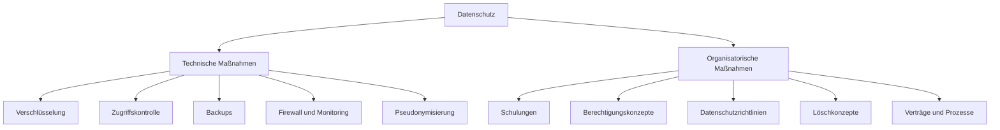
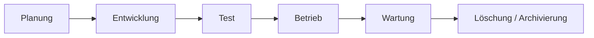
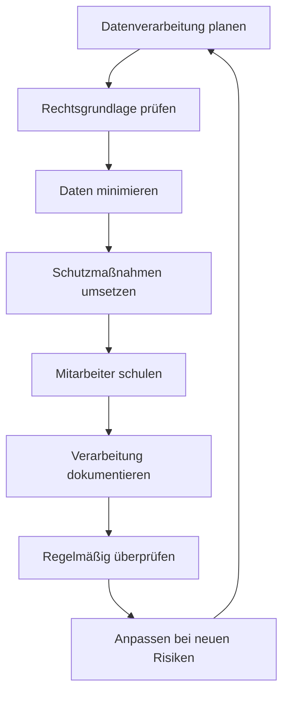

# Datenschutz

## Kurzüberblick / Definition

**Datenschutz** bezeichnet den Schutz personenbezogener Daten vor unrechtmäßiger Verarbeitung, Missbrauch, unbefugtem Zugriff, Verlust oder Offenlegung.

Ziel des Datenschutzes ist nicht in erster Linie der Schutz von Daten an sich, sondern der Schutz der **Rechte und Freiheiten natürlicher Personen**. Datenschutz soll sicherstellen, dass Menschen selbstbestimmt darüber informiert sind und mitbestimmen können, was mit ihren personenbezogenen Daten geschieht.

Personenbezogene Daten sind alle Informationen, die sich auf eine identifizierte oder identifizierbare natürliche Person beziehen.

Beispiele:

| Personenbezogene Daten | Erklärung |
|---|---|
| Name | Identifiziert eine Person direkt |
| Adresse | Kann einer Person zugeordnet werden |
| Telefonnummer | Ermöglicht Kontaktaufnahme zu einer Person |
| E-Mail-Adresse | Kann direkt oder indirekt identifizieren |
| Kundennummer | Identifiziert eine Person innerhalb eines Systems |
| IP-Adresse | Kann unter Umständen einer Person zugeordnet werden |
| Standortdaten | Können Bewegungsprofile ermöglichen |
| Gesundheitsdaten | Besonders schützenswerte personenbezogene Daten |

---

## Kernerklärung

### Datenschutz vs. Datensicherheit

Datenschutz und Datensicherheit hängen eng zusammen, bedeuten aber nicht dasselbe.

| Begriff | Bedeutung |
|---|---|
| Datenschutz | Schutz personenbezogener Daten und der Rechte betroffener Personen |
| Datensicherheit | Technischer und organisatorischer Schutz von Daten gegen Verlust, Manipulation und unbefugten Zugriff |

Datensicherheit ist ein Mittel, um Datenschutz umzusetzen.

Beispiel:

Eine verschlüsselte Datenbank ist eine Maßnahme der Datensicherheit. Sie unterstützt den Datenschutz, weil personenbezogene Daten dadurch besser vor unbefugtem Zugriff geschützt werden.

---

## Rechtliche Grundlagen

### Datenschutz-Grundverordnung

Die wichtigste rechtliche Grundlage in der Europäischen Union ist die **Datenschutz-Grundverordnung**, abgekürzt **DSGVO**.

Die DSGVO regelt den Umgang mit personenbezogenen Daten. Sie gilt unter anderem für Unternehmen, Behörden, Vereine und andere Organisationen, wenn diese personenbezogene Daten verarbeiten.

**Verarbeitung** bedeutet dabei sehr viel mehr als nur das Speichern von Daten.

Zur Verarbeitung gehören zum Beispiel:

- Erheben,
- Speichern,
- Ändern,
- Auslesen,
- Übermitteln,
- Löschen,
- Abfragen,
- Ordnen,
- Verknüpfen,
- Verwenden.

---

### Bundesdatenschutzgesetz

In Deutschland ergänzt das **Bundesdatenschutzgesetz**, abgekürzt **BDSG**, die DSGVO.

Das BDSG enthält unter anderem nationale Regelungen, zum Beispiel zu:

- Datenschutz im Beschäftigungskontext,
- Aufgaben von Datenschutzbeauftragten,
- Verarbeitung durch öffentliche Stellen,
- ergänzenden nationalen Datenschutzvorgaben.

Für die Prüfung ist wichtig:

> Die DSGVO ist die zentrale europäische Grundlage. Das BDSG ergänzt sie in Deutschland.

---

## Zentrale Begriffe

| Begriff | Bedeutung |
|---|---|
| Betroffene Person | Die natürliche Person, deren Daten verarbeitet werden |
| Verantwortlicher | Stelle, die über Zwecke und Mittel der Verarbeitung entscheidet |
| Auftragsverarbeiter | Stelle, die personenbezogene Daten im Auftrag verarbeitet |
| Verarbeitung | Jeder Umgang mit personenbezogenen Daten |
| Einwilligung | Freiwillige, informierte und eindeutige Zustimmung |
| Pseudonymisierung | Ersetzen direkter Identifikationsmerkmale durch Kennzeichen |
| Anonymisierung | Entfernung des Personenbezugs, sodass keine Identifikation mehr möglich ist |
| Technische und organisatorische Maßnahmen | Schutzmaßnahmen zur sicheren Verarbeitung personenbezogener Daten |

---

## Grundprinzipien der DSGVO

Die DSGVO beruht auf mehreren zentralen Datenschutzgrundsätzen.

| Grundsatz | Bedeutung |
|---|---|
| Rechtmäßigkeit | Daten dürfen nur mit gültiger Rechtsgrundlage verarbeitet werden |
| Transparenz | Betroffene müssen verständlich informiert werden |
| Zweckbindung | Daten dürfen nur für festgelegte Zwecke verarbeitet werden |
| Datenminimierung | Es dürfen nur notwendige Daten verarbeitet werden |
| Richtigkeit | Daten müssen sachlich richtig und aktuell sein |
| Speicherbegrenzung | Daten dürfen nicht länger als nötig gespeichert werden |
| Integrität und Vertraulichkeit | Daten müssen angemessen geschützt werden |
| Rechenschaftspflicht | Verantwortliche müssen die Einhaltung nachweisen können |

---

## Rechtmäßigkeit der Verarbeitung

Personenbezogene Daten dürfen nicht beliebig verarbeitet werden. Es muss immer eine Rechtsgrundlage geben.

Typische Rechtsgrundlagen sind:

| Rechtsgrundlage | Beispiel |
|---|---|
| Einwilligung | Anmeldung zu einem Newsletter |
| Vertragserfüllung | Verarbeitung einer Lieferadresse für eine Bestellung |
| Rechtliche Verpflichtung | Aufbewahrung von Rechnungen |
| Lebenswichtige Interessen | Notfallmedizinische Datenverarbeitung |
| Öffentliche Aufgabe | Verarbeitung durch Behörden |
| Berechtigtes Interesse | IT-Sicherheitslogging, sofern verhältnismäßig |

Wichtig:

Eine Einwilligung ist nicht immer notwendig. Sie ist nur eine von mehreren möglichen Rechtsgrundlagen.

---

## Beispiel: Zweckbindung

Ein Unternehmen erhebt bei einer Bestellung die Adresse eines Kunden, um die Ware zu liefern.

Zulässiger Zweck:

```text
Lieferung der bestellten Ware
```

Nicht automatisch zulässiger neuer Zweck:

```text
Weitergabe der Adresse an Werbepartner
```

Der ursprüngliche Zweck darf nicht einfach beliebig erweitert werden. Für neue Zwecke kann eine neue Rechtsgrundlage erforderlich sein.

---

## Besondere Kategorien personenbezogener Daten

Bestimmte personenbezogene Daten sind besonders sensibel und benötigen erhöhten Schutz.

Dazu gehören zum Beispiel:

- Gesundheitsdaten,
- biometrische Daten zur eindeutigen Identifizierung,
- genetische Daten,
- politische Meinungen,
- religiöse oder weltanschauliche Überzeugungen,
- Gewerkschaftszugehörigkeit,
- Daten zur sexuellen Orientierung.

Diese Daten dürfen nur unter besonders strengen Voraussetzungen verarbeitet werden.

---

## Rechte betroffener Personen

Betroffene Personen haben nach der DSGVO mehrere Rechte.

| Recht | Bedeutung |
|---|---|
| Recht auf Auskunft | Person darf erfahren, welche Daten über sie verarbeitet werden |
| Recht auf Berichtigung | Falsche Daten müssen korrigiert werden |
| Recht auf Löschung | Daten müssen unter bestimmten Voraussetzungen gelöscht werden |
| Recht auf Einschränkung der Verarbeitung | Verarbeitung kann eingeschränkt werden |
| Recht auf Datenübertragbarkeit | Daten können in einem übertragbaren Format verlangt werden |
| Widerspruchsrecht | Verarbeitung kann in bestimmten Fällen abgelehnt werden |
| Recht auf Widerruf | Eine Einwilligung kann widerrufen werden |
| Beschwerderecht | Beschwerde bei einer Datenschutzaufsichtsbehörde möglich |

---

## Technische und organisatorische Maßnahmen

Technische und organisatorische Maßnahmen werden häufig als **TOMs** bezeichnet.

Sie dienen dazu, personenbezogene Daten angemessen zu schützen.



---

## Technische Maßnahmen

### Verschlüsselung

**Verschlüsselung** schützt Daten davor, von unbefugten Personen gelesen zu werden.

Beispiele:

| Bereich | Maßnahme |
|---|---|
| Datenübertragung | HTTPS / TLS |
| Datenspeicherung | Verschlüsselte Festplatten oder Datenbanken |
| Backups | Verschlüsselte Sicherungen |
| E-Mail-Kommunikation | Transportverschlüsselung oder Ende-zu-Ende-Verschlüsselung |

Verschlüsselung ist besonders wichtig bei sensiblen Daten, mobilen Geräten und Datenübertragung über Netzwerke.

---

### Zugriffskontrolle

Zugriffskontrollen stellen sicher, dass nur berechtigte Personen auf bestimmte Daten zugreifen können.

Beispiele:

- Benutzerkonten,
- Passwörter,
- Mehr-Faktor-Authentifizierung,
- Rollen- und Rechtekonzepte,
- Zugriff nur nach dem Need-to-know-Prinzip,
- Protokollierung von Zugriffen.

Grundsatz:

> Jeder Benutzer sollte nur die Rechte erhalten, die er für seine Aufgabe wirklich benötigt.

Das entspricht dem Prinzip **Least Privilege**.

---

### Pseudonymisierung

Bei der **Pseudonymisierung** werden direkte Identifikationsmerkmale durch Ersatzwerte ersetzt.

Beispiel:

| Originaldaten | Pseudonymisierte Daten |
|---|---|
| Max Müller | Kunde 4711 |
| anna@example.com | Nutzerin A93F |

Der Personenbezug ist nicht vollständig entfernt, kann aber nur mit Zusatzinformationen wiederhergestellt werden.

Wichtig:

Pseudonymisierte Daten bleiben personenbezogene Daten, wenn eine Zuordnung grundsätzlich noch möglich ist.

---

### Anonymisierung

Bei der **Anonymisierung** wird der Personenbezug so entfernt, dass eine Person nicht mehr identifiziert werden kann.

Beispiel:

```text
Statt einzelner Kundendaten wird nur noch eine Statistik gespeichert:
„73 % der Kunden kauften Produktgruppe A.“
```

Wichtig:

Echte Anonymisierung ist schwerer als Pseudonymisierung. Wenn eine Re-Identifikation möglich ist, handelt es sich nicht um vollständig anonymisierte Daten.

---

### Datensicherung

**Datensicherung** schützt vor Datenverlust.

Beispiele:

- regelmäßige Backups,
- verschlüsselte Backup-Speicherung,
- getrennte Aufbewahrung von Sicherungen,
- Wiederherstellungstests,
- Schutz vor Ransomware,
- definierte Backup- und Restore-Prozesse.

Backups sind nicht nur für Verfügbarkeit wichtig, sondern auch für Datenschutz, weil Datenverlust ebenfalls ein Datenschutzproblem sein kann.

---

## Organisatorische Maßnahmen

Organisatorische Maßnahmen regeln, wie Menschen und Prozesse mit Daten umgehen.

Beispiele:

| Maßnahme | Zweck |
|---|---|
| Datenschutzrichtlinien | Einheitliche Regeln im Unternehmen |
| Mitarbeiterschulungen | Bewusstsein für Risiken schaffen |
| Berechtigungskonzepte | Zugriff nachvollziehbar regeln |
| Löschkonzepte | Daten nicht länger als nötig speichern |
| Auftragsverarbeitungsverträge | Dienstleister rechtlich einbinden |
| Meldeprozesse | Datenschutzverletzungen schnell behandeln |
| Dokumentation | Nachweis der Einhaltung ermöglichen |

---

## Datenschutzverletzung

Eine Datenschutzverletzung liegt vor, wenn personenbezogene Daten unbeabsichtigt oder unrechtmäßig:

- vernichtet,
- verloren,
- verändert,
- offengelegt,
- oder unbefugt zugänglich gemacht werden.

Beispiele:

| Situation | Datenschutzrisiko |
|---|---|
| Laptop mit Kundendaten wird gestohlen | Verlust und möglicher Zugriff |
| E-Mail mit Kundendaten wird an falsche Adresse geschickt | Unbefugte Offenlegung |
| Datenbank wird gehackt | Unbefugter Zugriff |
| Backup ist nicht wiederherstellbar | Verlust der Verfügbarkeit |
| Mitarbeiter ruft unnötig Kundendaten ab | Unbefugte interne Verarbeitung |

Datenschutzverletzungen müssen intern ernst genommen, dokumentiert und je nach Risiko an die zuständige Aufsichtsbehörde gemeldet werden.

---

## Datenschutz in der Praxis

Datenschutz muss im gesamten Lebenszyklus von IT-Systemen berücksichtigt werden.



In jeder Phase stellen sich andere Datenschutzfragen.

| Phase | Datenschutzfrage |
|---|---|
| Planung | Welche Daten werden wirklich benötigt? |
| Entwicklung | Werden Daten sicher verarbeitet? |
| Test | Werden Echtdaten vermieden oder geschützt? |
| Betrieb | Wer hat Zugriff auf welche Daten? |
| Wartung | Werden Logs und Backups sicher behandelt? |
| Löschung | Werden Daten rechtzeitig und vollständig gelöscht? |

---

## Privacy by Design und Privacy by Default

### Privacy by Design

**Privacy by Design** bedeutet, dass Datenschutz bereits bei der Entwicklung eines Systems berücksichtigt wird.

Beispiele:

- datensparsame Architektur,
- sichere Standardprozesse,
- frühe Risikoanalyse,
- Verschlüsselung von Anfang an,
- saubere Rollen- und Rechtekonzepte.

---

### Privacy by Default

**Privacy by Default** bedeutet, dass die datenschutzfreundlichsten Einstellungen standardmäßig aktiviert sind.

Beispiel:

Ein Benutzerkonto sollte nicht standardmäßig öffentlich sichtbar sein, wenn dies nicht notwendig ist.

Grundidee:

> Datenschutz darf nicht davon abhängen, dass Benutzer erst komplizierte Einstellungen ändern müssen.

---

## Datenschutz und Softwareentwicklung

Für Fachinformatiker ist Datenschutz besonders wichtig, weil viele Datenschutzprobleme durch Softwaredesign entstehen.

Wichtige Entwicklungsregeln:

| Regel | Bedeutung |
|---|---|
| Nur notwendige Daten erfassen | Datenminimierung |
| Eingaben validieren | Schutz vor fehlerhaften oder gefährlichen Daten |
| Zugriffe prüfen | Keine unberechtigten Datenzugriffe |
| Rollen sauber trennen | Benutzer sehen nur passende Daten |
| Logs sparsam gestalten | Keine unnötigen personenbezogenen Daten protokollieren |
| Testdaten verwenden | Keine echten Kundendaten in Tests |
| Löschfunktionen einplanen | Rechte auf Löschung technisch ermöglichen |
| Schnittstellen absichern | APIs dürfen keine Daten unkontrolliert preisgeben |

---

## Beispiel: Datenschutz bei einer Webanwendung

Eine Webanwendung speichert Benutzerkonten.

Mögliche personenbezogene Daten:

- Name,
- E-Mail-Adresse,
- Passwort-Hash,
- IP-Adresse,
- Login-Zeitpunkte,
- Bestellungen.

Datenschutzgerechte Umsetzung:

| Bereich | Maßnahme |
|---|---|
| Registrierung | Nur notwendige Daten abfragen |
| Passwortspeicherung | Passwörter nur gehasht und gesalzen speichern |
| Login | Mehr-Faktor-Authentifizierung ermöglichen |
| Datenbank | Zugriff nur für berechtigte Rollen |
| Logging | Keine Passwörter oder unnötigen personenbezogenen Daten loggen |
| Benutzerkonto | Auskunft, Berichtigung und Löschung technisch unterstützen |
| Übertragung | HTTPS verwenden |
| Backups | Verschlüsseln und Löschfristen beachten |

---

## Beispiel: Schlechte und bessere Datenerhebung

Schlecht:

```text
Für einen Newsletter werden Name, Adresse, Geburtsdatum, Telefonnummer und Beruf abgefragt.
```

Problem:

Die meisten dieser Daten sind für den Newsletter nicht erforderlich.

Besser:

```text
Für einen Newsletter wird nur die E-Mail-Adresse abgefragt.
```

Das entspricht dem Prinzip der Datenminimierung.

---

## Datenschutz und Auftragsverarbeitung

Eine **Auftragsverarbeitung** liegt vor, wenn ein externer Dienstleister personenbezogene Daten im Auftrag eines Unternehmens verarbeitet.

Beispiele:

- Cloud-Hosting-Anbieter,
- externer Newsletter-Dienst,
- IT-Wartungsdienstleister,
- Lohnabrechnungsdienstleister,
- externer Support mit Zugriff auf Kundendaten.

In solchen Fällen muss geregelt sein:

- welche Daten verarbeitet werden,
- zu welchem Zweck die Verarbeitung erfolgt,
- welche Schutzmaßnahmen gelten,
- welche Weisungen der Auftraggeber geben darf,
- wie Löschung und Rückgabe geregelt sind,
- wie Unterauftragnehmer behandelt werden.

---

## Datenschutzbeauftragter

Ein Datenschutzbeauftragter unterstützt eine Organisation bei der Einhaltung des Datenschutzrechts.

Typische Aufgaben:

- Beratung der Organisation,
- Überwachung der Einhaltung von Datenschutzvorgaben,
- Schulung und Sensibilisierung,
- Zusammenarbeit mit Aufsichtsbehörden,
- Ansprechpartner für Datenschutzfragen.

Nicht jedes Unternehmen benötigt zwingend einen Datenschutzbeauftragten. Ob einer erforderlich ist, hängt unter anderem von Art, Umfang und Regelmäßigkeit der Datenverarbeitung ab.

---

## Datenschutz-Folgenabschätzung

Eine **Datenschutz-Folgenabschätzung** ist eine systematische Risikoanalyse für Verarbeitungsvorgänge mit voraussichtlich hohem Risiko für betroffene Personen.

Beispiele für risikoreiche Verarbeitungen:

- umfangreiche Verarbeitung sensibler Daten,
- systematische Überwachung,
- Profiling,
- Verarbeitung großer Mengen personenbezogener Daten,
- neue Technologien mit unklaren Risiken.

Ziel ist es, Risiken frühzeitig zu erkennen und geeignete Schutzmaßnahmen festzulegen.

---

## Typische Risiken

| Risiko | Beispiel |
|---|---|
| Unbefugter Zugriff | Mitarbeiter sieht Daten ohne Berechtigung |
| Datenverlust | Backup fehlt oder ist beschädigt |
| Datenmanipulation | Kundendaten werden verändert |
| Datenleck | Datenbank wird öffentlich erreichbar |
| Zweckentfremdung | Daten werden für nicht erlaubte Werbung genutzt |
| Zu lange Speicherung | Alte Kundendaten werden nie gelöscht |
| Fehlversand | E-Mail mit personenbezogenen Daten geht an falschen Empfänger |
| Unsichere Tests | Echtdaten werden in Testsystemen verwendet |

---

## Herausforderungen

Datenschutz ist besonders anspruchsvoll, weil technische, rechtliche und organisatorische Aspekte zusammenkommen.

Wichtige Herausforderungen:

- zunehmende Digitalisierung,
- große Datenmengen,
- Cloud-Dienste,
- mobile Arbeit,
- Cyberangriffe,
- komplexe IT-Systeme,
- internationale Datenübermittlung,
- künstliche Intelligenz und automatisierte Auswertung,
- Schatten-IT,
- fehlende Sensibilisierung von Mitarbeitern.

Datenschutz ist daher kein einmaliges Projekt, sondern ein kontinuierlicher Prozess.

---

## Datenschutz als kontinuierlicher Prozess



---

## Praktische Checkliste

| Frage | Bedeutung |
|---|---|
| Welche personenbezogenen Daten werden verarbeitet? | Datenarten identifizieren |
| Warum werden diese Daten benötigt? | Zweckbindung prüfen |
| Welche Rechtsgrundlage liegt vor? | Rechtmäßigkeit sicherstellen |
| Wer hat Zugriff? | Berechtigungskonzept prüfen |
| Wie lange werden Daten gespeichert? | Löschfristen festlegen |
| Wie werden Daten geschützt? | TOMs umsetzen |
| Werden Dienstleister eingesetzt? | Auftragsverarbeitung prüfen |
| Können Betroffene ihre Rechte ausüben? | Prozesse bereitstellen |
| Werden Datenschutzverletzungen erkannt? | Melde- und Reaktionsprozess planen |
| Ist alles dokumentiert? | Rechenschaftspflicht erfüllen |

---

## Examensrelevanz

Datenschutz ist für die IHK-Prüfung relevant, weil Fachinformatiker personenbezogene Daten in IT-Systemen verarbeiten, speichern, sichern und übertragen.

Besonders wichtig sind:

- Unterschied zwischen Datenschutz und Datensicherheit,
- Begriff der personenbezogenen Daten,
- Grundprinzipien der DSGVO,
- Rechte betroffener Personen,
- technische und organisatorische Maßnahmen,
- Zugriffskontrolle und Verschlüsselung,
- Datenminimierung und Zweckbindung,
- Auftragsverarbeitung,
- Datenschutzverletzungen,
- Privacy by Design und Privacy by Default.

Typische Prüfungsfragen könnten sein:

| Frage | Erwartete Kernaussage |
|---|---|
| Was ist Datenschutz? | Schutz personenbezogener Daten und der Rechte betroffener Personen |
| Was sind personenbezogene Daten? | Informationen, die sich auf eine identifizierte oder identifizierbare Person beziehen |
| Was ist der Unterschied zwischen Datenschutz und Datensicherheit? | Datenschutz schützt Personenrechte, Datensicherheit schützt Daten technisch und organisatorisch |
| Was bedeutet Datenminimierung? | Nur notwendige Daten verarbeiten |
| Was bedeutet Zweckbindung? | Daten nur für festgelegte Zwecke verwenden |
| Welche Rechte haben Betroffene? | Auskunft, Berichtigung, Löschung, Widerspruch und weitere Rechte |
| Was sind TOMs? | Technische und organisatorische Maßnahmen zum Schutz personenbezogener Daten |
| Warum ist Verschlüsselung wichtig? | Sie schützt Daten vor unbefugtem Lesen |
| Was bedeutet Privacy by Design? | Datenschutz wird von Anfang an in Systeme eingebaut |
| Was bedeutet Privacy by Default? | Datenschutzfreundliche Voreinstellungen sind standardmäßig aktiv |

---

## Häufige Fehler und Klarstellungen

### Fehler 1: „Datenschutz bedeutet nur Verschlüsselung“

Falsch. Verschlüsselung ist eine wichtige technische Maßnahme, aber Datenschutz umfasst auch Rechtsgrundlagen, Zweckbindung, Betroffenenrechte, Löschfristen, Dokumentation und organisatorische Prozesse.

---

### Fehler 2: „Datenschutz und Datensicherheit sind dasselbe“

Falsch. Datensicherheit schützt Daten technisch und organisatorisch. Datenschutz schützt die Rechte natürlicher Personen beim Umgang mit personenbezogenen Daten.

---

### Fehler 3: „Wenn eine Person eingewilligt hat, darf man alles mit den Daten machen“

Falsch. Eine Einwilligung gilt nur für bestimmte Zwecke. Außerdem muss sie freiwillig, informiert und widerrufbar sein.

---

### Fehler 4: „Pseudonymisierte Daten sind keine personenbezogenen Daten mehr“

Falsch. Pseudonymisierte Daten bleiben personenbezogen, wenn eine Zuordnung mit Zusatzinformationen möglich ist.

---

### Fehler 5: „Anonymisierung ist leicht“

Falsch. Echte Anonymisierung ist anspruchsvoll. Wenn Personen durch Kombination mit anderen Informationen wieder identifiziert werden können, liegt keine echte Anonymisierung vor.

---

### Fehler 6: „Backups lösen jedes Datenschutzproblem“

Falsch. Backups schützen vor Datenverlust, müssen aber selbst geschützt, verschlüsselt, getestet und in Löschkonzepte einbezogen werden.

---

### Fehler 7: „Logs sind unproblematisch“

Falsch. Logs können personenbezogene Daten enthalten, zum Beispiel IP-Adressen, Benutzerkennungen oder Zeitpunkte von Aktivitäten. Deshalb müssen auch Logs datenschutzgerecht behandelt werden.

---

## Merksätze

- Datenschutz schützt nicht nur Daten, sondern vor allem Menschen.
- Personenbezogene Daten sind alle Informationen, die einer Person direkt oder indirekt zugeordnet werden können.
- Die DSGVO ist die zentrale Datenschutzgrundlage in der EU.
- Das BDSG ergänzt die DSGVO in Deutschland.
- Datenschutz und Datensicherheit sind verwandt, aber nicht identisch.
- Personenbezogene Daten dürfen nur mit Rechtsgrundlage verarbeitet werden.
- Daten dürfen nur für festgelegte Zwecke verwendet werden.
- Es sollen nur so viele Daten verarbeitet werden, wie wirklich notwendig sind.
- Betroffene Personen haben Rechte wie Auskunft, Berichtigung und Löschung.
- Technische und organisatorische Maßnahmen schützen personenbezogene Daten.
- Datenschutz muss bereits bei der Planung und Entwicklung berücksichtigt werden.
- Datenschutz ist ein kontinuierlicher Prozess, kein einmaliger Arbeitsschritt.