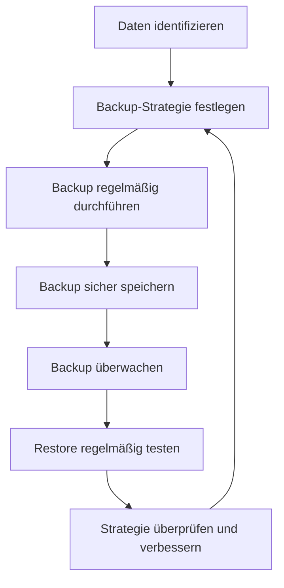
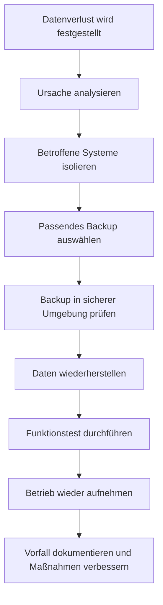

# Datensicherung

## Kurzüberblick / Definition

**Datensicherung** bezeichnet alle Maßnahmen, mit denen Daten vor Verlust, Beschädigung oder unbeabsichtigter Veränderung geschützt werden. Der wichtigste Bestandteil der Datensicherung ist das **Backup**, also das regelmäßige Erstellen von Sicherungskopien.

Das Ziel der Datensicherung ist es, Daten im Notfall wiederherstellen zu können.

Typische Ursachen für Datenverlust sind:

- Hardwaredefekte,
- versehentliches Löschen,
- Softwarefehler,
- Schadsoftware,
- Ransomware,
- Stromausfall,
- Brand oder Wasserschäden,
- Diebstahl,
- fehlerhafte Updates,
- menschliche Fehler.

Datensicherung ist ein zentraler Bestandteil der IT-Sicherheit, weil sie vor allem die **Verfügbarkeit** und **Integrität** von Daten unterstützt.

---

## Kernerklärung

### Datensicherung, Backup und Restore

Die Begriffe **Datensicherung**, **Backup** und **Restore** hängen eng zusammen, bedeuten aber nicht genau dasselbe.

| Begriff | Bedeutung |
|---|---|
| Datensicherung | Gesamtheit aller Maßnahmen zum Schutz vor Datenverlust |
| Backup | Sicherungskopie von Daten |
| Restore | Wiederherstellung von Daten aus einem Backup |
| Recovery | Wiederherstellung eines Systems oder Dienstes nach einem Ausfall |

Wichtig:

> Ein Backup ist nur dann wirklich nützlich, wenn die Wiederherstellung funktioniert.

Deshalb reicht es nicht aus, Backups nur zu erstellen. Sie müssen auch regelmäßig getestet werden.

---

## Ziel der Datensicherung

Datensicherung unterstützt die klassischen Schutzziele der IT-Sicherheit.

| Schutzziel | Bedeutung im Zusammenhang mit Datensicherung |
|---|---|
| Verfügbarkeit | Daten sollen nach einem Ausfall wieder nutzbar sein |
| Integrität | Daten sollen korrekt, vollständig und unverändert bleiben |
| Vertraulichkeit | Sicherungen dürfen nicht von Unbefugten gelesen werden |

Beispiel:

Ein Unternehmen verliert durch einen Festplattendefekt seine Kundendatenbank. Wenn ein aktuelles, funktionsfähiges Backup vorhanden ist, kann die Datenbank wiederhergestellt werden. Ohne Backup können die Daten dauerhaft verloren sein.

---

## Datensicherung vs. Datenschutz

Datensicherung und Datenschutz sind eng miteinander verbunden, haben aber unterschiedliche Schwerpunkte.

| Thema | Schwerpunkt |
|---|---|
| Datensicherung | Schutz vor Datenverlust und Wiederherstellung von Daten |
| Datenschutz | Schutz personenbezogener Daten und Rechte betroffener Personen |
| Datensicherheit | Technische und organisatorische Sicherheit von Daten allgemein |

Beispiel:

Eine verschlüsselte Sicherung einer Kundendatenbank ist gleichzeitig:

- eine Maßnahme der Datensicherung, weil Daten wiederhergestellt werden können,
- eine Maßnahme der Datensicherheit, weil sie technisch geschützt ist,
- eine unterstützende Maßnahme des Datenschutzes, weil personenbezogene Daten geschützt werden.

Wichtig:

> Datenschutz schützt Menschen und ihre personenbezogenen Daten. Datensicherung schützt Daten vor Verlust und sorgt für Wiederherstellbarkeit.

---

## Warum Datensicherung wichtig ist

Daten sind für Unternehmen oft geschäftskritisch.

Beispiele:

| Datenart | Risiko bei Verlust |
|---|---|
| Kundendaten | Verlust von Geschäftsbeziehungen, Datenschutzprobleme |
| Rechnungen | Buchhaltungs- und Steuerprobleme |
| Quellcode | Entwicklungsstillstand |
| Konfigurationsdateien | Systeme können nicht korrekt betrieben werden |
| Projektdaten | Arbeitsfortschritt geht verloren |
| E-Mails | Kommunikationsnachweise fehlen |
| Datenbanken | Anwendungen funktionieren nicht mehr |

Ohne Datensicherung kann ein technischer Fehler schnell zu einem wirtschaftlichen oder organisatorischen Schaden führen.

---

## Backup-Arten

Es gibt verschiedene Arten von Backups. Sie unterscheiden sich darin, welche Daten gesichert werden und wie aufwendig die Wiederherstellung ist.

## Vollbackup

Ein **Vollbackup** sichert alle ausgewählten Daten vollständig.

Beispiel:

```text
Jeden Sonntag wird der komplette Dateiserver gesichert.
```

Vorteile:

- einfache Wiederherstellung,
- alle Daten befinden sich in einer vollständigen Sicherung,
- übersichtlich und zuverlässig.

Nachteile:

- benötigt viel Speicherplatz,
- dauert länger,
- verursacht höhere Last auf Systemen und Netzwerk.

---

## Inkrementelles Backup

Ein **inkrementelles Backup** sichert nur die Daten, die sich seit dem letzten Backup geändert haben.

Beispiel:

```text
Sonntag: Vollbackup
Montag: Änderungen seit Sonntag
Dienstag: Änderungen seit Montag
Mittwoch: Änderungen seit Dienstag
```

Vorteile:

- spart Speicherplatz,
- ist schneller als ein Vollbackup,
- verursacht weniger Last.

Nachteile:

- Wiederherstellung ist aufwendiger,
- für einen vollständigen Restore werden das letzte Vollbackup und alle nachfolgenden inkrementellen Backups benötigt.

---

## Differenzielles Backup

Ein **differenzielles Backup** sichert alle Daten, die sich seit dem letzten Vollbackup geändert haben.

Beispiel:

```text
Sonntag: Vollbackup
Montag: Änderungen seit Sonntag
Dienstag: alle Änderungen seit Sonntag
Mittwoch: alle Änderungen seit Sonntag
```

Vorteile:

- Wiederherstellung einfacher als beim inkrementellen Backup,
- nur Vollbackup und letztes differenzielles Backup werden benötigt.

Nachteile:

- benötigt mit der Zeit mehr Speicherplatz als inkrementelle Backups,
- dauert mit jedem Tag seit dem letzten Vollbackup länger.

---

## Vergleich der Backup-Arten

| Backup-Art | Gesichert wird | Vorteil | Nachteil |
|---|---|---|---|
| Vollbackup | Alle ausgewählten Daten | Einfache Wiederherstellung | Hoher Speicherbedarf |
| Inkrementelles Backup | Änderungen seit letztem Backup | Schnell und platzsparend | Restore aufwendiger |
| Differenzielles Backup | Änderungen seit letztem Vollbackup | Restore einfacher als inkrementell | Speicherbedarf wächst bis zum nächsten Vollbackup |

---

## Beispiel für eine Backup-Strategie

Eine mögliche Strategie könnte so aussehen:

| Tag | Backup-Art |
|---|---|
| Sonntag | Vollbackup |
| Montag | Inkrementelles Backup |
| Dienstag | Inkrementelles Backup |
| Mittwoch | Inkrementelles Backup |
| Donnerstag | Inkrementelles Backup |
| Freitag | Inkrementelles Backup |
| Samstag | Inkrementelles Backup |

Alternative:

| Tag | Backup-Art |
|---|---|
| Sonntag | Vollbackup |
| Montag | Differenzielles Backup |
| Dienstag | Differenzielles Backup |
| Mittwoch | Differenzielles Backup |
| Donnerstag | Differenzielles Backup |
| Freitag | Differenzielles Backup |
| Samstag | Differenzielles Backup |

Welche Strategie geeignet ist, hängt ab von:

- Datenmenge,
- Änderungsrate,
- verfügbarem Speicherplatz,
- maximal tolerierbarer Ausfallzeit,
- benötigter Wiederherstellungsgeschwindigkeit,
- Kosten,
- gesetzlichen und organisatorischen Anforderungen.

---

## Ablauf einer Datensicherung



---

## Die 3-2-1-Regel

Eine bekannte Grundregel für Datensicherung ist die **3-2-1-Regel**.

| Bestandteil | Bedeutung |
|---|---|
| 3 Kopien | Mindestens drei Datenkopien, einschließlich Original |
| 2 verschiedene Medien | Speicherung auf mindestens zwei unterschiedlichen Speichermedien |
| 1 Kopie extern | Mindestens eine Kopie außerhalb des Hauptstandorts |

Beispiel:

```text
1. Originaldaten auf dem Server
2. Backup auf lokalem Backup-System
3. Zusätzliches Backup in einem externen Rechenzentrum oder Offline-Medium
```

Der Vorteil dieser Regel ist, dass sie verschiedene Schadensfälle berücksichtigt.

| Schadensfall | Warum 3-2-1 hilft |
|---|---|
| Festplattendefekt | Eine weitere Kopie ist vorhanden |
| Brand im Serverraum | Externe Kopie bleibt erhalten |
| Ransomware | Offline- oder getrennte Sicherung kann geschützt sein |
| Bedienfehler | Ältere Sicherungsversion kann wiederhergestellt werden |

---

## Speicherorte für Backups

Backups können auf unterschiedlichen Medien und an unterschiedlichen Orten gespeichert werden.

| Speicherort | Vorteil | Risiko |
|---|---|---|
| Externe Festplatte | Einfach und günstig | Kann verloren gehen oder beschädigt werden |
| NAS | Zentral und gut automatisierbar | Bei Netzwerkzugriff durch Schadsoftware gefährdet |
| Bandlaufwerk | Geeignet für langfristige Archivierung | Langsamer Zugriff |
| Cloud-Speicher | Externer Standort und skalierbar | Abhängigkeit vom Anbieter und Internet |
| Externes Rechenzentrum | Professionelle Infrastruktur | Kosten und Vertragsabhängigkeit |
| Offline-Backup | Schutz vor Ransomware | Manuelle Prozesse nötig |

Wichtig:

Backups sollten nicht ausschließlich auf demselben System liegen wie die Originaldaten. Wenn das Hauptsystem ausfällt oder verschlüsselt wird, wären sonst auch die Backups betroffen.

---

## Online-, Offline- und Offsite-Backups

| Begriff | Bedeutung |
|---|---|
| Online-Backup | Backup ist dauerhaft erreichbar, zum Beispiel über Netzwerk |
| Offline-Backup | Backup ist nach der Sicherung getrennt und nicht dauerhaft erreichbar |
| Offsite-Backup | Backup befindet sich an einem anderen physischen Standort |

Beispiel:

Ein Backup auf einem dauerhaft verbundenen Netzlaufwerk ist praktisch, aber bei Ransomware gefährdet. Ein zusätzliches Offline-Backup kann dieses Risiko reduzieren.

---

## Backup und Redundanz

**Redundanz** bedeutet, dass Komponenten mehrfach vorhanden sind, damit ein System bei einem Ausfall weiter funktionieren kann.

Beispiele:

- RAID-Systeme,
- redundante Netzteile,
- Cluster,
- gespiegelte Server,
- Hochverfügbarkeitssysteme.

Wichtig:

> Redundanz ersetzt kein Backup.

Ein RAID kann vor dem Ausfall einer einzelnen Festplatte schützen. Es schützt aber nicht zuverlässig vor:

- versehentlichem Löschen,
- Ransomware,
- Datenkorruption,
- falschen Änderungen,
- Diebstahl,
- Brand,
- fehlerhaften Updates.

Beispiel:

Wenn ein Benutzer eine wichtige Datei löscht, wird diese Löschung bei vielen redundanten Systemen ebenfalls sofort übernommen. Ein Backup kann dagegen eine frühere Version wiederherstellen.

---

## RAID und Backup

RAID wird oft mit Backup verwechselt.

| Aussage | Bewertung |
|---|---|
| RAID erhöht Verfügbarkeit | Richtig |
| RAID kann Hardwareausfälle abfedern | Richtig |
| RAID schützt vor versehentlichem Löschen | Falsch |
| RAID schützt vor Ransomware | Falsch |
| RAID ersetzt ein Backup | Falsch |

Merksatz:

> RAID ist Verfügbarkeitssteigerung, kein vollständiges Datensicherungskonzept.

---

## Verschlüsselung von Backups

Backups enthalten häufig besonders sensible Daten. Deshalb sollten sie gegen unbefugten Zugriff geschützt werden.

Maßnahmen:

- Backup-Dateien verschlüsseln,
- Backup-Medien sicher aufbewahren,
- Zugriff auf Backup-Systeme beschränken,
- Schlüssel sicher verwalten,
- Transport von Backup-Medien absichern.

Wichtig:

Wenn ein Backup verschlüsselt wird, muss der Schlüssel sicher aufbewahrt werden. Geht der Schlüssel verloren, kann das Backup möglicherweise nicht mehr wiederhergestellt werden.

---

## Zugriffskontrolle

Nicht jeder Mitarbeiter sollte Zugriff auf Backups haben.

Backups können große Mengen an Daten enthalten und dadurch besonders kritisch sein.

Geeignete Maßnahmen:

- Rollen- und Rechtekonzept,
- Zugriff nur für autorisierte Administratoren,
- Mehr-Faktor-Authentifizierung,
- Protokollierung von Zugriffen,
- Trennung von administrativen Aufgaben,
- regelmäßige Überprüfung von Berechtigungen.

Grundsatz:

> Wer Zugriff auf Backups hat, hat oft Zugriff auf sehr viele Unternehmensdaten.

---

## Backup-Monitoring

Backups müssen überwacht werden.

Es reicht nicht, einen Backup-Job einzurichten und danach nicht mehr zu prüfen.

Überwacht werden sollte:

- Wurde das Backup erfolgreich abgeschlossen?
- Wurden alle geplanten Daten gesichert?
- Gab es Fehlermeldungen?
- Ist genügend Speicherplatz vorhanden?
- Sind die Sicherungen lesbar?
- Wurde die Sicherung manipuliert?
- Funktioniert die Wiederherstellung?

Typische Maßnahmen:

- automatische Benachrichtigungen bei Fehlern,
- tägliche Kontrolle von Backup-Protokollen,
- regelmäßige Reports,
- Test-Wiederherstellungen,
- Alarmierung bei fehlgeschlagenen Jobs.

---

## Restore-Test

Ein **Restore-Test** prüft, ob Daten aus einem Backup wirklich wiederhergestellt werden können.

Beispiel:

```text
Einmal pro Monat wird eine ausgewählte Datenbank aus dem Backup in einer Testumgebung wiederhergestellt.
```

Ziel:

- Backup ist lesbar,
- Daten sind vollständig,
- Wiederherstellung funktioniert technisch,
- benötigte Zeit ist bekannt,
- Verantwortliche kennen den Ablauf.

Wichtig:

> Ein ungeprüftes Backup ist nur eine Vermutung. Ein getesteter Restore ist ein Nachweis.

---

## RPO und RTO

Für professionelle Datensicherung sind die Begriffe **RPO** und **RTO** wichtig.

## RPO: Recovery Point Objective

Das **Recovery Point Objective** beschreibt, wie viel Datenverlust maximal akzeptabel ist.

Beispiel:

```text
RPO = 24 Stunden
```

Bedeutung:

Im schlimmsten Fall dürfen Daten der letzten 24 Stunden verloren gehen.

Wenn ein Unternehmen maximal eine Stunde Datenverlust akzeptiert, müssen Backups oder Replikationsmechanismen entsprechend häufig erfolgen.

---

## RTO: Recovery Time Objective

Das **Recovery Time Objective** beschreibt, wie lange die Wiederherstellung maximal dauern darf.

Beispiel:

```text
RTO = 4 Stunden
```

Bedeutung:

Nach einem Ausfall muss das System innerhalb von 4 Stunden wieder verfügbar sein.

---

## Unterschied zwischen RPO und RTO

| Begriff | Leitfrage | Beispiel |
|---|---|---|
| RPO | Wie viele Daten dürfen maximal verloren gehen? | Maximal 1 Stunde Datenverlust |
| RTO | Wie lange darf die Wiederherstellung dauern? | System muss nach 4 Stunden wieder laufen |

Merksatz:

> RPO betrifft den Datenverlust. RTO betrifft die Ausfallzeit.

---

## Backup-Fenster

Das **Backup-Fenster** ist der Zeitraum, in dem eine Datensicherung durchgeführt werden kann, ohne den normalen Betrieb zu stark zu beeinträchtigen.

Beispiel:

```text
Backups laufen nachts zwischen 22:00 Uhr und 04:00 Uhr.
```

Problem:

Wenn Datenmengen wachsen, kann ein Backup länger dauern als das verfügbare Backup-Fenster. Dann muss die Strategie angepasst werden.

Mögliche Lösungen:

- inkrementelle Backups,
- differenzielle Backups,
- Snapshots,
- schnellere Speichersysteme,
- Lastverteilung,
- geänderte Backup-Zeiten,
- zusätzliche Backup-Software.

---

## Snapshots

Ein **Snapshot** ist ein Abbild eines Systems oder Datenbestands zu einem bestimmten Zeitpunkt.

Snapshots werden häufig bei:

- virtuellen Maschinen,
- Dateisystemen,
- Storage-Systemen,
- Datenbanken

verwendet.

Vorteile:

- schnelle Erstellung,
- schnelle Rückkehr zu einem vorherigen Zustand,
- nützlich vor Updates oder Konfigurationsänderungen.

Aber:

> Snapshots ersetzen kein vollständiges Backup.

Wenn der zugrunde liegende Speicher ausfällt oder kompromittiert wird, können auch Snapshots verloren gehen.

---

## Archivierung vs. Backup

Backup und Archivierung werden häufig verwechselt.

| Begriff | Zweck |
|---|---|
| Backup | Wiederherstellung nach Datenverlust |
| Archivierung | Langfristige Aufbewahrung aus rechtlichen oder organisatorischen Gründen |

Beispiel:

Ein Backup dient dazu, eine gelöschte Datei von gestern wiederherzustellen.

Ein Archiv dient dazu, eine Rechnung mehrere Jahre lang aufzubewahren.

Wichtig:

Backups sind normalerweise nicht dafür gedacht, langfristige Archivierungspflichten vollständig zu erfüllen.

---

## Notfallplan

Zur Datensicherung gehört auch ein Plan für den Ernstfall.

Ein Notfallplan sollte festlegen:

- Wer ist verantwortlich?
- Welche Systeme haben Priorität?
- Wo befinden sich die Backups?
- Welche Zugangsdaten werden benötigt?
- Wie wird die Wiederherstellung durchgeführt?
- Welche Reihenfolge ist einzuhalten?
- Wer wird informiert?
- Wie wird der Erfolg geprüft?
- Wie wird der Vorfall dokumentiert?

Ohne Notfallplan kann im Ernstfall wertvolle Zeit verloren gehen.

---

## Beispiel: Wiederherstellung nach Datenverlust



---

## Best Practices für Datensicherung

Wichtige Best Practices sind:

| Maßnahme | Zweck |
|---|---|
| Regelmäßige Backups | Datenverlust begrenzen |
| Automatisierung | Menschliche Fehler reduzieren |
| Restore-Tests | Wiederherstellbarkeit nachweisen |
| Verschlüsselung | Vertraulichkeit schützen |
| Zugriffskontrolle | Missbrauch verhindern |
| Offsite-Kopie | Schutz vor Standortausfall |
| Offline-Kopie | Schutz vor Ransomware |
| Monitoring | Fehler früh erkennen |
| Dokumentation | Nachvollziehbarkeit sicherstellen |
| Notfallplan | Strukturierte Reaktion im Ernstfall |
| Schulung | Bewusstsein bei Mitarbeitern schaffen |
| Patchmanagement | Risiken durch bekannte Schwachstellen reduzieren |

---

## Praktisches Beispiel: Backup-Konzept für einen kleinen Betrieb

Ein kleiner Betrieb betreibt einen Dateiserver, eine Kundendatenbank und ein Warenwirtschaftssystem.

Mögliches Backup-Konzept:

| Komponente | Maßnahme |
|---|---|
| Dateiserver | Tägliches inkrementelles Backup, wöchentliches Vollbackup |
| Kundendatenbank | Tägliches Datenbankbackup, zusätzliche Transaktionslogs |
| Warenwirtschaft | Backup nach Geschäftsschluss |
| Backup-Speicher | Lokales NAS plus verschlüsseltes Offsite-Backup |
| Schutz vor Ransomware | Regelmäßige Offline-Kopie |
| Überwachung | E-Mail-Benachrichtigung bei fehlgeschlagenem Backup |
| Test | Monatlicher Restore-Test |
| Dokumentation | Backup- und Wiederherstellungsanleitung |

Dieses Konzept ist nur ein Beispiel. In der Praxis muss es an Anforderungen, Risiken und Budget angepasst werden.

---

## Typische Fehler

## Fehler 1: Backups werden nicht getestet

Ein Backup ist wertlos, wenn es im Ernstfall nicht wiederhergestellt werden kann.

Korrekt ist:

```text
Backups regelmäßig erstellen und regelmäßig Restore-Tests durchführen.
```

---

## Fehler 2: Backups liegen nur am gleichen Standort

Wenn Originaldaten und Backup am selben Ort liegen, können beide gleichzeitig zerstört werden.

Beispiele:

- Brand,
- Wasserschaden,
- Diebstahl,
- Stromschaden.

Korrekt ist:

```text
Mindestens eine Kopie sollte an einem anderen Standort aufbewahrt werden.
```

---

## Fehler 3: Backups sind dauerhaft online erreichbar

Wenn Backups dauerhaft im Netzwerk erreichbar sind, kann Schadsoftware sie möglicherweise ebenfalls verschlüsseln oder löschen.

Korrekt ist:

```text
Zusätzliche Offline- oder unveränderbare Backups verwenden.
```

---

## Fehler 4: RAID wird als Backup verstanden

RAID kann die Verfügbarkeit erhöhen, schützt aber nicht vor logischen Fehlern wie versehentlichem Löschen oder Verschlüsselung durch Ransomware.

Korrekt ist:

```text
RAID kann Backup ergänzen, aber nicht ersetzen.
```

---

## Fehler 5: Keine klare Verantwortlichkeit

Wenn niemand für die Kontrolle der Backups zuständig ist, werden Fehler oft erst im Notfall bemerkt.

Korrekt ist:

```text
Verantwortlichkeiten, Kontrollen und Eskalationswege festlegen.
```

---

## Fehler 6: Passwörter und Schlüssel werden schlecht verwaltet

Verschlüsselte Backups sind sicher, aber ohne Schlüssel nicht wiederherstellbar.

Korrekt ist:

```text
Backup-Schlüssel sicher und nachvollziehbar verwalten.
```

---

## Fehler 7: Backups enthalten personenbezogene Daten, werden aber nicht geschützt

Backups enthalten oft vollständige Datenbestände. Deshalb müssen sie genauso ernst genommen werden wie Produktivsysteme.

Korrekt ist:

```text
Backups verschlüsseln, Zugriff beschränken und Löschfristen beachten.
```

---

## Examensrelevanz

Datensicherung ist für die IHK-Prüfung relevant, weil sie ein zentraler Bestandteil von Systemtechnik, IT-Sicherheit und betrieblichem IT-Betrieb ist.

Besonders prüfungsrelevant sind:

- Unterschied zwischen Backup und Restore,
- Backup-Arten,
- Unterschied zwischen Datensicherung und Datenschutz,
- 3-2-1-Regel,
- Unterschied zwischen Backup und Redundanz,
- RAID ist kein Backup,
- Restore-Tests,
- RPO und RTO,
- Verschlüsselung und Zugriffsschutz,
- Notfallplanung.

Typische Prüfungsfragen könnten sein:

| Frage | Erwartete Kernaussage |
|---|---|
| Was ist Datensicherung? | Maßnahmen zur Sicherung und Wiederherstellung von Daten |
| Was ist ein Backup? | Eine Sicherungskopie von Daten |
| Was ist ein Restore? | Wiederherstellung aus einem Backup |
| Welche Backup-Arten gibt es? | Vollbackup, inkrementelles Backup, differenzielles Backup |
| Was bedeutet die 3-2-1-Regel? | Drei Kopien, zwei Medien, eine externe Kopie |
| Warum ersetzt RAID kein Backup? | RAID schützt nicht vor Löschen, Ransomware oder logischen Fehlern |
| Warum sind Restore-Tests wichtig? | Sie prüfen, ob Backups wirklich wiederherstellbar sind |
| Was bedeutet RPO? | Maximal akzeptabler Datenverlust |
| Was bedeutet RTO? | Maximal akzeptable Wiederherstellungszeit |
| Warum sollten Backups verschlüsselt werden? | Schutz vor unbefugtem Zugriff |

---

## Merksätze

- Datensicherung schützt vor Datenverlust.
- Ein Backup ist eine Sicherungskopie.
- Ein Restore ist die Wiederherstellung aus einer Sicherung.
- Ein Backup ist nur dann wertvoll, wenn der Restore funktioniert.
- Vollbackups sind einfach wiederherzustellen, benötigen aber viel Speicherplatz.
- Inkrementelle Backups sparen Speicher, machen die Wiederherstellung aber aufwendiger.
- Differenzielle Backups sind ein Mittelweg zwischen Vollbackup und inkrementellem Backup.
- Die 3-2-1-Regel erhöht die Ausfallsicherheit.
- RAID erhöht Verfügbarkeit, ersetzt aber kein Backup.
- Backups müssen verschlüsselt, geschützt und regelmäßig getestet werden.
- RPO beschreibt den maximal akzeptablen Datenverlust.
- RTO beschreibt die maximal akzeptable Ausfallzeit.
- Datensicherung ist ein kontinuierlicher Prozess, kein einmaliger Vorgang.