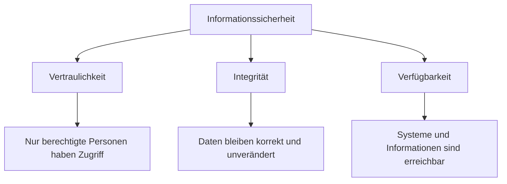
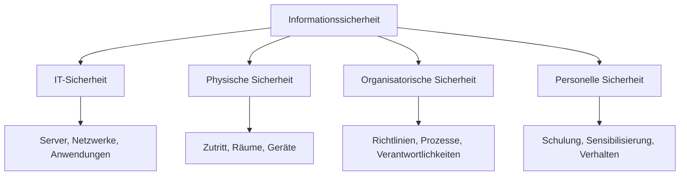
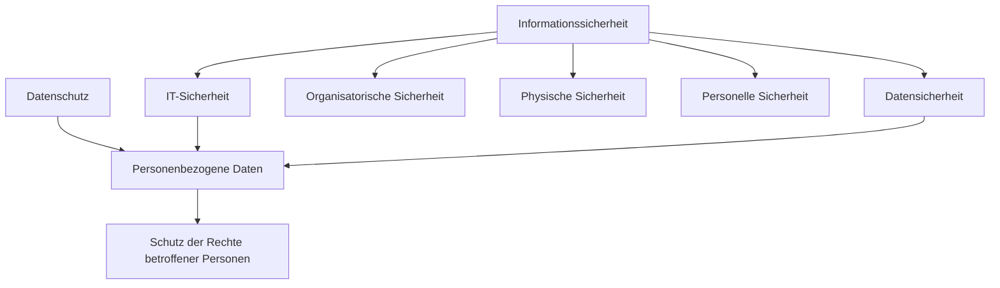
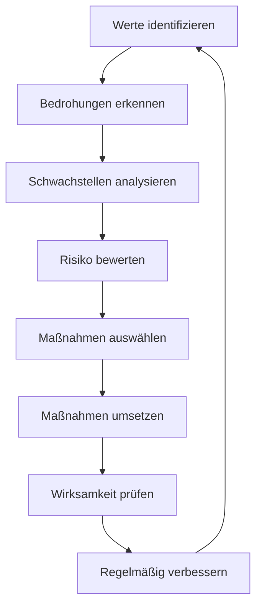
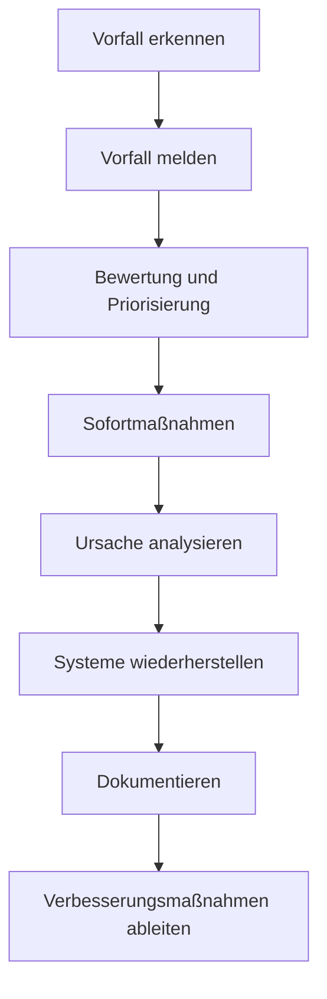
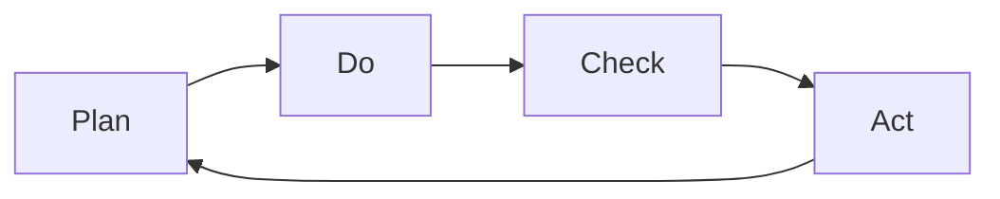

# Informationssicherheit

## Kurzüberblick / Definition

**Informationssicherheit** umfasst alle technischen, organisatorischen und personellen Maßnahmen, die Informationen vor unbefugtem Zugriff, Manipulation, Verlust, Missbrauch oder Ausfall schützen.

Dabei geht es nicht nur um digitale Daten in IT-Systemen. Informationssicherheit betrifft alle Formen von Informationen, zum Beispiel:

- digitale Daten,
- Papierdokumente,
- mündliche Informationen,
- E-Mails,
- Datenbanken,
- Quellcode,
- Zugangsdaten,
- Geschäftsgeheimnisse,
- Kundendaten,
- technische Dokumentationen.

Das Ziel der Informationssicherheit ist es, Informationen so zu schützen, dass sie für berechtigte Personen zuverlässig, korrekt und vertraulich verfügbar bleiben.

---

## Kernerklärung

### Die zentralen Schutzziele der Informationssicherheit

Die wichtigsten Schutzziele der Informationssicherheit sind:

1. **Vertraulichkeit**
2. **Integrität**
3. **Verfügbarkeit**

Diese drei Ziele werden häufig als **CIA-Triade** bezeichnet:

| Englisch | Deutsch | Bedeutung |
|---|---|---|
| Confidentiality | Vertraulichkeit | Nur Berechtigte dürfen Informationen sehen |
| Integrity | Integrität | Informationen müssen korrekt und unverändert bleiben |
| Availability | Verfügbarkeit | Informationen müssen bei Bedarf nutzbar sein |

---

## Vertraulichkeit

**Vertraulichkeit** bedeutet, dass Informationen nur von berechtigten Personen, Systemen oder Prozessen eingesehen werden dürfen.

Beispiele:

| Situation | Bewertung |
|---|---|
| Nur die Personalabteilung kann Gehaltsdaten einsehen | Vertraulichkeit wird gewahrt |
| Ein Mitarbeiter findet ungeschützte Kundendaten auf einem Netzlaufwerk | Vertraulichkeit ist verletzt |
| Eine Datenbank wird verschlüsselt gespeichert | Vertraulichkeit wird unterstützt |
| Passwörter werden im Klartext gespeichert | Vertraulichkeit ist gefährdet |

Typische Maßnahmen zur Sicherstellung der Vertraulichkeit:

- Zugriffskontrollen,
- Benutzerrechte,
- Rollen- und Berechtigungskonzepte,
- Verschlüsselung,
- Mehr-Faktor-Authentifizierung,
- sichere Passwortrichtlinien,
- Schulungen,
- Clean-Desk-Policy,
- Vertraulichkeitsvereinbarungen.

---

## Integrität

**Integrität** bedeutet, dass Informationen vollständig, korrekt und unverändert bleiben, sofern keine autorisierte Änderung erfolgt.

Beispiele:

| Situation | Bewertung |
|---|---|
| Eine Rechnung wird korrekt gespeichert und nicht verändert | Integrität ist gewahrt |
| Ein Angreifer manipuliert Kontodaten | Integrität ist verletzt |
| Eine Datei wird durch einen Übertragungsfehler beschädigt | Integrität ist verletzt |
| Änderungen werden protokolliert und geprüft | Integrität wird unterstützt |

Typische Maßnahmen zur Sicherstellung der Integrität:

- Prüfsummen,
- Hashwerte,
- digitale Signaturen,
- Versionskontrolle,
- Protokollierung,
- Eingabevalidierung,
- Datenbanktransaktionen,
- Berechtigungskonzepte,
- Vier-Augen-Prinzip,
- Änderungsmanagement.

---

## Verfügbarkeit

**Verfügbarkeit** bedeutet, dass Informationen und Systeme für berechtigte Benutzer dann zugänglich sind, wenn sie benötigt werden.

Beispiele:

| Situation | Bewertung |
|---|---|
| Ein Server ist während der Arbeitszeit erreichbar | Verfügbarkeit ist gegeben |
| Ein Onlineshop ist wegen eines Serverausfalls nicht nutzbar | Verfügbarkeit ist verletzt |
| Ein Backup kann nach Datenverlust eingespielt werden | Verfügbarkeit wird unterstützt |
| Ein DDoS-Angriff überlastet einen Dienst | Verfügbarkeit ist gefährdet |

Typische Maßnahmen zur Sicherstellung der Verfügbarkeit:

- Backups,
- redundante Systeme,
- RAID,
- Monitoring,
- unterbrechungsfreie Stromversorgung,
- Notfallpläne,
- Hochverfügbarkeitssysteme,
- Lastverteilung,
- Patchmanagement,
- Schutz vor Schadsoftware.

---

## Erweiterte Schutzziele

Neben Vertraulichkeit, Integrität und Verfügbarkeit gibt es weitere wichtige Schutzziele.

| Schutzziel | Bedeutung |
|---|---|
| Authentizität | Echtheit einer Person, eines Systems oder einer Information |
| Nichtabstreitbarkeit | Handlungen können nachweisbar einer Person oder Stelle zugeordnet werden |
| Verantwortlichkeit | Zuständigkeiten und Handlungen sind nachvollziehbar |
| Nachvollziehbarkeit | Ereignisse können durch Protokolle rekonstruiert werden |
| Verbindlichkeit | Eine Handlung oder Aussage ist beweisbar und rechtlich belastbar |

---

## Authentizität

**Authentizität** bedeutet, dass eine Information, ein Benutzer oder ein System echt ist.

Beispiel:

Eine digital signierte E-Mail kann zeigen, dass die Nachricht tatsächlich vom angegebenen Absender stammt und nicht gefälscht wurde.

Typische Maßnahmen:

- digitale Zertifikate,
- digitale Signaturen,
- sichere Authentifizierung,
- Zertifikatsprüfung,
- Identitätsprüfung,
- kryptografische Verfahren.

---

## Nichtabstreitbarkeit

**Nichtabstreitbarkeit** bedeutet, dass eine Handlung später nicht glaubhaft abgestritten werden kann.

Beispiel:

Wenn eine Bestellung digital signiert wurde, kann der Absender später nicht einfach behaupten, er habe die Bestellung nie ausgelöst.

Typische Maßnahmen:

- digitale Signaturen,
- manipulationssichere Protokolle,
- Zeitstempel,
- revisionssichere Dokumentation,
- eindeutige Benutzerkonten.

---

## Verantwortlichkeit

**Verantwortlichkeit** bedeutet, dass klar geregelt ist, wer für bestimmte Informationen, Systeme oder Prozesse zuständig ist.

Beispiel:

| Bereich | Verantwortliche Rolle |
|---|---|
| Benutzerverwaltung | Administrator |
| Datenschutz | Datenschutzbeauftragter oder Verantwortlicher |
| Backup-Kontrolle | Systemadministrator |
| Sicherheitsrichtlinien | Geschäftsleitung / IT-Sicherheitsbeauftragter |
| Anwendungssicherheit | Entwicklungsteam |

Ohne klare Verantwortlichkeiten bleiben Sicherheitsmaßnahmen oft unvollständig oder werden nicht regelmäßig überprüft.

---

## Informationssicherheit vs. IT-Sicherheit

Informationssicherheit und IT-Sicherheit werden häufig verwechselt, sind aber nicht identisch.

| Begriff | Schwerpunkt |
|---|---|
| Informationssicherheit | Schutz aller Informationen, unabhängig von ihrer Form |
| IT-Sicherheit | Schutz von IT-Systemen, Netzwerken, Anwendungen und digitalen Informationen |

**Informationssicherheit** ist der umfassendere Begriff.

Sie umfasst zum Beispiel auch:

- Papierakten,
- mündliche Gespräche,
- Ausdrucke,
- physische Zutrittskontrolle,
- organisatorische Regeln,
- Sicherheitsbewusstsein der Mitarbeiter.

**IT-Sicherheit** ist ein wichtiger Teilbereich der Informationssicherheit.

Sie konzentriert sich auf technische Systeme wie:

- Server,
- Clients,
- Netzwerke,
- Datenbanken,
- Cloud-Systeme,
- Anwendungen,
- mobile Geräte,
- Schnittstellen.

---

## Beispiel: Unterschied zwischen Informationssicherheit und IT-Sicherheit

Ein vertraulicher Vertrag liegt ausgedruckt im Besprechungsraum.

| Betrachtung | Bewertung |
|---|---|
| IT-Sicherheit | Nicht direkt betroffen, da kein IT-System beteiligt ist |
| Informationssicherheit | Betroffen, weil vertrauliche Information offen sichtbar ist |

Ein Webserver ist schlecht gepatcht und angreifbar.

| Betrachtung | Bewertung |
|---|---|
| IT-Sicherheit | Direkt betroffen |
| Informationssicherheit | Ebenfalls betroffen, weil Informationen gefährdet sein können |

---

## Informationssicherheit vs. Datenschutz

Informationssicherheit und Datenschutz überschneiden sich, haben aber unterschiedliche Ziele.

| Begriff | Schwerpunkt |
|---|---|
| Informationssicherheit | Schutz aller Arten von Informationen |
| Datenschutz | Schutz personenbezogener Daten und der Rechte natürlicher Personen |

Datenschutz bezieht sich ausschließlich auf **personenbezogene Daten**.

Informationssicherheit betrifft auch Informationen ohne Personenbezug, zum Beispiel:

- Geschäftsgeheimnisse,
- Quellcode,
- technische Pläne,
- interne Preisstrategien,
- Produktionsdaten,
- Netzwerkkonzepte,
- Verträge mit Unternehmen.

Beispiel:

| Information | Datenschutz relevant? | Informationssicherheit relevant? |
|---|---:|---:|
| Kundendatenbank | Ja | Ja |
| Gehaltsliste | Ja | Ja |
| Quellcode einer Anwendung | Nein, meistens nicht | Ja |
| Netzwerktopologie | Nein, meistens nicht | Ja |
| Öffentliche Produktbeschreibung | Nein | Eher gering |
| Patientenakte | Ja, besonders stark | Ja |

Merksatz:

> Datenschutz schützt Personen. Informationssicherheit schützt Informationen.

---

## Informationssicherheit vs. Datensicherheit

**Datensicherheit** konzentriert sich auf den Schutz von Daten, besonders im technischen Sinn.

**Informationssicherheit** ist breiter, weil Informationen auch außerhalb klassischer Datensysteme existieren können.

| Begriff | Schwerpunkt |
|---|---|
| Datensicherheit | Schutz von Daten vor Verlust, Manipulation und unbefugtem Zugriff |
| Informationssicherheit | Schutz aller Informationen, unabhängig von Form und Medium |

Beispiel:

Ein Passwort in einer Datenbank betrifft Datensicherheit und Informationssicherheit.

Ein vertrauliches Gespräch auf dem Flur betrifft Informationssicherheit, aber nicht direkt Datensicherheit.

---

## Vergleich der Begriffe

| Begriff | Schutzobjekt | Typische Maßnahmen | Beispiel |
|---|---|---|---|
| Informationssicherheit | Alle Informationen | Richtlinien, Schulungen, Zugriffsschutz, Prozesse | Schutz von Geschäftsgeheimnissen |
| IT-Sicherheit | IT-Systeme und digitale Informationen | Firewalls, Patchmanagement, Virenschutz, Rechtekonzepte | Schutz eines Servers |
| Datenschutz | Personenbezogene Daten und Betroffenenrechte | DSGVO-Prozesse, Einwilligung, Auskunft, Löschung | Schutz von Kundendaten |
| Datensicherheit | Daten allgemein | Backups, Verschlüsselung, Integritätsprüfungen | Schutz einer Datenbank |

---

## Zusammenhang der Begriffe

Datenschutz überschneidet sich mit Informationssicherheit, ist aber kein reiner Teilbereich davon. Datenschutz hat eine eigene rechtliche Zielrichtung: den Schutz der Rechte und Freiheiten natürlicher Personen.

---

## Sicherheitsmaßnahmen

Informationssicherheit benötigt technische, organisatorische und personelle Maßnahmen.

## Technische Maßnahmen

Technische Maßnahmen schützen Informationen mithilfe von Technik.

Beispiele:

| Maßnahme | Zweck |
|---|---|
| Verschlüsselung | Schutz vor unbefugtem Lesen |
| Firewall | Kontrolle von Netzwerkverkehr |
| Backup | Wiederherstellung nach Datenverlust |
| Virenschutz / EDR | Erkennung und Abwehr von Schadsoftware |
| Patchmanagement | Schließen bekannter Sicherheitslücken |
| Mehr-Faktor-Authentifizierung | Erhöhung der Zugriffssicherheit |
| Monitoring | Erkennen ungewöhnlicher Ereignisse |
| Protokollierung | Nachvollziehbarkeit von Zugriffen und Änderungen |
| Netzwerksegmentierung | Begrenzung von Schäden bei Angriffen |

---

## Organisatorische Maßnahmen

Organisatorische Maßnahmen regeln Prozesse, Zuständigkeiten und Abläufe.

Beispiele:

| Maßnahme | Zweck |
|---|---|
| Sicherheitsrichtlinien | Einheitliche Regeln für alle Mitarbeiter |
| Berechtigungskonzept | Klare Zugriffsrechte |
| Notfallplan | Strukturierte Reaktion bei Ausfällen |
| Risikomanagement | Risiken erkennen und behandeln |
| Rollen und Verantwortlichkeiten | Zuständigkeiten eindeutig festlegen |
| Lieferantenmanagement | Sicherheitsanforderungen an Dienstleister |
| Änderungsmanagement | Kontrollierte Änderungen an Systemen |
| Dokumentation | Nachvollziehbarkeit und Prüfbarkeit |

---

## Personelle Maßnahmen

Der Mensch ist ein zentraler Faktor der Informationssicherheit.

Beispiele:

| Maßnahme | Zweck |
|---|---|
| Schulungen | Wissen über Risiken vermitteln |
| Sensibilisierung | Sicherheitsbewusstes Verhalten fördern |
| Verpflichtung auf Vertraulichkeit | Schutz vertraulicher Informationen stärken |
| Klare Meldewege | Sicherheitsvorfälle schnell melden |
| Phishing-Training | Erkennen betrügerischer Nachrichten |
| Rollenbezogene Schulung | Passende Kenntnisse für jeweilige Aufgaben |

Wichtig:

> Informationssicherheit funktioniert nicht allein durch Technik. Menschen, Prozesse und Technik müssen zusammenwirken.

---

## Physische Maßnahmen

Physische Sicherheit schützt Informationen und IT-Systeme vor direkten physischen Gefahren.

Beispiele:

- verschlossene Serverräume,
- Zutrittskontrollsysteme,
- Besuchermanagement,
- Brandschutz,
- Klimatisierung,
- Schutz vor Wasser,
- sichere Entsorgung von Datenträgern,
- abschließbare Aktenschränke,
- Sichtschutzfilter,
- Clean-Desk-Regeln.

Beispiel:

Wenn ein Serverraum frei zugänglich ist, können auch gute Passwörter und Firewalls den physischen Zugriff auf Geräte nicht vollständig ausgleichen.

---

## Risikomanagement

Informationssicherheit basiert auf dem Umgang mit Risiken.

Ein Risiko entsteht aus dem Zusammenspiel von:

1. einem schützenswerten Wert,
2. einer Bedrohung,
3. einer Schwachstelle,
4. einer möglichen Auswirkung.

Beispiel:

| Bestandteil | Beispiel |
|---|---|
| Wert | Kundendatenbank |
| Bedrohung | Ransomware |
| Schwachstelle | Fehlende Updates |
| Auswirkung | Datenverlust und Betriebsunterbrechung |

---

## Ablauf des Risikomanagements

---

## Umgang mit Risiken

Es gibt verschiedene Strategien zum Umgang mit Risiken.

| Strategie | Bedeutung | Beispiel |
|---|---|---|
| Risiko vermeiden | Gefährliche Aktivität nicht durchführen | Unsicheren Dienst nicht einsetzen |
| Risiko vermindern | Schutzmaßnahmen einführen | MFA aktivieren |
| Risiko übertragen | Risiko vertraglich oder finanziell verlagern | Cyberversicherung |
| Risiko akzeptieren | Restrisiko bewusst tragen | Geringes Risiko dokumentiert akzeptieren |

Wichtig:

Nicht jedes Risiko kann vollständig beseitigt werden. Ziel ist ein angemessenes Sicherheitsniveau.

---

## Sicherheitsrichtlinien

Sicherheitsrichtlinien legen verbindliche Regeln für den Umgang mit Informationen fest.

Beispiele für Richtlinien:

- Passwortrichtlinie,
- Backup-Richtlinie,
- Clean-Desk-Policy,
- Mobile-Device-Policy,
- E-Mail- und Internetnutzungsrichtlinie,
- Berechtigungsrichtlinie,
- Richtlinie zur Klassifizierung von Informationen,
- Incident-Response-Richtlinie.

Eine gute Richtlinie sollte:

- verständlich formuliert sein,
- zum Arbeitsalltag passen,
- Verantwortlichkeiten festlegen,
- regelmäßig überprüft werden,
- durch Schulung bekannt gemacht werden,
- technisch und organisatorisch umsetzbar sein.

---

## Klassifizierung von Informationen

Nicht jede Information benötigt denselben Schutz. Deshalb werden Informationen häufig klassifiziert.

Beispielhafte Schutzklassen:

| Schutzklasse | Bedeutung | Beispiel |
|---|---|---|
| Öffentlich | Darf frei veröffentlicht werden | Produktflyer |
| Intern | Nur für interne Nutzung | interne Arbeitsanweisung |
| Vertraulich | Nur für bestimmten Personenkreis | Kundenvertrag |
| Streng vertraulich | Besonders hoher Schutzbedarf | Geschäftsgeheimnis, Sicherheitskonzept |

Die Klassifizierung hilft dabei, passende Schutzmaßnahmen auszuwählen.

---

## Notfallmanagement

Informationssicherheit umfasst auch die Vorbereitung auf Sicherheitsvorfälle und Ausfälle.

Ein Notfallmanagement legt fest:

- welche Vorfälle kritisch sind,
- wer im Notfall entscheidet,
- welche Systeme Priorität haben,
- wie kommuniziert wird,
- welche Wiederherstellungsschritte gelten,
- wo Backups liegen,
- wie Vorfälle dokumentiert werden,
- wie nach dem Vorfall verbessert wird.

Typische Notfälle:

| Notfall | Beispielhafte Maßnahme |
|---|---|
| Serverausfall | Wiederherstellung aus Backup |
| Ransomware | Systeme isolieren, Incident Response starten |
| Datenleck | Vorfall bewerten und Meldepflicht prüfen |
| Stromausfall | USV und Notstromkonzept |
| Brand im Serverraum | Ausweichstandort und Offsite-Backup |
| Ausfall eines Dienstleisters | Notfallplan und Ersatzprozesse |

---

## Sicherheitsvorfälle

Ein Sicherheitsvorfall ist ein Ereignis, das die Informationssicherheit beeinträchtigen kann.

Beispiele:

- verdächtige Login-Versuche,
- Malware-Fund,
- verlorener Laptop,
- versehentlich versendete vertrauliche E-Mail,
- unberechtigter Datenbankzugriff,
- manipulierte Dateien,
- Ausfall eines zentralen Systems,
- Phishing-Angriff,
- öffentlich erreichbare interne Daten.

Typischer Ablauf bei einem Sicherheitsvorfall:

---

## Sicherheitsbewusstsein

Sicherheitsbewusstsein bedeutet, dass Mitarbeiter Risiken erkennen und sich sicherheitsgerecht verhalten.

Typische Schulungsthemen:

- Phishing erkennen,
- sichere Passwörter verwenden,
- Mehr-Faktor-Authentifizierung nutzen,
- vertrauliche Informationen schützen,
- verdächtige Vorfälle melden,
- keine unbekannten Anhänge öffnen,
- sichere Nutzung mobiler Geräte,
- Umgang mit USB-Sticks,
- Clean Desk,
- Social Engineering.

Beispiel:

Ein Mitarbeiter erkennt eine gefälschte E-Mail und meldet sie an die IT. Dadurch kann ein möglicher Angriff früh gestoppt werden.

---

## Compliance

**Compliance** bedeutet, dass gesetzliche, regulatorische, vertragliche und interne Anforderungen eingehalten werden.

Im Kontext der Informationssicherheit können dazu gehören:

- Datenschutzvorgaben,
- branchenspezifische Sicherheitsanforderungen,
- interne Sicherheitsrichtlinien,
- vertragliche Pflichten gegenüber Kunden,
- Aufbewahrungspflichten,
- Dokumentationspflichten,
- Anforderungen aus Standards oder Zertifizierungen.

Compliance ist wichtig, ersetzt aber keine echte Sicherheit.

> Ein System kann formal regelkonform wirken und trotzdem praktische Sicherheitslücken haben.

---

## Kontinuierliche Verbesserung

Informationssicherheit ist kein einmaliges Projekt.

Bedrohungen, Systeme und Geschäftsprozesse ändern sich ständig. Deshalb müssen Sicherheitsmaßnahmen regelmäßig überprüft und verbessert werden.

Typische Auslöser für Anpassungen:

- neue Schwachstellen,
- neue gesetzliche Anforderungen,
- neue IT-Systeme,
- Cloud-Migration,
- neue Angriffsarten,
- organisatorische Änderungen,
- Sicherheitsvorfälle,
- Ergebnisse von Audits,
- neue Geschäftsprozesse.

---

## PDCA-Zyklus in der Informationssicherheit

Ein häufig verwendetes Modell zur kontinuierlichen Verbesserung ist der **PDCA-Zyklus**.

| Phase | Bedeutung |
|---|---|
| Plan | Sicherheitsziele und Maßnahmen planen |
| Do | Maßnahmen umsetzen |
| Check | Wirksamkeit prüfen |
| Act | Verbesserungen ableiten und umsetzen |

---

## Praktisches Beispiel: Informationssicherheit in einem Unternehmen

Ein Unternehmen verarbeitet Kundendaten, betreibt interne Server und nutzt Cloud-Dienste.

Mögliche Schutzmaßnahmen:

| Bereich | Maßnahme |
|---|---|
| Benutzerkonten | MFA und sichere Passwortrichtlinie |
| Dateien | Berechtigungen nach Rollen |
| Server | Patchmanagement und Monitoring |
| Datenbanken | Verschlüsselung und Zugriffskontrolle |
| E-Mails | Spamfilter und Phishing-Schulung |
| Backups | 3-2-1-Regel und Restore-Tests |
| Räume | Zutrittskontrolle zum Serverraum |
| Mitarbeiter | regelmäßige Security Awareness Trainings |
| Dienstleister | Sicherheitsanforderungen vertraglich regeln |
| Notfälle | Incident-Response-Plan und Notfallübungen |

---

## Beispiel: Verletzung mehrerer Schutzziele

Ein Angreifer verschafft sich Zugriff auf eine Kundendatenbank, kopiert Daten und verändert anschließend Datensätze.

| Schutzziel | Verletzung |
|---|---|
| Vertraulichkeit | Unbefugter Zugriff und Kopieren der Daten |
| Integrität | Manipulation von Datensätzen |
| Verfügbarkeit | Möglicherweise eingeschränkt, wenn Systeme gesperrt oder abgeschaltet werden müssen |
| Authentizität | Fraglich, ob Daten noch echt und vertrauenswürdig sind |
| Nachvollziehbarkeit | Nur gegeben, wenn Logs vorhanden und unverändert sind |

Dieses Beispiel zeigt, dass Sicherheitsvorfälle oft mehrere Schutzziele gleichzeitig betreffen.

---

## Typische Bedrohungen

| Bedrohung | Beispiel |
|---|---|
| Malware | Trojaner, Ransomware, Spyware |
| Phishing | Gefälschte E-Mails zur Passwortabfrage |
| Social Engineering | Manipulation von Mitarbeitern |
| Insider-Bedrohung | Missbrauch durch interne Personen |
| Fehlkonfiguration | Öffentlich erreichbare Datenbank |
| Software-Schwachstelle | Ungepatchter Serverdienst |
| Hardwareausfall | Defekte Festplatte |
| Naturereignis | Brand, Hochwasser, Sturm |
| Diebstahl | Gestohlener Laptop |
| Menschlicher Fehler | Falscher E-Mail-Empfänger |

---

## Typische Schwachstellen

| Schwachstelle | Risiko |
|---|---|
| Schwache Passwörter | Konten können leichter übernommen werden |
| Fehlende Updates | Bekannte Sicherheitslücken bleiben ausnutzbar |
| Zu viele Rechte | Schaden bei Kompromittierung wird größer |
| Keine Backups | Datenverlust wird schwer oder unmöglich beheben |
| Keine Schulungen | Phishing und Social Engineering wirken leichter |
| Schlechte Dokumentation | Notfallreaktion dauert länger |
| Unverschlüsselte Datenträger | Daten können bei Diebstahl gelesen werden |
| Fehlendes Monitoring | Angriffe werden spät oder gar nicht erkannt |
| Gemeinsame Benutzerkonten | Verantwortlichkeit ist nicht nachvollziehbar |

---

## Examensrelevanz

Informationssicherheit ist für die IHK-Prüfung relevant, weil sie viele Themen aus Systemtechnik, IT-Sicherheit, Datenschutz, Netzwerken und Softwareentwicklung verbindet.

Besonders wichtig sind:

- Schutzziele der Informationssicherheit,
- Unterschied zwischen Informationssicherheit und IT-Sicherheit,
- Unterschied zwischen Informationssicherheit und Datenschutz,
- Unterschied zwischen Informationssicherheit und Datensicherheit,
- technische, organisatorische und personelle Maßnahmen,
- Risikomanagement,
- Sicherheitsrichtlinien,
- Sicherheitsbewusstsein,
- Notfallmanagement,
- Verfügbarkeit, Integrität und Vertraulichkeit,
- Beispiele für Bedrohungen und Schutzmaßnahmen.

Typische Prüfungsfragen könnten sein:

| Frage | Erwartete Kernaussage |
|---|---|
| Was ist Informationssicherheit? | Schutz aller Informationen vor unbefugtem Zugriff, Manipulation, Verlust und Ausfall |
| Welche drei Hauptschutzziele gibt es? | Vertraulichkeit, Integrität und Verfügbarkeit |
| Was bedeutet Vertraulichkeit? | Nur Berechtigte dürfen Informationen einsehen |
| Was bedeutet Integrität? | Informationen bleiben korrekt und unverändert |
| Was bedeutet Verfügbarkeit? | Informationen und Systeme sind bei Bedarf nutzbar |
| Was ist der Unterschied zwischen Informationssicherheit und IT-Sicherheit? | Informationssicherheit ist umfassender, IT-Sicherheit schützt IT-Systeme |
| Was ist der Unterschied zwischen Informationssicherheit und Datenschutz? | Datenschutz schützt personenbezogene Daten und Personenrechte |
| Was ist Risikomanagement? | Risiken erkennen, bewerten und angemessen behandeln |
| Warum sind Schulungen wichtig? | Menschen sind ein zentraler Sicherheitsfaktor |
| Warum reicht Technik allein nicht aus? | Prozesse, Verantwortlichkeiten und Verhalten sind ebenfalls entscheidend |

---

## Häufige Fehler und Klarstellungen

### Fehler 1: „Informationssicherheit ist dasselbe wie IT-Sicherheit“

Falsch. IT-Sicherheit ist ein Teilbereich der Informationssicherheit. Informationssicherheit umfasst auch organisatorische, personelle und physische Aspekte sowie Informationen außerhalb von IT-Systemen.

---

### Fehler 2: „Informationssicherheit betrifft nur digitale Daten“

Falsch. Auch Papierdokumente, Ausdrucke, Gespräche und physische Unterlagen können schützenswerte Informationen enthalten.

---

### Fehler 3: „Datenschutz und Informationssicherheit sind identisch“

Falsch. Datenschutz schützt personenbezogene Daten und die Rechte natürlicher Personen. Informationssicherheit schützt Informationen allgemein.

---

### Fehler 4: „Verfügbarkeit ist weniger wichtig als Vertraulichkeit“

Nicht allgemein richtig. Die Bedeutung der Schutzziele hängt vom Kontext ab.

Beispiel:

In einem Krankenhaus kann die Verfügbarkeit von Patientendaten lebenswichtig sein. In einem Forschungsunternehmen kann die Vertraulichkeit von Geschäftsgeheimnissen besonders wichtig sein.

---

### Fehler 5: „Sicherheit kann vollständig erreicht werden“

Falsch. Es gibt immer Restrisiken. Ziel ist ein angemessenes Sicherheitsniveau, das Risiken reduziert und beherrschbar macht.

---

### Fehler 6: „Technische Maßnahmen reichen aus“

Falsch. Firewalls, Verschlüsselung und Backups sind wichtig, aber ohne klare Prozesse, Verantwortlichkeiten und geschulte Mitarbeiter bleibt Informationssicherheit unvollständig.

---

### Fehler 7: „Mehr Sicherheit bedeutet immer bessere Sicherheit“

Nicht unbedingt. Sicherheitsmaßnahmen müssen angemessen sein.

Zu strenge oder unpraktische Regeln können dazu führen, dass Mitarbeiter Umgehungslösungen nutzen. Gute Informationssicherheit muss wirksam, verständlich und praktikabel sein.

---

## Merksätze

- Informationssicherheit schützt alle Arten von Informationen.
- IT-Sicherheit ist ein Teilbereich der Informationssicherheit.
- Datenschutz schützt personenbezogene Daten und Personenrechte.
- Datensicherheit schützt Daten vor Verlust, Manipulation und unbefugtem Zugriff.
- Die drei wichtigsten Schutzziele sind Vertraulichkeit, Integrität und Verfügbarkeit.
- Authentizität und Nichtabstreitbarkeit sind wichtige ergänzende Schutzziele.
- Informationssicherheit betrifft Technik, Organisation, Menschen und physische Umgebung.
- Risiken müssen erkannt, bewertet und behandelt werden.
- Sicherheitsrichtlinien schaffen verbindliche Regeln.
- Schulungen stärken Sicherheitsbewusstsein.
- Notfallmanagement bereitet auf Sicherheitsvorfälle vor.
- Informationssicherheit ist ein kontinuierlicher Verbesserungsprozess.